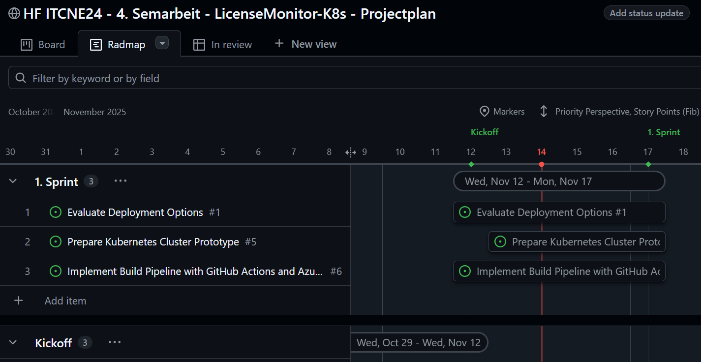
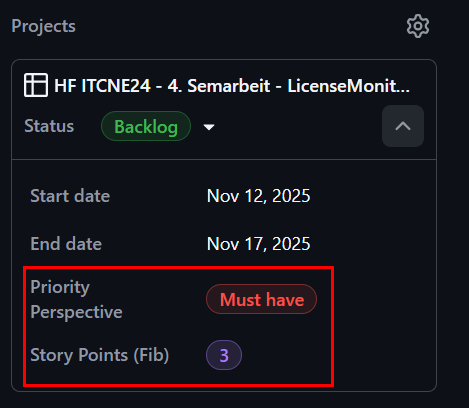

# Zeitplan

Um meine Semesterarbeit strukturiert voranzutreiben, habe ich zwei unterschiedliche Zeitpläne erstellt. Diese Zeitpläne variieren in ihrer Detailtiefe und bieten mir somit verschiedene Ansätze zur Organisation meiner Arbeit.

Dies ist der grobe Zeitplan, welchen ich aus dem [Einreichungsformular](../../ressources/docs/ITCNE24_Semesterarbeit_4_Einreichungsformular_Miguel_Schneider.pdf) entnommen habe. 

| Datum    | Aktivität                                                              | Wer                            | Empfänger        |
| -------- | ---------------------------------------------------------------------- | ------------------------------ | ---------------- |
| 01.10.25 | Ablauf Semesterarbeiten und Liste mit Projektthemen vorstellen         | Lehrgangsleitung               | Studierende      |
| 20.10.25 | Abgabe Einreichungsformular                                            | Studierende                    | Expert/innen     |
| 27.10.25 | Freigabe Semesterarbeit durch Expert/innen                             | Expert/innen                   | Studierende      |
| 27.10.25 | Beginn Umsetzung Semesterarbeit                                        | Studierende                    | Expert/innen     |
| 17.11.25 | 1. Sprint, evtl. mit Besprechung                                       | Studierende                    | Expert/innen     |
| 15.12.25 | 2. Sprint, evtl. mit Besprechung                                       | Studierende                    | Expert/innen     |
| 23.01.26 | 3. Sprint, evtl. mit Besprechung                                       | Studierende                    | Expert/innen     |
| 28.01.26 | Abgabe der Arbeit / Abnahme mit Schlusspräsentation                    | Studierende                    | Expert/innen     |
| 04.02.26 | Notenvorschlag                                                         | Projekt-Experte/in             | Lehrgangsleitung |
| 13.02.26 | Mitteilung der Noten mit individuellem Feedback zur Einsicht hochladen | Projekt-Experte/in             | Studierende      |
| 13.03.26 | Mitteilung der Noten                                                   | Lehrgangsleitung / Sekretariat | Studierende      |

Den genaueren Zeitplan habe ich im Projektmanagement in Github erstellt. 
Dies ist ein Kanban-Board, auf dem ich die Einzelnen Tasks und verschiedene Buckets habe. 
Mit diesem Board, kann ich auch eine Zeitplan-Achse abbilden, wo ich die Dauer eines Tasks definieren kann. 

Den Zeitplan in GitHub Project, kannst du unter diesem Link finden: <a href="https://github.com/users/Radball-Migi/projects/9" target="_blank">Github Project</a>

Mit GitHub Project, gibt es die Möglichkeit, die einzelnen Schritte in einer Roadmap anzuzeigen. 
Dies sieht dann in etwa so aus:

[*Roadmap in GitHub Projects*](https://github.com/users/Radball-Migi/projects/9/views/8)

Der Vorteil dabei ist, dass ich eine graphisch übersichtliche Zeitplanung habe, in der ich Visuell meine Tasks sehe (Balken mit dem Status des Issues), inklusive meinen Meilensteinen (Grüne Linie auf dem Zeitstrahl). 

**Zusätzlich habe ich in diesem Semester meine Planung erweitert und um zwei Elemente ergänzt:** Zum einen nutze ich die **MoSCoW-Methode**, um die Priorität meiner Aufgaben eindeutig festzulegen (Must, Should, Could, Won’t). Dadurch erhalte ich eine klare Übersicht, welche Aufgaben zwingend umgesetzt werden müssen und welche optional oder nachrangig sind.  

Zum anderen bewerte ich den geschätzten Aufwand meiner Tasks anhand der **Fibonacci-Nummerierung**. Diese Methode unterstützt mich dabei, den Umfang einzelner Arbeitspakete realistisch einzuschätzen und erleichtert die Planung innerhalb der Sprints und der Roadmap.

### Story Points - Fibonacci-Nummerierung

| Story Points | Typischer Aufwand | Beschreibung / Orientierung                                                                                                                 |
| ------------ | ----------------- | ------------------------------------------------------------------------------------------------------------------------------------------- |
| **1**        | **Sehr gering**   | Kleine Änderung, klar definiert, kaum Risiko.  Beispiel: Textanpassung in der README, Variable umbenennen.                               |
| **2**        | **Gering**        | Kleine Aufgabe, klarer Ablauf.  Beispiel: Einfache Funktion ergänzen, kleine Pipeline-Anpassung.                                         |
| **3**        | **Mittel**        | Etwas mehr Aufwand, 1–2 Stunden konzentrierte Arbeit, evtl. kleine Abstimmung nötig.  Beispiel: Unit Tests ergänzen, YAML-Job erweitern. |
| **5**        | **Hoch**          | Größerer Task, mehrere Schritte oder Unsicherheiten.  Beispiel: neue Pipeline-Stage, neues Modul erstellen, API-Call erweitern.          |
| **8**        | **Sehr hoch**     | Komplexe Aufgabe mit Abhängigkeiten oder Rechercheaufwand. Beispiel: Integration mit Azure DevOps, Graph API Anbindung.                     |
| **13**       | **Extrem**        | Grosse Story, evtl. in mehrere kleinere Stories zerlegen.  Beispiel: komplette CI/CD-Architektur umstellen oder Microservice refactoren. |
| **21+**      | **Episch**        | Zu gross für einen Sprint → muss in kleinere Stories aufgeteilt werden.                                                                     |
