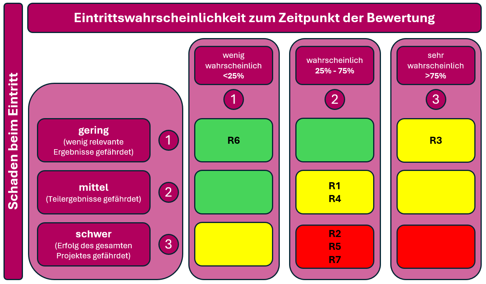

# Risiken

Bei Projektarbeiten sind Risiken grundsätzlich vorhanden. Durch eine frühzeitige Identifikation und Bewertung dieser Risiken können geeignete Massnahmen definiert werden, um negative Auswirkungen auf den Projektverlauf zu minimieren. Ziel der Risikoanalyse ist es, den Projekterfolg sicherzustellen und das Erreichen der definierten Ziele zu unterstützen.

Während der Umsetzung des Projekts wurden die in der nachfolgenden Tabelle dargestellten Risiken identifiziert sowie hinsichtlich ihrer Eintrittswahrscheinlichkeit und potenziellen Auswirkung bewertet.

| ID     | Risiko                                                                                                         | Eintritt | Auswirkung | Massnahme zur Vermeidung / Minderung                                                                                                                                 |
| ------ | -------------------------------------------------------------------------------------------------------------- | -------- | ---------- | -------------------------------------------------------------------------------------------------------------------------------------------------------------------- |
| **R1** | Komplexität bei der Einrichtung der CI/CD-Pipeline (z. B. YAML-Fehler, Pipeline-Trigger)                       | Mittel   | Mittel     | Schrittweise Implementierung, Nutzung von Templates, regelmässige Tests und Code-Reviews                                                                             |
| **R2** | Fehlkonfiguration von Kubernetes-Ressourcen (z. B. Pods, Services, Secrets)                                    | Mittel   | Hoch       | Einsatz von Helm-Charts, Validierung der Konfiguration über Testumgebungen und Dokumentation der Deployments                                                         |
| **R3** | Datenschutzrisiko durch unsichere Speicherung von Lizenzdaten                                                  | Niedrig  | Hoch       | Klare Trennung von sensiblen Daten, Speicherung innerhalb der definierten Systemumgebung und Einhaltung interner Datenschutzrichtlinien                              |
| **R4** | Integrationsprobleme zwischen Microservices oder Pipeline-Komponenten                                          | Mittel   | Mittel     | Klare Schnittstellendefinitionen, Integrationstests in jeder Pipeline-Stufe, Logging und Fehlerauswertung                                                            |
| **R5** | Instabilität des Systems bei Skalierung oder Lasttests                                                         | Mittel   | Hoch       | Stufenweiser Ausbau der Skalierung, Tests unter realistischen Bedingungen, Nutzung von Kubernetes-Self-Healing-Mechanismen                                           |
| **R6** | GitHub-Dokumentation wird nicht laufend gepflegt                                                               | Niedrig  | Niedrig    | Doku fix in Workflow einplanen, regelmässige Erinnerung im Taskboard                                                                                                 |
| **R7** | Authentifizierungsprobleme mit der Microsoft Graph API in Kubernetes (z. B. Zertifikate, Thumbprints, Secrets) | Mittel   | Hoch       | Sichere Verwaltung und regelmässige Erneuerung der Zertifikate/Secrets, Einsatz von Kubernetes-Secrets oder Key Vault, Monitoring und Logging der Authentifizierung. |
_Übersicht der identifizierten Projektrisiken_

Die identifizierten Risiken wurden zusätzlich in einer grafischen Risikomatrix visualisiert. Diese Darstellung ermöglicht eine übersichtliche Einordnung der Risiken und unterstützt die Priorisierung von Massnahmen.

_Risikomatrix zur Einordnung der Projektrisiken nach Eintrittswahrscheinlichkeit und Schadensauswirkung._

Die Risikoanalyse zeigt, dass die Mehrheit der identifizierten Risiken im mittleren bis hohen Risikobereich liegt. Insbesondere Risiken im Zusammenhang mit der Konfiguration der Kubernetes-Umgebung, der Systemstabilität bei Skalierung sowie der Authentifizierung mit externen Schnittstellen erfordern erhöhte Aufmerksamkeit. Durch die definierten Massnahmen zur Risikovermeidung und -minderung können diese Risiken jedoch kontrolliert und deren Auswirkungen auf den Projekterfolg reduziert werden.

