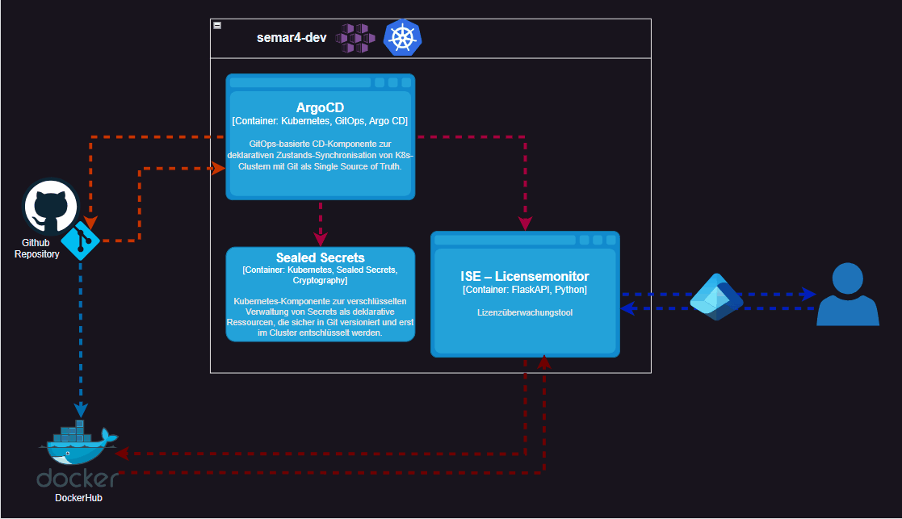

# SEUSAG

Mit der SEUSAG möchte ich die Systemgrenzen aufzeigen, welche bei meinem Projekt auftreten.

[*SEUSAG des Projektes* (Falls Bild nicht richtig angezeigt wird.)](../../ressources/images/seusag.gif)

Das betrachtete System ist ein **cloud-native Lizenzüberwachungssystem**, welches innerhalb eines Kubernetes-Clusters betrieben wird. Der Fokus dieser Semesterarbeit liegt auf **Deployment, Betrieb, Automatisierung und Sicherheit** der Lösung.

> **Hinweis:**  
> Das eigentliche Lizenzüberwachungstool (_ISE – Licensemonitor_) wurde bereits in der [**Semesterarbeit 3**]([Startseite | HF-ITCNE24-SemArbeit3-MSVC-Lizenztool](https://radball-migi.github.io/HF-ITCNE24-SemArbeit3-MSVC-Lizenztool/)) entwickelt. In dieser Arbeit erfolgt **keine Neuentwicklung der Applikation**, sondern deren Integration in eine GitOps-basierte Kubernetes-Umgebung.

---

## Systemgrenze

Die Systemgrenze umfasst alle Komponenten innerhalb des Kubernetes-Clusters `semar4-dev`:

- Argo CD zur GitOps-basierten Continuous Delivery
- Sealed Secrets zur sicheren Verwaltung sensibler Daten
- Laufzeitumgebung der bestehenden Applikation

Diese Komponenten werden im Rahmen der Arbeit gestaltet und optimiert.

---

## Umfeld (externe Systeme)

Als externe Systeme gelten:

- **GitHub** zur Versionierung und Bereitstellung der Deployment-Definitionen
- **Docker Hub** als Container-Registry
- **Microsoft Entra / Entra ID** als externe Authentifizierungs- und API-Plattform
- **Benutzer**, welche über die Applikation auf die bereitgestellten Informationen zugreifen