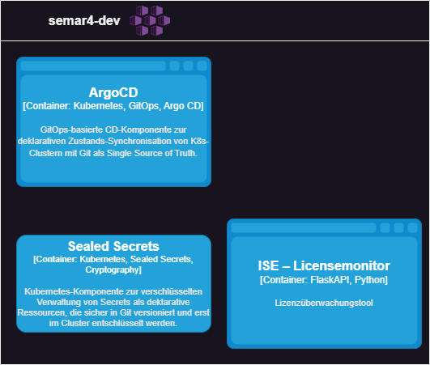
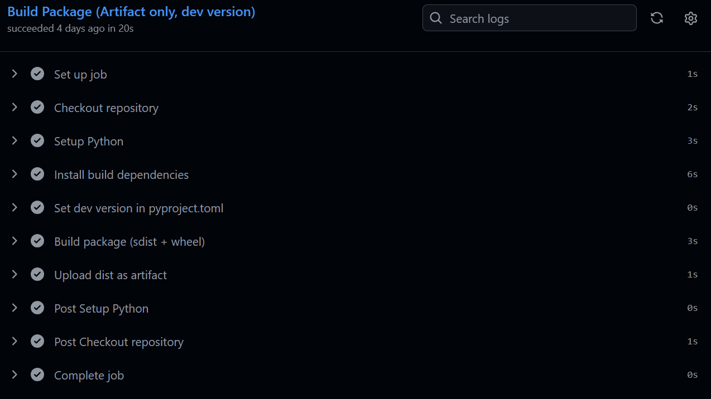
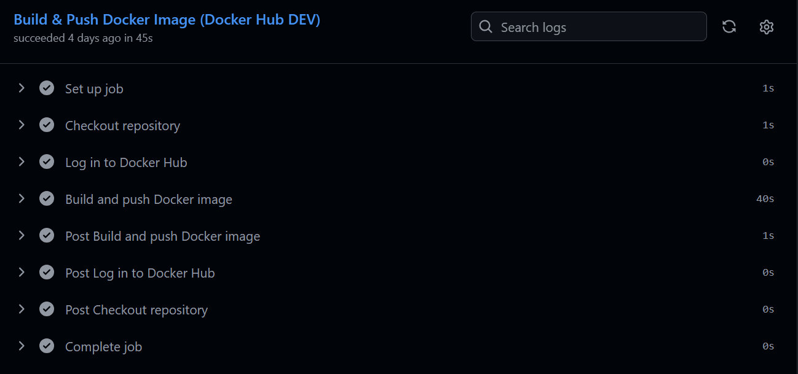
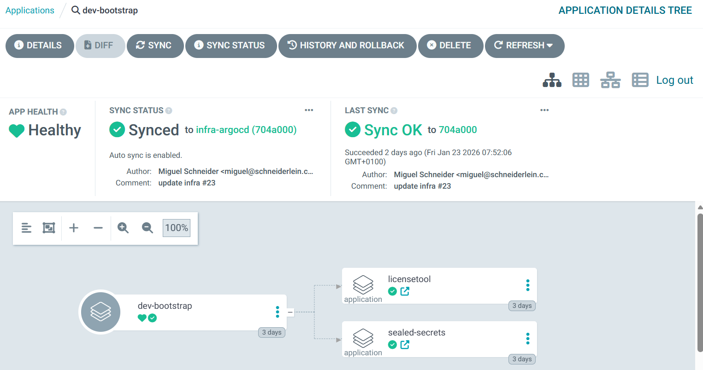

#  Verbessern (Improve) Phase

Die Improve-Phase ist der vierte Schritt in einem Six Sigma Projekt. In dieser Phase werden die in der [Analyze-Phase](./33_analysieren.md) identifizierten Hauptursachen für Prozessabweichungen adressiert und Lösungen entwickelt, um diese zu beheben. Ziel ist es, durch gezielte Verbesserungsmassnahmen die Prozessleistung zu optimieren und die identifizierten Probleme nachhaltig zu lösen. Dies umfasst die Anwendung von Kreativitätstechniken, statistischen Methoden und Pilotprojekten, um die Wirksamkeit der vorgeschlagenen Lösungen zu testen und zu validieren.

Der Fokus dieser Phase liegt **nicht auf der Neuentwicklung der Applikation**, sondern auf der **Migration, Automatisierung und dem cloud-nativen Betrieb** eines bereits bestehenden Lizenzüberwachungstools. Der funktionale Umfang der Anwendung wurde in einer vorherigen Semesterarbeit umgesetzt und bleibt im Rahmen dieser Arbeit unverändert.

Ziel der Improve-Phase ist es, die bestehende Anwendung so weiterzuentwickeln, dass sie reproduzierbar bereitgestellt, automatisiert betrieben und nachhaltig gewartet werden kann – im Sinne moderner DevOps- und Cloud-Native-Core-Prinzipien.


[Quelle](../Quellverzeichnis/index.md#improve-phase)

## Architekturgrundlage des Lizenzüberwachungstools

Das Lizenzüberwachungstool basiert auf einem **Microservice-Architekturstil (MSVC)** und nutzt **Python mit Flask** zur Umsetzung der einzelnen Services. Diese Architektur bildet die fachliche und technische Grundlage für die nachfolgenden Verbesserungsmassnahmen.

### Microservice-Architektur (MSVC) und Flask API

Bei einer Microservice-Architektur wird eine Anwendung nicht als monolithisches System umgesetzt, sondern in mehrere kleine, unabhängige Dienste aufgeteilt. Jeder dieser Dienste übernimmt eine klar abgegrenzte fachliche Aufgabe und kann unabhängig entwickelt, betrieben und skaliert werden.

Im vorliegenden Projekt fungieren die Flask-Services als **REST-basierte APIs**, welche unter anderem folgende Aufgaben übernehmen:
- Abfrage von Lizenzinformationen über die Microsoft Graph API
- Verarbeitung und Aufbereitung der Lizenzdaten
- Bereitstellung von Schnittstellen für weitere Systeme oder Automatisierungen

Durch den Einsatz von Flask als leichtgewichtigem Framework bleiben die Services bewusst schlank und stateless. Dies erleichtert nicht nur die Containerisierung, sondern ist auch eine zentrale Voraussetzung für den späteren Betrieb in einer Cloud-Native-Umgebung.

Diese Architekturentscheidung unterstützt die in der Analyze-Phase identifizierten Verbesserungsziele direkt: geringere Kopplung, bessere Wartbarkeit und gezielte Skalierbarkeit einzelner Komponenten.

---

## Cloud-Native Core (CNC) als Zielarchitektur

Um die bestehenden Microservices effizient, stabil und automatisiert betreiben zu können, wird das Lizenzüberwachungstool in eine **Cloud-Native-Core-Architektur (CNC)** überführt. CNC beschreibt dabei keinen einzelnen Technologie-Stack, sondern ein Architekturprinzip.

Zentrale Merkmale dieser Architektur sind:
- Containerisierte Anwendungen
- Deklarative Infrastruktur
- Automatisierte Deployments
- Skalierbarkeit und Self-Healing
- Klare Trennung von Code, Konfiguration und Laufzeit

Durch die Umsetzung dieser Prinzipien wird sichergestellt, dass die Anwendung reproduzierbar betrieben, einfach erweitert und zuverlässig überwacht werden kann.

---

## Minikube als Kubernetes-Laufzeitumgebung

Für die praktische Umsetzung der Cloud-Native-Core-Architektur wird **Minikube** als Kubernetes-Umgebung eingesetzt. Minikube ermöglicht den Betrieb eines vollständigen Kubernetes-Clusters in einer lokalen Umgebung und eignet sich damit ideal für Entwicklungs-, Test- und Evaluationszwecke.

Der Einsatz von Minikube bietet mehrere Vorteile im Kontext dieser Semesterarbeit:
- Realistisches Kubernetes-Verhalten ohne Cloud-Abhängigkeit
- Volle Kontrolle über Infrastruktur und Konfiguration
- Konformität mit den Datenschutzanforderungen (DSG)
- Nahtlose Integration in CI/CD-Pipelines

Durch Minikube kann die Zielarchitektur praxisnah umgesetzt werden, ohne die im Analyse-Teil identifizierten Risiken eines Cloud-Deployments einzugehen. Gleichzeitig bleibt die Architektur so gestaltet, dass ein späterer Wechsel auf eine Cloud-Plattform grundsätzlich möglich wäre.

---

## Evaluation und Festlegung der Infrastruktur

Zu Beginn der Improve-Phase wurde die in der Analyze-Phase begonnene Infrastruktur-Evaluation konkretisiert. Dabei wurden sowohl **Cloud-basierte Lösungen** als auch eine **lokale Kubernetes-Umgebung** betrachtet. Entscheidende Bewertungskriterien waren unter anderem Datenschutz, Kontrolle über sensible Lizenzdaten, technische Komplexität sowie Kosten- und Betriebsaspekte.

Das Ergebnis dieser Evaluation war die bewusste Entscheidung für eine **lokale Kubernetes-Umgebung auf Basis von Minikube**. Diese Lösung ermöglicht ein realistisches Cloud-Native-Setup, ohne Abhängigkeiten von externen Cloud-Anbietern einzugehen. Gleichzeitig bleibt die Architektur so gestaltet, dass ein späterer Wechsel in eine Cloud-Umgebung grundsätzlich möglich wäre.

| **Kriterium**        | **Gewicht** | **Azure**   | **AWS**     | **Lokal**   |
| -------------------- | ----------- | ----------- | ----------- | ----------- |
| Datenschutz / DSG    | **35%**     | Mittel (6)  | Niedrig (4) | ⭐ Hoch (9)  |
| Security             | **25%**     | Mittel (7)  | Mittel (7)  | ⭐ Hoch (9)  |
| Kosten               | 10%         | Mittel (6)  | Niedrig (5) | Mittel (6)  |
| Scalability          | 10%         | Hoch (9)    | Hoch (10)   | Niedrig (4) |
| Operational Control  | 10%         | Niedrig (5) | Niedrig (5) | ⭐ Hoch (9)  |
| Integration MS Graph | 10%         | Hoch (9)    | Mittel (7)  | Niedrig (4) |
_Gewichtete Entscheidungsmatrix, mehr details zur Evaluation unter [Vergleich der Deployment-Optionen](./33_analyze#vergleich-der-deployment-optionen)_

**Gesamtpunktzahl (0–10):**

- Azure: **6.75**
- AWS: **5.85**
- ⭐ **Lokal: 7.70**

Mit dieser Entscheidung wurde eine stabile und datenschutzkonforme Grundlage geschaffen, auf der alle weiteren Verbesserungen aufbauen.

---

## Weiterentwicklung zur Cloud-Native-Core-Architektur

Basierend auf der gewählten Zielinfrastruktur wurde das bestehende Lizenzüberwachungstool konsequent in Richtung einer **Cloud-Native-Core-Architektur** weiterentwickelt. Dabei standen nicht einzelne Technologien im Vordergrund, sondern zentrale Architektur- und Betriebsprinzipien.

Umgesetzte Kernprinzipien waren unter anderem:

- Containerisierung der bestehenden Anwendung
- Trennung von Anwendungscode, Konfiguration und Infrastruktur
- Deklarative Beschreibung des gewünschten Systemzustands
- Stateless-Betrieb der Applikation

Die Anwendung wurde als Container-Image bereitgestellt, ohne die fachliche Logik zu verändern. Durch diese Entkopplung ist die Applikation unabhängig von der Laufzeitumgebung und eignet sich für automatisierte Deployments und Skalierung innerhalb von Kubernetes.


_Zielarchitektur_

---

## Aufbau einer CI/CD-Pipeline (Build & Artefakt-Erstellung)

Ein zentrales Ziel der Improve-Phase war die **Reduktion manueller Schritte** im Build- und Bereitstellungsprozess. Dazu wurde eine CI-Pipeline aufgebaut, welche Änderungen am Quellcode automatisch verarbeitet.

Die Pipeline übernimmt unter anderem:

- Build der Applikation
- Erstellung eines versionierten Container-Images
- Bereitstellung des Artefakts für das Deployment

Dadurch ist jeder Build eindeutig einer Code-Version zugeordnet und reproduzierbar. Fehlerquellen durch manuelle Builds oder inkonsistente Artefakte konnten so eliminiert werden.


_Pipeline summary_


_CI-Build der App_


_CI Build des Dockerhub-Artefakts_

Diese Pipeline bildet die technische Grundlage für den nachfolgenden GitOps-basierten Deployment-Ansatz.

---

## Einführung eines GitOps-Ansatzes mit Argo CD

Für das Deployment der Anwendung wurde ein **GitOps-Ansatz** umgesetzt. Dabei dient das Git-Repository als Single Source of Truth für den gewünschten Systemzustand.  
Als zentrales Werkzeug wurde **Argo CD** eingesetzt.

Die Struktur folgt dem **App-of-Apps-Pattern**, bei dem eine zentrale Bootstrap-Applikation weitere Applikationen verwaltet, darunter:

- Argo CD Core-Komponenten
- Sealed Secrets Controller
- LicenseMonitor Applikation

Diese Struktur ermöglicht eine klare Trennung von Verantwortlichkeiten und eine saubere Steuerung von Abhängigkeiten.


_ArgoCD UI Overview_

Durch GitOps wird sichergestellt, dass jede Änderung nachvollziehbar versioniert ist und automatisch in die Kubernetes-Umgebung synchronisiert wird.

---

## Sicheres Secrets Management mit Sealed Secrets

Ein wesentlicher Schwerpunkt der Improve-Phase lag auf der **Sicherstellung von Datenschutz und Betriebssicherheit**. Sensible Daten wie Zertifikate, Tenant-Profile und Authentifizierungsparameter dürfen weder im Klartext im Repository abgelegt noch manuell in Pods konfiguriert werden.

Daher wurde das **Sealed-Secrets-Konzept** eingeführt:

- Secrets werden lokal erstellt
- clientseitig verschlüsselt (`kubeseal`)
- als SealedSecrets im Git-Repository versioniert
- ausschließlich im Cluster entschlüsselt

```text
infra/ 
└── k8s/     
	└── apps/         
		└── licensetool/             
			└── overlays/                 
				└── dev/                     
					└── sealed-secret.yaml
```
_Dateistruktur der Sealed Secrets_

```output
PS C:\Users\miguel.schneider> kubeseal --controller-name "sealed-secrets" --controller-namespace "kube-system" --fetch-cert
-----BEGIN CERTIFICATE-----
MIIEzDCCArSgAwIBAgIQaW/IbK02PNctcQpjqggjnzANBgkqhkiG9w0BAQsFADAA
MB4XDTI2MDEyMjIzMzE1OFoXDTM2MDEyMDIzMzE1OFowADCCAiIwDQYJKoZIhvcN...
```
_Teiloutput CLI, des Sealed-Secrets _

Damit ist sichergestellt, dass zu keinem Zeitpunkt Klartext-Secrets im Repository oder in der CI/CD-Pipeline vorhanden sind.

---

## Technische Stabilisierung der Kubernetes-Integration

Während der Umsetzung traten mehrere Kubernetes-spezifische Probleme auf, insbesondere im Umgang mit Secrets, Mount-Pfaden und Namenskonventionen.  
Zertifikate und Konfigurationsprofile waren ursprünglich auf lokale Dateisysteme ausgelegt und mussten für einen zustandslosen Pod-Betrieb angepasst werden.

Die folgenden Verbesserungen wurden umgesetzt:
- Migration aller Zertifikate und Profile in Kubernetes Secrets
- Einheitliche Mount-Pfade innerhalb der Container
- Trennung von tenant-spezifischen und serviceweiten Zertifikaten
- Einführung verbindlicher Namenskonventionen für Kubernetes-Ressourcen

Die Wirksamkeit dieser Massnahmen wurde iterativ überprüft durch:
- Analyse von Pod-Logs
- Validierung gemounteter Dateien
- Funktionstests der Microsoft- und SharePoint-Integrationen

📌 **Hier CLI-Ausgabe einfügen:**  
`kubectl exec … ls /app/certs`  
`kubectl logs licensetool-pod`

Nach diesen Anpassungen lief die Applikation stabil mit mehreren Replikas.

---

## Fehleranalyse und Troubleshooting (Argo CD Repo Server)

Während der GitOps-Einführung trat ein kritischer Fehler auf:

> _Failed to load target state: connection refused (argocd-repo-server)_

Die Ursache lag in einem inkonsistenten Zustand des Argo CD Repo Servers. Ein gezielter Neustart des Deployments stellte die Kommunikation wieder her.

📌 **Hier CLI-Ausgabe einfügen:**  
`kubectl -n argocd get pods`  
`kubectl -n argocd rollout restart deploy/argocd-repo-server`

📌 **Hier Screenshot einfügen:**  
_Argo CD – Application Status: Healthy / Synced_

Dieser Schritt wurde dokumentiert und als Bestandteil des Troubleshooting-Wissens festgehalten.

---

## Ergebnis und Zielerreichung der Improve-Phase

Durch die umgesetzten Massnahmen konnten alle definierten Ziele erreicht werden:

- Die Infrastruktur wurde evaluiert und nachvollziehbar festgelegt
- Build- und Deployment-Prozesse sind automatisiert
- Die Anwendung folgt Cloud-Native-Core-Prinzipien
- Datenschutz und Betriebssicherheit sind Kubernetes-konform umgesetzt
- Die Umgebung ist reproduzierbar und stabil betreibbar

---

## Fazit der Improve-Phase

Die Improve-Phase führte zu einer nachhaltigen technischen Stabilisierung des Lizenzüberwachungstools.  
Durch die Kombination aus **CI/CD**, **GitOps**, **Sealed Secrets** und klarer Architektur wurde eine Lösung geschaffen, die nicht nur funktional, sondern auch betrieblich und organisatorisch überzeugt.

Die Anwendung kann nach einem vollständigen Re-Deploy des Clusters ohne manuelle Eingriffe wiederhergestellt werden und bildet eine solide Grundlage für zukünftige Erweiterungen oder einen möglichen Cloud-Betrieb.