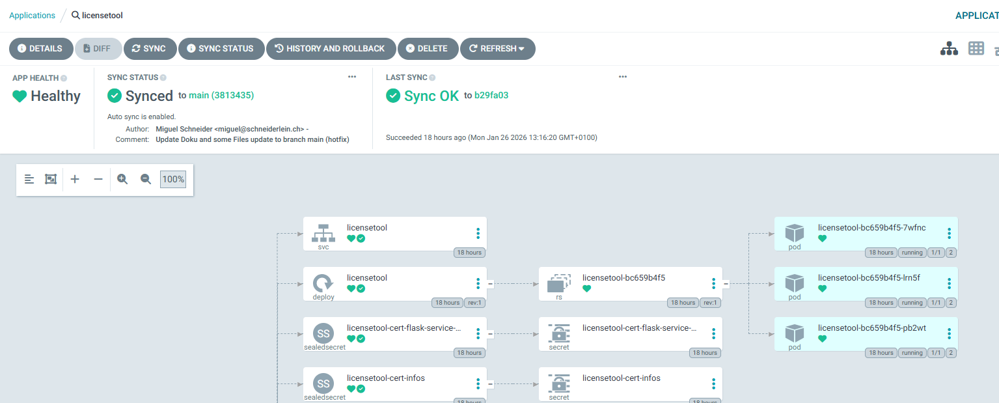
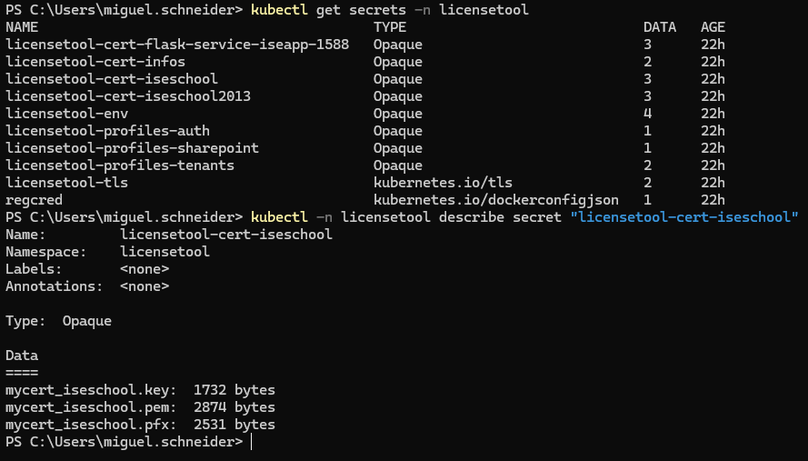
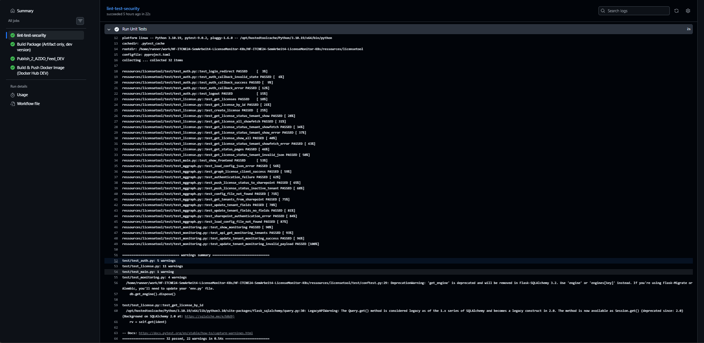
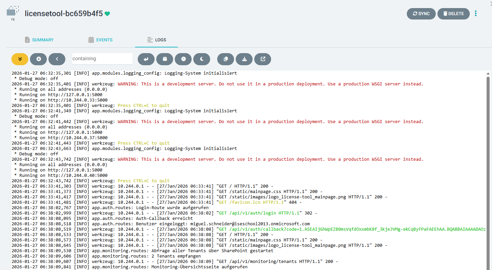

#  Kontrollieren (Control) Phase

Die Control-Phase ist der letzte Schritt im DMAIC-Zyklus eines Lean-/Six-Sigma-Projekts. Ziel dieser Phase ist es, sicherzustellen, dass die in der Improve-Phase umgesetzten Massnahmen langfristig stabil funktionieren und Rückfälle vermieden werden. In diesem Projekt steht besonders im Fokus, dass der Microservice korrekt arbeitet, kontinuierlich überwacht wird und automatisiert auf kritische Zustände reagiert.


[Quelle](../Quellverzeichnis/index.md#control-phase) 

## Ziele der Control-Phase

Die Control-Phase verfolgt folgende Ziele:

- Sicherstellung eines **stabilen Kubernetes-Deployments**
- Nachvollziehbare und versionierte **GitOps-Deployments mit Argo CD**
- Vermeidung manueller Eingriffe durch **automatisierte Rollouts**
- Kontrolle des **Secret- und Zertifikats-Handlings**
- Qualitätssicherung durch **automatisierte Tests**
- Transparenz durch **Logs, Status- und Health-Checks**
- Reproduzierbarkeit des Systems nach vollständigem Redeploy

---

## Kontrollmechanismen im Überblick

| Mechanismus              | Beschreibung                                           |
| ------------------------ | ------------------------------------------------------ |
| GitOps (Argo CD)         | Deklarative Steuerung aller Deployments über Git       |
| Kubernetes Health Checks | Überwachung von Pod-Status, Readiness & Liveness       |
| Pytest                   | Automatisierte Tests für Kernlogik der Anwendung       |
| Logging                  | Zentrale Logausgabe der Container über `kubectl logs`  |
| Secret-Management        | Zertifikate & Auth-Profile als Kubernetes Secrets      |
| Redeploy-Tests           | Vollständiger Neuaufbau des Namespaces                 |
| Zugriffskontrolle        | Microsoft-Authentifizierung via gemountete Zertifikate |

---

## GitOps-Kontrolle mit Argo CD

Die zentrale Kontrollinstanz des Deployments ist **Argo CD**.  
Alle Kubernetes-Ressourcen (Deployments, Services, Secrets, ConfigMaps) werden **ausschliesslich deklarativ über Git verwaltet**.

### Kontrollaspekte

- Abgleich von **Soll-Zustand (Git)** und **Ist-Zustand (Cluster)**
- Automatische Synchronisation bei Änderungen
- Sichtbare Abweichungen („OutOfSync“) im Argo-Dashboard
- Rollbacks jederzeit möglich durch Git-Historie




---

## Kubernetes-Betriebskontrolle

Zur Überprüfung des stabilen Betriebs wurden folgende Kubernetes-Kontrollen eingesetzt:

### Pod- und Deployment-Status

`kubectl get pods -n licensetool kubectl get deploy -n licensetool`

```Output
PS C:\Users\miguel.schneider> kubectl get pods -n licensetool
NAME                          READY   STATUS    RESTARTS      AGE
licensetool-bc659b4f5-7wfnc   1/1     Running   2 (16m ago)   18h
licensetool-bc659b4f5-lrn5f   1/1     Running   2 (16m ago)   18h
licensetool-bc659b4f5-pb2wt   1/1     Running   2 (16m ago)   18h
PS C:\Users\miguel.schneider> kubectl get deploy -n licensetool
NAME          READY   UP-TO-DATE   AVAILABLE   AGE
licensetool   3/3     3            3           18h
PS C:\Users\miguel.schneider>
```

Erwartetes Verhalten:

- Pods befinden sich im Status `Running`
- Deployments zeigen `READY = desired replicas`
- Keine Pods im Zustand `CrashLoopBackOff` oder `Error`


_Get all Pods in Cluster_

---

### Health-Checks & Neustarts

Durch die containerisierte Architektur kann Kubernetes fehlerhafte Pods automatisch neu starten.  
Fehlerfälle (z. B. fehlende Zertifikate) wurden gezielt provoziert und überprüft.

📸 **Screenshot einfügen:**

- Pod-Restart nach fehlerhaftem Secret
- Erfolgreicher Neustart nach Korrektur

---

## Secret- und Zertifikats-Kontrolle

Ein zentraler Bestandteil der Control-Phase ist die **Absicherung sensibler Daten**.

### Kontrollmechanismen

- Zertifikate und Auth-Profile liegen ausschliesslich als Kubernetes Secrets vor
- Keine sensiblen Daten im Git-Repository
- Mount-Pfade werden im Deployment definiert
- Anwendung startet nur bei korrekt gemounteten Secrets


_Get all Secrets und describe secret_

```yaml
template:
    metadata:
      labels:
        app: licensetool
    spec:
      containers:
        - envFrom:
            - secretRef:
                name: licensetool-env
          image: docker.io/radballmigi/licensemonitor-dev:latest
          imagePullPolicy: Always
          name: licensetool
          ports:
            - containerPort: 5000
              name: http
              protocol: TCP
          resources: {}
          terminationMessagePath: /dev/termination-log
          terminationMessagePolicy: File
          volumeMounts:
            - mountPath: /app/config-profiles/auth
              name: profiles-auth
              readOnly: true
            - mountPath: /app/config-profiles/sharepoint
              name: profiles-sharepoint
              readOnly: true
            - mountPath: /app/config-profiles/tenants
              name: profiles-tenants
              readOnly: true
            - mountPath: /app/certs/infos
              name: certs-infos
              readOnly: true
            - mountPath: /app/certs/iseschool
              name: licensetool-cert-iseschool
              readOnly: true
            - mountPath: /app/certs/iseschool2013
              name: licensetool-cert-iseschool2013
              readOnly: true
            - mountPath: /app/certs/flask-service-iseapp-1588
              name: licensetool-cert-flask-service-iseapp-1588
              readOnly: true
```

_Ausschnitt aus Deploy Manifest_

---

## Testautomatisierung mit Pytest

Zur Sicherstellung der Anwendungslogik wird weiterhin **pytest** eingesetzt.  
Die Tests prüfen die Kernfunktionen der Lizenzverarbeitung unabhängig von der Kubernetes-Infrastruktur.

### Getestete Bereiche

- Abruf von Lizenzdaten
- Verarbeitung und Aggregation
- Fehlerbehandlung bei ungültiger Konfiguration
- Simulation von API-Fehlern
- Validierung der Rückgabewerte

Beispiel:

```python
@pytest.fixture(scope='function')
def client(app, db):
    with app.app_context():
        create_test_data()
        test_client = app.test_client()
        test_client.post('/api/v1/auth/test-login')
        yield test_client
        db.session.remove()
        db.get_engine().dispose()
```

Mocking stellt sicher, dass keine externen Abhängigkeiten (Microsoft Graph, SharePoint) notwendig sind.

Die Pytests werden in der Ci-Pipeline bereits gemacht.

```yaml
jobs:
  tests:
    name: lint-test-security
    runs-on: ubuntu-latest
    steps:
      - name: Checkout repository
        uses: actions/checkout@v4
        
      - name: Setup Python
        uses: actions/setup-python@v5
        with:
          python-version: '3.10'
          cache: 'pip'
          cache-dependency-path: |
            ${{ vars.WORKDIR }}/licensetool/requirements.txt
            
      - name: Install dependencies
        run: |
          python -m pip install --upgrade pip
          pip install -r ${{ vars.WORKDIR }}/licensetool/requirements.txt
          pip install pytest flake8 black isort mypy bandit ruff
  
      - name: Run Unit Tests
        run: |
          pytest ${{ vars.WORKDIR }}/licensetool/test/. -v --tb=short

      - name: Run Integration Tests
        run: |
          pytest ${{ vars.WORKDIR }}/licensetool/test/. -v --tb=short
        continue-on-error: false
```

_Ci-Pipeline-yaml ausschnitt Pytests_


_Output Ci-Pipeline Pytests_

---

## Logging & Fehlerkontrolle

Die Anwendung schreibt Logs direkt auf `stdout`, wodurch diese über Kubernetes ausgelesen werden können:

`kubectl logs -l app=licensetool -n licensetool`


_Logs des Lizenztools via CLI_

Nebst das wir die Logs über Kubernetes auslesen können, Können wir auch über ArgoCD die Logs konsultieren:


_Logs des Lizenztools via ArgoCD_

### Kontrollierte Fehlerfälle

- Fehlende Tenant-Konfiguration
- Ungültige JSON-Profile
- Fehlerhafte Authentifizierungsdaten
- API-Fehler externer Services

Erwartetes Verhalten:

- Fehler werden sauber geloggt
- Anwendung stürzt nicht ab
- HTTP-Antwort bleibt kontrolliert (`200` oder definierter Fehlercode)

📸 **Screenshot einfügen:**

- Log-Auszug mit ERROR- und INFO-Einträgen

---

## Redeploy- und Stabilitätstest

Als finaler Kontrollschritt wurde das System vollständig neu aufgebaut:

`kubectl delete namespace licensetool kubectl apply -k .`

### Erfolgsbewertung

- Namespace wird neu erstellt
- Secrets werden korrekt geladen
- Pods starten ohne manuelle Eingriffe
- Argo CD synchronisiert automatisch
- Anwendung ist erreichbar und funktionsfähig

✅ **Ergebnis:**  
Das System ist vollständig **reproduzierbar und stabil betreibbar**.

---

## Zusammenfassung der Control-Massnahmen

| Massnahme                             | Umgesetzt |
| ------------------------------------- | --------- |
| GitOps mit Argo CD                    | Ja        |
| Automatisierte Kubernetes-Deployments | Ja        |
| Secret-Management über K8s            | Ja        |
| Reproduzierbarer Redeploy             | Ja        |
| Logging & Fehlerkontrolle             | Ja        |
| Automatisierte Tests                  | Ja        |
| Kein manuelles Nachkonfigurieren      | Ja        |

---

## Fazit

Die Control-Phase bestätigt, dass die im Projekt umgesetzten Massnahmen **nicht nur technisch korrekt**, sondern auch **nachhaltig und betriebssicher** sind.  
Durch die Kombination aus **GitOps**, **Kubernetes-Mechanismen**, **automatisierten Tests** und **klaren Kontrollpunkten** ist das System langfristig wartbar und robust gegenüber Änderungen.

Damit ist sichergestellt, dass zukünftige Erweiterungen oder Anpassungen durchgeführt werden können, **ohne die Stabilität oder Sicherheit des Systems zu gefährden**.