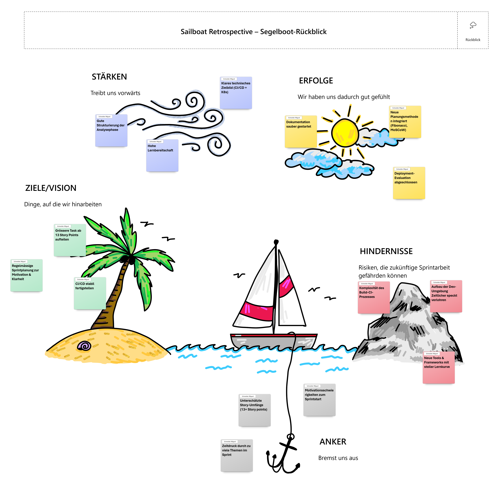

# Sprint 1 – Evaluation & Grundlegende CI/CD-Pipeline
**Zeitraum:** 12.11.2025 – 17.11.2025  
**Team:** Miguel Schneider  
**Sprint-Ziel:** Eine fundierte Deployment-Evaluation erstellen, Dev-umgebung aufbauen und die grundlegende CI/CD-Pipeline (inkl. Build & Artefakt-Upload nach Azure DevOps) funktionsfähig bereitstellen.

---

## Kontext & Fokus
- **Ausgangslage:**  
  Projektstart der Semesterarbeit. Ziel ist es, sowohl die technische Basis (Pipeline) als auch konzeptionelle Entscheidungen (Deployment-Strategie) frühzeitig zu sichern.
  
- **Fokus dieses Sprints:**  
  - Erstellung einer Vergleichsevaluation (Lokal vs. Cloud) bezüglich Deployment.  
  - Entwicklungsumgebung aufbauen, für Basistests.
  - Aufbau einer funktionierenden CI/CD-Pipeline mittels GitHub Actions.  
  - Build-Prozess erstellen, der ein Artefakt erzeugt.  
  - Erfolgreicher Upload des Artefakts nach Azure DevOps (Artifact Feed oder Storage).  

---

## Sprint Backlog
Backlog gemäss User Stories des [Meilenstein 1 - 1. Sprint](https://github.com/Radball-Migi/HF-ITCNE24-SemArbeit4-LicenseMonitor-K8s/milestone/2)

| #                                                                                       | User Story                                                    | Priorität | Story Points | Akzeptanzkriterien erfüllt? |
| --------------------------------------------------------------------------------------- | ------------------------------------------------------------- | --------- | ------------ | --------------------------- |
| [#1](https://github.com/Radball-Migi/HF-ITCNE24-SemArbeit4-LicenseMonitor-K8s/issues/1) | Evaluate Deployment Options                                   | Must have | 3            |                             |
| [#5](https://github.com/Radball-Migi/HF-ITCNE24-SemArbeit4-LicenseMonitor-K8s/issues/5) | Prepare Kubernetes Clusteototype                              | Must have | 5            |                             |
| [#6](https://github.com/Radball-Migi/HF-ITCNE24-SemArbeit4-LicenseMonitor-K8s/issues/6) | Implement Build Pipeline with GitHub Actions and Azure DevOps | Must have | 13           |                             |

---

## Aufgaben (Tasks)

| Task-ID | Story # | Task-Beschreibung                                   | Verantwortlich | Status |
| ------- | ------- | --------------------------------------------------- | -------------- | ------ |
| T-1     | 1       | Kriterienkatalog für Deployment erarbeiten          | Miguel         | Todo   |
| T-2     | 1       | Lokal vs. Cloud (AWS/Azure) analysieren             | Miguel         | Todo   |
| T-3     | 1       | Tabelle & Entscheiddokument erstellen               | Miguel         | Todo   |
| T-4     | 5       | Installieren von Minicube                           | Miguel         | Todo   |
| T-5     | 5       | Dev-Umgebung einrichten                             | Miguel         | Todo   |
| T-6     | 6       | GitHub Actions Workflow erstellen                   | Miguel         | Todo   |
| T-7     | 6       | Build-Schritt implementieren (Generierung Artefakt) | Miguel         | Todo   |
| T-8     | 6       | Testing-Sektion einrichten                          | Miguel         | Todo   |
| T-9     | 6       | Azure DevOps Verbindung herstellen                  | Miguel         | Todo   |
| T-10    | 6       | Artefakt erfolgreich nach Azure hochladen           | Miguel         | Todo   |

---
## Definition of Done (DoD) für diesen Sprint

- [x] Evaluation schriftlich dokumentiert (Markdown)  
- [x] Vergleichstabelle vollständig und begründet  
- [ ] GitHub Actions Pipeline läuft erfolgreich durch  
- [ ] Build generiert ein Artefakt  
- [ ] Artefakt wird nach Azure DevOps übermittelt  
- [ ] Alle Stories abgeschlossen  

---
## Sprint Review

**Datum:** 17.11.2025  
**Teilnehmer:** Miguel

### Erreichte Ergebnisse
- Deployment-Evaluation abgeschlossen  

### Offene Punkte / Nicht erreichte Ziele
- CI/CD-Pipeline läuft erfolgreich durch  
- Artefakt wird nach Azure DevOps übertragen  
---

## Retrospektive

**Datum:** 17.11.2025  
**Methode:** Sailboat - Segelschiff

_Retrospektive Sprint 1 nach der Segelschiffmethode_

### Verbesserungs-Massnahmen (Action Items)

| #   | Massnahme                                                                 | Verantwortlich | Ziel-Sprint | Status |
| --- | ------------------------------------------------------------------------- | -------------- | ----------- | ------ |
| 1   | User Stories mit >13 SP aufteilen und neu strukturieren                   | Miguel         | Sprint 2    | Offen  |
| 2   | Ci Pipeline bereitstellen (Bis Build Job)                                 | Miguel         | Sprint 2    | Offen  |
| 3   | Entwicklungsumgebung priorisieren und minimal lauffähig bereitstellen     | Miguel         | Sprint 2    | Offen  |
| 4   | Sprintplanung präziser gestalten (MoSCoW & Fibonacci konsequent anwenden) | Miguel         | Sprint 2    | Offen  |

---

## Zusammenfassung des Sprints

- **Sprint-Ziel erreicht?** Nein  
    Das Sprintziel wurde nicht erreicht, da sowohl der Aufbau der CI/CD-Pipeline als auch der Build-/Artefaktprozess noch nicht erfolgreich umgesetzt wurden.
    
- **Wichtigste Ergebnisse:**
    - Deployment-Evaluation abgeschlossen und fundierte Entscheidungsgrundlage geschaffen
    - Dokumentationsstruktur erfolgreich gestartet
    - Einführung und Anwendung neuer Planungsmethoden (Fibonacci, MoSCoW)
      
- **Impact auf das Gesamtprojekt:**  
    Die abgeschlossene Evaluation liefert eine klare architektonische Richtung für den weiteren Projektverlauf.  
    Durch die Methodenerweiterung und die initiale Dokumentationsstruktur wurde eine solide Basis geschaffen, auf der Sprint 2 aufbauen kann.  
    Gleichzeitig wurde sichtbar, dass die technischen Aufgaben (CI, Build, Dev-Umgebung) mehr Zeit benötigen und in Sprint 2 priorisiert werden müssen.
