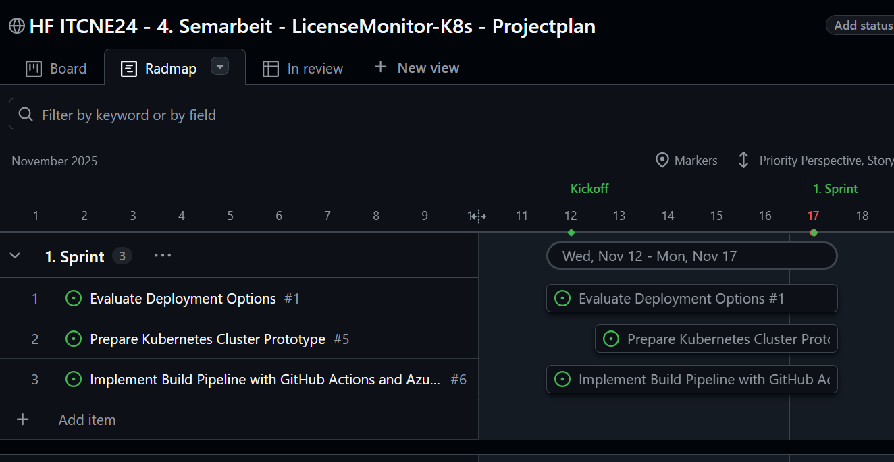

# Sprint 2 – Ausbau CI/CD Pipeline und App Release
**Zeitraum:** 24.11.2025 – 15.12.2025  
**Team:** Miguel Schneider  
**Sprint-Ziel:** Eine durchgängige CI/CD-Pipeline bereitstellen, welche die Anwendung baut, versioniert und ein deploybares Artefakt erzeugt. Zusätzlich soll die Anwendung als Kubernetes-Deployment und -Service im Minikube bereitgestellt werden, sodass am Ende des Sprints ein erster funktionsfähiger App-Release im Cluster erreichbar und testbar ist.

---

## Kontext & Fokus
- **Ausgangslage:**  
  Im ersten Sprint wurden die Grundlagen für die CI/CD-Pipeline gelegt, jedoch ist der vollständige Build- und Artefaktprozess noch nicht abgeschlossen. Die Anwendung wurde bisher nicht in einer Kubernetes-Umgebung bereitgestellt, sodass kein durchgängiger End-to-End-Prozess existiert. Für den Projektfortschritt ist es notwendig, die Pipeline zu vervollständigen und erstmals ein funktionsfähiges Deployment in Minikube bereitzustellen.
  
- **Fokus dieses Sprints:**  
  - Erweiterung und Fertigstellung der CI/CD-Pipeline aus Sprint 1.
  - Sicherstellen, dass die Pipeline ein versioniertes, deploybares Artefakt erzeugt.
  - Erstellung eines Kubernetes Deployments für die Applikation.
  - Aufbau eines Kubernetes Services zur internen und externen Erreichbarkeit der App.
  - Bereitstellung einer ersten funktionierenden Release-Version im Minikube-Cluster.
  - Durchführung erster manueller Funktionstests (Smoke-Tests) direkt im Cluster.
  - Dokumentation der Deployment-Schritte und Testresultate.

---

## Sprint Backlog
Backlog gemäss User Stories des [Meilenstein 2 - 2. Sprint](https://github.com/Radball-Migi/HF-ITCNE24-SemArbeit4-LicenseMonitor-K8s/milestone/3)

| #                                                                                       | User Story                                                    | Priorität | Story Points | Akzeptanzkriterien erfüllt? |
| --------------------------------------------------------------------------------------- | ------------------------------------------------------------- | --------- | ------------ | --------------------------- |
| [#1](https://github.com/Radball-Migi/HF-ITCNE24-SemArbeit4-LicenseMonitor-K8s/issues/1) | Evaluate Deployment Options                                   | Must have | 3            |                             |
| [#5](https://github.com/Radball-Migi/HF-ITCNE24-SemArbeit4-LicenseMonitor-K8s/issues/5) | Prepare Kubernetes Clusteototype                              | Must have | 5            |                             |
| [#6](https://github.com/Radball-Migi/HF-ITCNE24-SemArbeit4-LicenseMonitor-K8s/issues/6) | Implement Build Pipeline with GitHub Actions and Azure DevOps | Must have | 13           |                             |

_Abbildung der [Roadmap des 2. Sprints](https://github.com/users/Radball-Migi/projects/9/views/8)_ 

---

## Aufgaben (Tasks)

| Task-ID | Story # | Task-Beschreibung                                   | Verantwortlich | Status |
| ------- | ------- | --------------------------------------------------- | -------------- | ------ |
| T-1     | 1       | Kriterienkatalog für Deployment erarbeiten          | Miguel         | Todo   |

---
## Sprint Review

**Datum:** 15.12.2025  
**Teilnehmer:** Miguel

### Erreichte Ergebnisse
-  

### Offene Punkte / Nicht erreichte Ziele

---

## Retrospektive

**Datum:** 15.12.2025  
**Methode:** Sailboat - Segelschiff

_Retrospektive Sprint 2 nach der Segelschiffmethode_

### Verbesserungs-Massnahmen (Action Items)

| #   | Massnahme | Verantwortlich | Ziel-Sprint | Status |
| --- | --------- | -------------- | ----------- | ------ |
| 1   |           |                |             |        |
|     |           |                |             |        |

---

## Zusammenfassung des Sprints

- **Sprint-Ziel erreicht?**
  
- **Wichtigste Ergebnisse:**
    
      
- **Impact auf das Gesamtprojekt:**  
    
