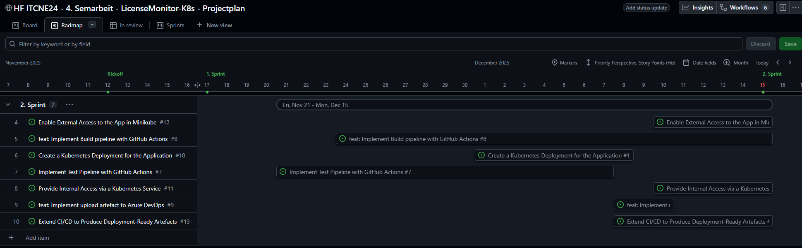
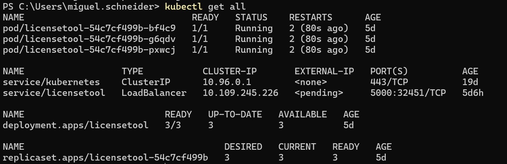
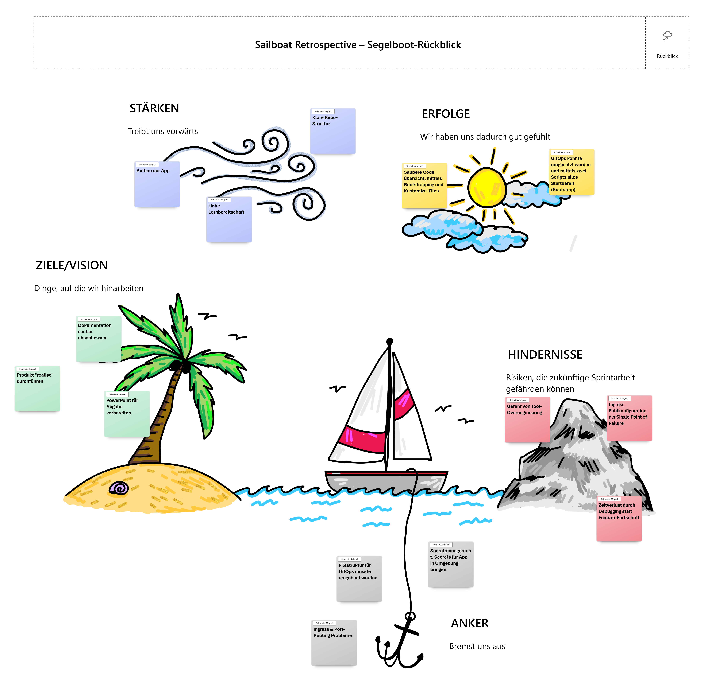

# Sprint 3 – Ausarbeiten der Dokumentation, Aufbau Kubernetes und Argo CD
**Zeitraum:** 16.12.2025 – 23.01.2026  
**Team:** Miguel Schneider  
**Sprint-Ziel:** 

---

## Kontext & Fokus
- **Ausgangslage:**  
  Im ersten Sprint wurden die Grundlagen für die CI/CD-Pipeline gelegt, jedoch ist der vollständige Build- und Artefaktprozess noch nicht abgeschlossen. Die Anwendung wurde bisher nicht in einer Kubernetes-Umgebung bereitgestellt, sodass kein durchgängiger End-to-End-Prozess existiert. Für den Projektfortschritt ist es notwendig, die Pipeline zu vervollständigen und erstmals ein funktionsfähiges Deployment in Minikube bereitzustellen.
  
- **Fokus dieses Sprints:**  
  - Erweiterung und Fertigstellung der CI/CD-Pipeline aus Sprint 1.
  - Sicherstellen, dass die Pipeline ein versioniertes, deploybares Artefakt erzeugt.
  - Erstellung eines Kubernetes Deployments für die Applikation.
  - Aufbau eines Kubernetes Services zur internen und externen Erreichbarkeit der App.
  - Bereitstellung einer ersten funktionierenden Release-Version im Minikube-Cluster.
  - Durchführung erster manueller Funktionstests (Smoke-Tests) direkt im Cluster.
  - Dokumentation der Deployment-Schritte und Testresultate.

---

## Sprint Backlog
Backlog gemäss User Stories des [Meilenstein 2 - 2. Sprint](https://github.com/Radball-Migi/HF-ITCNE24-SemArbeit4-LicenseMonitor-K8s/milestone/3)

| #                                                                                         | User Story                                         | Priorität   | Story Points | Akzeptanzkriterien erfüllt? |
| ----------------------------------------------------------------------------------------- | -------------------------------------------------- | ----------- | ------------ | --------------------------- |
| [#7](https://github.com/Radball-Migi/HF-ITCNE24-SemArbeit4-LicenseMonitor-K8s/issues/7)   | Implement Test Pipeline with GitHub Actions        | Must have   | 5            |                             |
| [#8](https://github.com/Radball-Migi/HF-ITCNE24-SemArbeit4-LicenseMonitor-K8s/issues/8)   | feat: Implement Build pipeline with GitHub Actions | Must have   | 5            |                             |
| [#9](https://github.com/Radball-Migi/HF-ITCNE24-SemArbeit4-LicenseMonitor-K8s/issues/9)   | feat: Implement upload artefact to Azure DevOps    | Should have | 3            |                             |
| [#10](https://github.com/Radball-Migi/HF-ITCNE24-SemArbeit4-LicenseMonitor-K8s/issues/10) | Create a Kubernetes Deployment for the Application | Must have   | 5            |                             |
| [#11](https://github.com/Radball-Migi/HF-ITCNE24-SemArbeit4-LicenseMonitor-K8s/issues/11) | Provide Internal Access via a Kubernetes Service   | Must have   | 5            |                             |
| [#12](https://github.com/Radball-Migi/HF-ITCNE24-SemArbeit4-LicenseMonitor-K8s/issues/12) | Enable External Access to the App in Minikube      | Must have   | 3            |                             |
| [#13](https://github.com/Radball-Migi/HF-ITCNE24-SemArbeit4-LicenseMonitor-K8s/issues/13) | Extend CI/CD to Produce Deployment-Ready Artefacts | Should have | 5            |                             |

_Abbildung der [Roadmap des 2. Sprints](https://github.com/users/Radball-Migi/projects/9/views/8)_ 

---

## Aufgaben (Tasks)

| Task-ID | Story # | Task-Beschreibung                                                | Verantwortlich | Status     |
| ------- | ------- | ---------------------------------------------------------------- | -------------- | ---------- |
| T-1     | 7       | GitHub Actions Test-Pipeline (pytest, ruff ) einrichten          | Miguel         | Done       |
| T-2     | 7       | CI-Abbruch bei Lint-/Testfehler konfigurieren                    | Miguel         | Done       |
| T-3     | 8       | Dockerfile für Flask Anwendung erstellen                         | Miguel         | Done       |
| T-4     | 8       | Automatisierter Docker Build & Push in GitHub Actions einrichten | Miguel         | Done       |
| T-5     | 9       | Python-Artefakt (Package) erstellen                              | Miguel         | Done       |
| T-6     | 9       | Automatischen Upload des Artefakts in Azure DevOps konfigurieren | Miguel         | Done       |
| T-7     | 10      | Kubernetes Deployment YAML für App erstellen                     | Miguel         | Done       |
| T-8     | 10      | Deployment lokal in Minikube testen                              | Miguel         | Done       |
| T-9     | 11      | Kubernetes Service für interne Erreichbarkeit konfigurieren      | Miguel         | Done       |
| T-10    | 11      | Service-Port ↔ TargetPort Zuordnung testen                       | Miguel         | Done       |
| T-11    | 12      | NGINX Ingress Controller in Minikube aktivieren                  | Miguel         | Done       |
| T-12    | 12      | Ingress YAML für externen Zugriff erstellen                      | Miguel         | Done       |
| T-13    | 12      | Externen Zugriff (Ingress Routing) debuggen und validieren       | Miguel         | Done       |
| T-14    | 13      | CI/CD erweitern: Deployment-ready Artefakte erzeugen             | Miguel         | InProgress |
| T-15    | 13      | Deployment-Oberfläche & Artefakt-Flow dokumentieren              | Miguel         | Tod        |

---
## Sprint Review

**Datum:** 23.01.2026 
**Teilnehmer:** Miguel

### Erreichte Ergebnisse

- Die offenen Issues aus **Sprint 1** wurden erfolgreich aufgearbeitet und abgeschlossen.
    
- Die ursprüngliche Story [**Issue #6**](https://github.com/Radball-Migi/HF-ITCNE24-SemArbeit4-LicenseMonitor-K8s/issues/6) wurde im aktuellen Sprint sinnvoll in drei Sub-Issues (**Issues [#7](https://github.com/Radball-Migi/HF-ITCNE24-SemArbeit4-LicenseMonitor-K8s/issues/7), [#8](https://github.com/Radball-Migi/HF-ITCNE24-SemArbeit4-LicenseMonitor-K8s/issues/8), [#9](https://github.com/Radball-Migi/HF-ITCNE24-SemArbeit4-LicenseMonitor-K8s/issues/9)**) aufgeteilt, um eine genauere Aufwandsabschätzung und bessere Story-Point-Vergabe zu ermöglichen.
- Es wurde eine funktionierende **CI/CD-Pipeline** aufgebaut, welche automatisiert:
    - Syntax-Tests (Linting mit Ruff und isort)
    - Smoke-Tests  
    ausführt.
- Ein **Docker-Artefakt** der Applikation wird automatisiert erstellt und in **Docker Hub** veröffentlicht und kann von dort aus für Deployments bezogen werden.
- Zusätzlich wird als Bonus ein **Python-Artefakt** der Applikation in **Azure DevOps** bereitgestellt.
- Eine **Versionierungsstrategie** wurde eingeführt, bei der:
    - pro Push automatisch eine **Development-Version** erzeugt wird,
    - eine separate **Release-Version** vorbereitet ist und im nächsten Sprint finalisiert wird.
- Die Anwendung ist erfolgreich containerisiert und kann in der Zielumgebung betrieben werden.

_Create Cluster und install ArgoCD_

_Bild des Clusters in Minikube_

### Offene Punkte / Nicht erreichte Ziele

- Die **Dokumentation** konnte im aktuellen Sprint nicht vollständig nachgeführt werden, da der Fokus stark auf der technischen Umsetzung sowie auf CI/CD- und Infrastruktur-Themen lag.
- Der Aufbau und die Stabilisierung der **CI-Pipeline** (insbesondere Linting mit Ruff und isort) haben mehr Zeit als geplant beansprucht.
- Aktuell besteht in der Applikation noch ein **Problem beim Login**, da die verwendeten **Zertifikate noch nicht korrekt funktionieren**.
- Die Behebung des Login- und Zertifikatsproblems ist bereits analysiert und wird **gezielt im kommenden Sprint umgesetzt**.
- Die finale **Release-Versionierung** ist vorbereitet, aber noch nicht produktiv umgesetzt.

---

## Retrospektive

**Datum:** 15.12.2025  
**Methode:** Sailboat - Segelschiff

_Retrospektive Sprint 3 nach der Segelschiffmethode_

### Verbesserungs-Massnahmen (Action Items)

| #   | Massnahme                                                               | Verantwortlich | Ziel-Sprint | Status |
| --- | ----------------------------------------------------------------------- | -------------- | ----------- | ------ |
| 1   | Login-Problem beheben und Zertifikats-Handling in der App stabilisieren | Miguel         | Sprint 3    | Offen  |
| 2   | Technische Dokumentation (CI/CD, K8s, Deployment-Flow) nachführen       | Miguel         | Sprint 3    | Offen  |
| 3   | Release-Versionierung final umsetzen und dokumentieren                  | Miguel         | Sprint 3    | Offen  |
| 4   | Deployment-Ablauf standardisieren (Image → Cluster → Ingress)           | Miguel         | Sprint 3    | Offen  |

---

## Zusammenfassung des Sprints

- **Sprint-Ziel erreicht?**  
    Das Sprint-Ziel wurde **grösstenteils erreicht**. Die geplanten technischen Grundlagen im Bereich CI/CD, Containerisierung und Kubernetes-Deployment konnten erfolgreich umgesetzt werden. Einzelne Themen (Dokumentation und Login-Problem) wurden bewusst in den nächsten Sprint verschoben.
    
- **Wichtigste Ergebnisse:**
    - Aufbau einer stabilen CI/CD-Pipeline mit automatisierten Syntax- und Smoke-Tests
    - Erstellung und Veröffentlichung eines Docker-Artefakts auf Docker Hub
    - Bereitstellung eines zusätzlichen Python-Artefakts in Azure DevOps
    - Erfolgreiche Containerisierung und Deployment der Applikation in Minikube
    - Einführung einer automatischen Versionierung für Development-Builds
    - Aufteilung einer zu grossen Story in mehrere Sub-Issues zur besseren Planung

- **Impact auf das Gesamtprojekt:**  
    Der Sprint hat eine **zentrale technische Basis** für das Projekt geschaffen. Durch die automatisierten Pipelines und die funktionierende Kubernetes-Infrastruktur ist das Projekt nun skalierbar, reproduzierbar und bereit für weitere funktionale Erweiterungen sowie für die Einführung eines stabilen Release-Prozesses im nächsten Sprint.
