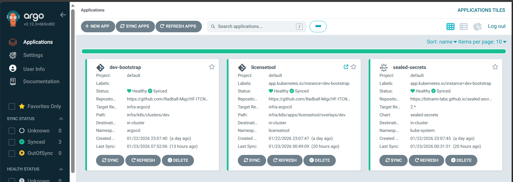
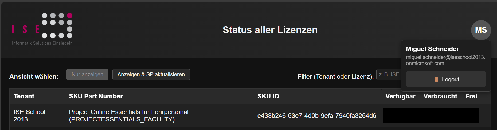
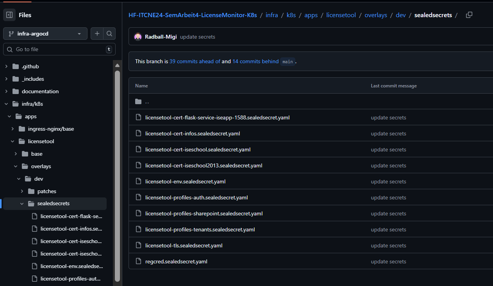
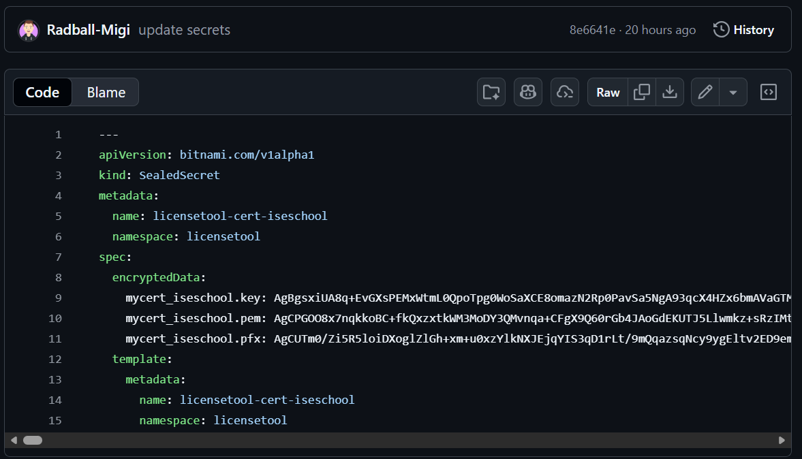

# Sprint 3 – Stabilisierung, Security & GitOps-Einführung

**Zeitraum:** 16.12.2025 – 23.01.2026  
**Team:** Miguel Schneider  
**Sprint-Ziel:**  
Stabilisierung der Applikation durch Behebung des Login- und Zertifikatsproblems, Migration sensibler Konfigurationen in Kubernetes-native Ressourcen sowie Einführung eines GitOps-basierten Deployment-Ansatzes mit Argo CD. Zusätzlich soll die Projektdokumentation an den aktuellen technischen Stand angepasst werden.

---

## Kontext & Fokus

- **Ausgangslage:**  
    Nach Sprint 2 stand eine funktionierende CI/CD-Pipeline sowie ein lauffähiges Kubernetes-Deployment in Minikube zur Verfügung. Kritische Themen blieben jedoch offen:
    
    - Login gegen Microsoft funktionierte aufgrund fehlerhafter Zertifikats- und Profilintegration nicht stabil.
        
    - Zertifikate und Authentifizierungsprofile waren nicht Kubernetes-konform eingebunden.
        
    - Deployments erfolgten teilweise manuell und ohne GitOps-Ansatz.
        
    - Die Projektdokumentation entsprach nicht mehr vollständig dem aktuellen technischen Stand.
        
- **Fokus dieses Sprints:**
    
    - **Zu Beginn des Sprints** lag der Fokus bewusst auf der **Aktualisierung und Nachführung der Dokumentation**, um eine saubere und konsistente Ausgangslage zu schaffen.
        
    - Im weiteren Verlauf verlagerte sich der Schwerpunkt erneut stark auf die **praktische Umsetzung**, insbesondere:
        - Analyse und Behebung des Login- und Zertifikatsproblems
        - Migration sensibler Konfigurationen in Kubernetes Secrets
        - Einführung von Sealed Secrets
        - Aufbau eines GitOps-Deployments mit Argo CD
    - Durch den hohen technischen Aufwand und die Problembehebung im Bereich Security und Authentifizierung **lit das agile Arbeiten teilweise**, insbesondere in Bezug auf detaillierte Sprint-Planung und laufende Re-Priorisierung.

---

## Sprint Backlog

Backlog gemäss User Stories des  
[Meilenstein 3 – 3. Sprint](https://github.com/Radball-Migi/HF-ITCNE24-SemArbeit4-LicenseMonitor-K8s/milestone/4)

| #   | Issue                                                                                     | User Story                                                     | Priorität | Akzeptanzkriterien erfüllt? |
| --- | ----------------------------------------------------------------------------------------- | -------------------------------------------------------------- | --------- | --------------------------- |
| #15 | [#15](https://github.com/Radball-Migi/HF-ITCNE24-SemArbeit4-LicenseMonitor-K8s/issues/15) | Update project documentation                                   | Must have | Teilweise                   |
| #20 | [#20](https://github.com/Radball-Migi/HF-ITCNE24-SemArbeit4-LicenseMonitor-K8s/issues/20) | Migrate certificates and authentication profiles to Kubernetes | Must have | Ja                          |
| #21 | [#21](https://github.com/Radball-Migi/HF-ITCNE24-SemArbeit4-LicenseMonitor-K8s/issues/21) | Setup Sealed Secrets                                           | Must have | Ja                          |
| #22 | [#22](https://github.com/Radball-Migi/HF-ITCNE24-SemArbeit4-LicenseMonitor-K8s/issues/22) | Install and configure Argo CD                                  | Must have | Ja                          |
| #23 | [#23](https://github.com/Radball-Migi/HF-ITCNE24-SemArbeit4-LicenseMonitor-K8s/issues/23) | Bootstrap application deployment via Argo CD                   | Must have | Weitgehend                  |

---

## Aufgaben (Tasks)

| Task-ID | Story                                                                                     | Task-Beschreibung                                             | Verantwortlich | Status     |
| ------- | ----------------------------------------------------------------------------------------- | ------------------------------------------------------------- | -------------- | ---------- |
| T-1     | [#15](https://github.com/Radball-Migi/HF-ITCNE24-SemArbeit4-LicenseMonitor-K8s/issues/15) | Dokumentation analysieren und aktualisieren                   | Miguel         | InProgress |
| T-2     | [#20](https://github.com/Radball-Migi/HF-ITCNE24-SemArbeit4-LicenseMonitor-K8s/issues/20) | Analyse Login- und Zertifikatsproblem                         | Miguel         | Done       |
| T-3     | [#20](https://github.com/Radball-Migi/HF-ITCNE24-SemArbeit4-LicenseMonitor-K8s/issues/20) | Migration bestehender Zertifikate in Kubernetes Secrets       | Miguel         | Done       |
| T-4     | [#20](https://github.com/Radball-Migi/HF-ITCNE24-SemArbeit4-LicenseMonitor-K8s/issues/20) | Anpassung der Deployment-Manifeste (Secret Mounts)            | Miguel         | Done       |
| T-5     | [#21](https://github.com/Radball-Migi/HF-ITCNE24-SemArbeit4-LicenseMonitor-K8s/issues/21) | Einführung Sealed Secrets zur sicheren Ablage sensibler Daten | Miguel         | Done       |
| T-6     | [#20](https://github.com/Radball-Migi/HF-ITCNE24-SemArbeit4-LicenseMonitor-K8s/issues/20) | Verifikation Microsoft Login aus dem Cluster                  | Miguel         | Done       |
| T-7     | [#22](https://github.com/Radball-Migi/HF-ITCNE24-SemArbeit4-LicenseMonitor-K8s/issues/22) | Installation und Grundkonfiguration von Argo CD               | Miguel         | Done       |
| T-8     | [#23](https://github.com/Radball-Migi/HF-ITCNE24-SemArbeit4-LicenseMonitor-K8s/issues/23) | GitOps-basiertes Deployment der Applikation via Argo CD       | Miguel         | Done       |

---

## Sprint Review

**Datum:** 23.01.2026  
**Teilnehmer:** Miguel

### Erreichte Ergebnisse

- Das **kritische Login-Problem** aus Sprint 2 konnte erfolgreich analysiert und behoben werden.
- Die bisher manuell oder lokal verwalteten **Zertifikate und Authentifizierungsprofile** wurden vollständig:
    - in **Kubernetes Secrets** migriert,
    - sauber in die Applikation gemountet,
    - und ohne manuelle Konfiguration innerhalb der Container nutzbar gemacht.
- Die Applikation kann sich nun **stabil und reproduzierbar gegen Microsoft-Endpunkte authentifizieren**.
- Zur Erhöhung der Sicherheit wurde **Sealed Secrets** eingeführt, sodass sensible Daten verschlüsselt im Git-Repository abgelegt werden können.
- Mit **Argo CD** wurde ein **GitOps-basierter Deployment-Ansatz** implementiert:
    - Deployments erfolgen deklarativ über Git
    - Der gewünschte und der aktuelle Cluster-Zustand sind transparent nachvollziehbar
    - Manuelle Deployments im Cluster wurden deutlich reduziert
- Die Dokumentation wurde zu Beginn des Sprints gezielt überarbeitet und anschliessend punktuell ergänzt, insbesondere in den Bereichen:
    - Kubernetes-Architektur
    - Secrets- und Zertifikats-Handling
    - Deployment- und GitOps-Flow

_ArgoCD Dashboard_

_Login an App, in der neuen K8s-Umgebung_

_Sealed Secrets in Repo_

_Verschlüsseltes Sealed Secret_

_Bootstrap für Aufbau der Infrastruktur_

---

### Offene Punkte / Nicht erreichte Ziele

- Die **Dokumentation (Issue #15)** konnte trotz initialem Fokus nicht vollständig abgeschlossen werden, da:
    - unvorhergesehene technische Probleme im Bereich Authentifizierung und Security mehr Zeit beanspruchten,
    - der Fokus bewusst auf einer stabilen und funktionierenden Lösung lag.
- Das agile Arbeiten (Planung, Feinjustierung während des Sprints) wurde aufgrund der starken technischen Fokussierung nur eingeschränkt umgesetzt.
- Die Argo-CD-Integration ist funktional, bietet jedoch noch Optimierungspotenzial (z. B. Strukturierung der Repositories oder App-of-Apps-Pattern).

---

## Retrospektive

**Datum:** 23.01.2026  
**Methode:** Sailboat – Segelschiff

_Retrospektive Sprint 3 nach der Segelschiffmethode_

---

### Verbesserungs-Massnahmen (Action Items)

| #   | Massnahme                                    | Verantwortlich | Ziel-Sprint | Status |
| --- | -------------------------------------------- | -------------- | ----------- | ------ |
| 1   | Dokumentation konsolidieren und finalisieren | Miguel         | Bis Abgabe  | Offen  |
| 2   | Präsentation für Abgabe erstellen            | Miguel         | Bis Abgabe  | Offen  |

---

## Zusammenfassung des Sprints

- **Sprint-Ziel erreicht?**  
    Ja. Die sicherheitskritischen und stabilitätsrelevanten Ziele des Sprints wurden erreicht.
    
- **Wichtigste Ergebnisse:**
    - Behebung des Login- und Zertifikatsproblems
    - Migration sensibler Konfigurationen in Kubernetes Secrets
    - Einführung von Sealed Secrets zur sicheren Verwaltung von Secrets
    - Einführung eines GitOps-basierten Deployments mit Argo CD
    - Verbesserte Stabilität und Reproduzierbarkeit der Gesamtumgebung

- **Impact auf das Gesamtprojekt:**  
    Sprint 3 stellt einen **entscheidenden Stabilisierungsschritt** dar. Durch die Einführung von Kubernetes-nativen Security-Mechanismen und GitOps ist das Projekt nun:
    - sicherer,
    - wartbarer,
    - und langfristig stabil betreibbar.
