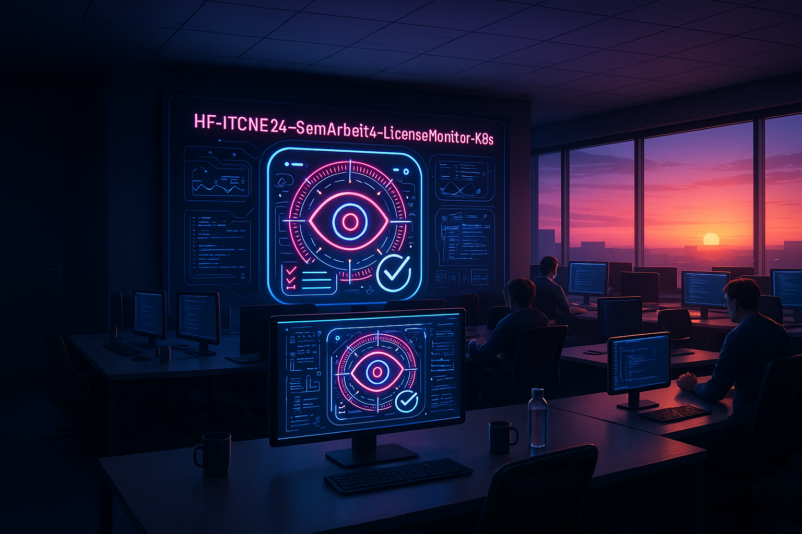

---

<!-- SOURCE: index.md -->

---
layout: default
title: 1. Startseite
nav_order: 1
permalink: /

---

# Willkommen!

Unter dieser Page findest du die Dokumentation von Miguel Schneider, über Kubernetes (K8s) im 4. Semester des HF-Lehrgangs. 

Diese Webseite wird von Github Pages gehostet.
Sie wird durch meine Einträge im Gitrepo stetig aktualisiert und erneuert.

Ich wünsche dir viel Spass beim Lesen!

 

[Quelle](./Quellverzeichnis/index.md#startseite)


---

<!-- SOURCE: Einleitung\index.md -->

---
layout: default
title: 2. Einleitung
nav_order: 2
has_children: "true"

---
# Einleitung

Im Abschnitt "Einleitung" werde ich die Projektidee etwas genauer beschreiben. 


---

<!-- SOURCE: Einleitung\21_ausgangslage.md -->

---
layout: default
title: 2.1 Ausgangslage
parent: 2. Einleitung
nav_order: 3

---

# Ausgangslage / Projektidee


Das bisher entwickelte Lizenzüberwachungstool für die ISE AG läuft in einer statischen Umgebung und erfordert manuelle Eingriffe bei der Bereitstellung, Skalierung und Wartung der Microservices. Diese Architektur ist nur begrenzt flexibel und erschwert eine schnelle Umsetzung von Änderungen oder Erweiterungen.

Unter diesem Link kannst du das Einreichungsformular einsehen: [Einreichungsformular](../../ressources/docs/ITCNE24_Semesterarbeit_4_Einreichungsformular_Miguel_Schneider.pdf) 


[Quelle](../Quellverzeichnis/index.md#ausgangslage) 


---

<!-- SOURCE: Einleitung\22_ziele.md -->

---
layout: default
title: 2.2 Ziele
parent: 2. Einleitung
nav_order: 4

---
# Ziele

Während meiner Semesterarbeit möchte ich folgende Ziele erreichen. 
Diese Ziele sind auch bereits im [Einreichungsformular](../../ressources/docs/ITCNE24_Semesterarbeit_4_Einreichungsformular_Miguel_Schneider.pdf) aufgelistet. 

- **Evaluation und Festlegung der Infrastruktur**
  Zu Beginn des Projekts wird eine Evaluation durchgeführt, um die geeignete Infrastruktur für den Betrieb der Anwendung zu bestimmen, entweder lokal oder in einer Cloud-Umgebung. Dabei werden technische Anforderungen, Sicherheitsaspekte und vorhandene Ressourcen berücksichtigt. Das Ergebnis dient als Grundlage für die weitere Umsetzung, bleibt jedoch offen für Anpassungen bei neuen Erkenntnissen im Projektverlauf.  

- **Aufbau einer CI/CD-Pipeline zur Automatisierung zentraler Prozesse** 
  Es wird eine CI/CD-Pipeline entwickelt, die den automatisierten Ablauf von Build-, Test- und Deployment-Prozessen ermöglicht. Ziel ist eine durchgängige Automatisierung und Nachvollziehbarkeit der Entwicklungsabläufe. Die konkrete Toolwahl (z. B. GitHub Actions oder GitLab CI) und der Umfang einzelner Pipeline-Stufen können im Projektverlauf iterativ angepasst werden.  
  
- **Weiterentwicklung in Richtung einer Cloud-Native-Core-Architektur** 
  Das bestehende Lizenzüberwachungstool wird so erweitert, dass zentrale Cloud-Native-Prinzipien umgesetzt werden – insbesondere Containerisierung, Skalierbarkeit und modulare Strukturen. Dabei wird flexibel vorgegangen: Umfang und Tiefe der Umsetzung können auf Basis der Ergebnisse aus der Evaluationsphase angepasst werden, um die technische Machbarkeit und den Nutzen sicherzustellen.  
  
- **Sicherstellung von Datenschutz, Stabilität und Betriebssicherheit**
  Während der Entwicklung werden Datenschutz- und Sicherheitsaspekte fortlaufend berücksichtigt. Zudem sollen geeignete Mechanismen zur Überwachung, Fehlertoleranz und Stabilität implementiert oder getestet werden. Welche konkreten Lösungen (z. B. Monitoring-Tools, Self-Healing, Logging) eingesetzt werden, wird im Verlauf evaluiert und dokumentiert.
  
<br>


[Quelle](../Quellverzeichnis/index.md#ziele)


---

<!-- SOURCE: Einleitung\23_zeitplan.md -->

---
layout: default
title: 2.3 Zeitplan
parent: 2. Einleitung
nav_order: 5

---
# Zeitplan

Um meine Semesterarbeit strukturiert voranzutreiben, habe ich zwei unterschiedliche Zeitpläne erstellt. Diese Zeitpläne variieren in ihrer Detailtiefe und bieten mir somit verschiedene Ansätze zur Organisation meiner Arbeit.

Dies ist der grobe Zeitplan, welchen ich aus dem [Einreichungsformular](../../ressources/docs/ITCNE24_Semesterarbeit_4_Einreichungsformular_Miguel_Schneider.pdf) entnommen habe. 

| Datum    | Aktivität                                                              | Wer                            | Empfänger        |
| -------- | ---------------------------------------------------------------------- | ------------------------------ | ---------------- |
| 01.10.25 | Ablauf Semesterarbeiten und Liste mit Projektthemen vorstellen         | Lehrgangsleitung               | Studierende      |
| 20.10.25 | Abgabe Einreichungsformular                                            | Studierende                    | Expert/innen     |
| 27.10.25 | Freigabe Semesterarbeit durch Expert/innen                             | Expert/innen                   | Studierende      |
| 27.10.25 | Beginn Umsetzung Semesterarbeit                                        | Studierende                    | Expert/innen     |
| 17.11.25 | 1. Sprint, evtl. mit Besprechung                                       | Studierende                    | Expert/innen     |
| 15.12.25 | 2. Sprint, evtl. mit Besprechung                                       | Studierende                    | Expert/innen     |
| 23.01.26 | 3. Sprint, evtl. mit Besprechung                                       | Studierende                    | Expert/innen     |
| 28.01.26 | Abgabe der Arbeit / Abnahme mit Schlusspräsentation                    | Studierende                    | Expert/innen     |
| 04.02.26 | Notenvorschlag                                                         | Projekt-Experte/in             | Lehrgangsleitung |
| 13.02.26 | Mitteilung der Noten mit individuellem Feedback zur Einsicht hochladen | Projekt-Experte/in             | Studierende      |
| 13.03.26 | Mitteilung der Noten                                                   | Lehrgangsleitung / Sekretariat | Studierende      |

Den genaueren Zeitplan habe ich im Projektmanagement in Github erstellt. 
Dies ist ein Kanban-Board, auf dem ich die Einzelnen Tasks und verschiedene Buckets habe. 
Mit diesem Board, kann ich auch eine Zeitplan-Achse abbilden, wo ich die Dauer eines Tasks definieren kann. 

Den Zeitplan in GitHub Project, kannst du unter diesem Link finden: <a href="https://github.com/users/Radball-Migi/projects/9" target="_blank">Github Project</a>

Mit GitHub Project, gibt es die Möglichkeit, die einzelnen Schritte in einer Roadmap anzuzeigen. 
Dies sieht dann in etwa so aus:


[*Roadmap in GitHub Projects*](https://github.com/users/Radball-Migi/projects/9/views/8)

Der Vorteil dabei ist, dass ich eine graphisch übersichtliche Zeitplanung habe, in der ich Visuell meine Tasks sehe (Balken mit dem Status des Issues), inklusive meinen Meilensteinen (Grüne Linie auf dem Zeitstrahl). 

**Zusätzlich habe ich in diesem Semester meine Planung erweitert und um zwei Elemente ergänzt:** Zum einen nutze ich die **MoSCoW-Methode**, um die Priorität meiner Aufgaben eindeutig festzulegen (Must, Should, Could, Won’t). Dadurch erhalte ich eine klare Übersicht, welche Aufgaben zwingend umgesetzt werden müssen und welche optional oder nachrangig sind.  

Zum anderen bewerte ich den geschätzten Aufwand meiner Tasks anhand der **Fibonacci-Nummerierung**. Diese Methode unterstützt mich dabei, den Umfang einzelner Arbeitspakete realistisch einzuschätzen und erleichtert die Planung innerhalb der Sprints und der Roadmap.


### Story Points - Fibonacci-Nummerierung

| Story Points | Typischer Aufwand | Beschreibung / Orientierung                                                                                                                 |
| ------------ | ----------------- | ------------------------------------------------------------------------------------------------------------------------------------------- |
| **1**        | **Sehr gering**   | Kleine Änderung, klar definiert, kaum Risiko. <br>Beispiel: Textanpassung in der README, Variable umbenennen.                               |
| **2**        | **Gering**        | Kleine Aufgabe, klarer Ablauf. <br>Beispiel: Einfache Funktion ergänzen, kleine Pipeline-Anpassung.                                         |
| **3**        | **Mittel**        | Etwas mehr Aufwand, 1–2 Stunden konzentrierte Arbeit, evtl. kleine Abstimmung nötig. <br>Beispiel: Unit Tests ergänzen, YAML-Job erweitern. |
| **5**        | **Hoch**          | Größerer Task, mehrere Schritte oder Unsicherheiten. <br>Beispiel: neue Pipeline-Stage, neues Modul erstellen, API-Call erweitern.          |
| **8**        | **Sehr hoch**     | Komplexe Aufgabe mit Abhängigkeiten oder Rechercheaufwand. Beispiel: Integration mit Azure DevOps, Graph API Anbindung.                     |
| **13**       | **Extrem**        | Grosse Story, evtl. in mehrere kleinere Stories zerlegen. <br>Beispiel: komplette CI/CD-Architektur umstellen oder Microservice refactoren. |
| **21+**      | **Episch**        | Zu gross für einen Sprint → muss in kleinere Stories aufgeteilt werden.                                                                     |


---

<!-- SOURCE: Einleitung\24_risiken.md -->

---
layout: default
title: 2.4 Risiken
parent: 2. Einleitung
nav_order: 6

---
# Risiken

Bei Projektarbeiten sind Risiken grundsätzlich vorhanden. Durch eine frühzeitige Identifikation und Bewertung dieser Risiken können geeignete Massnahmen definiert werden, um negative Auswirkungen auf den Projektverlauf zu minimieren. Ziel der Risikoanalyse ist es, den Projekterfolg sicherzustellen und das Erreichen der definierten Ziele zu unterstützen.

Während der Umsetzung des Projekts wurden die in der nachfolgenden Tabelle dargestellten Risiken identifiziert sowie hinsichtlich ihrer Eintrittswahrscheinlichkeit und potenziellen Auswirkung bewertet.


| ID     | Risiko                                                                                                         | Eintritt | Auswirkung | Massnahme zur Vermeidung / Minderung                                                                                                                                 |
| ------ | -------------------------------------------------------------------------------------------------------------- | -------- | ---------- | -------------------------------------------------------------------------------------------------------------------------------------------------------------------- |
| **R1** | Komplexität bei der Einrichtung der CI/CD-Pipeline (z. B. YAML-Fehler, Pipeline-Trigger)                       | Mittel   | Mittel     | Schrittweise Implementierung, Nutzung von Templates, regelmässige Tests und Code-Reviews                                                                             |
| **R2** | Fehlkonfiguration von Kubernetes-Ressourcen (z. B. Pods, Services, Secrets)                                    | Mittel   | Hoch       | Einsatz von Helm-Charts, Validierung der Konfiguration über Testumgebungen und Dokumentation der Deployments                                                         |
| **R3** | Datenschutzrisiko durch unsichere Speicherung von Lizenzdaten                                                  | Niedrig  | Hoch       | Klare Trennung von sensiblen Daten, Speicherung innerhalb der definierten Systemumgebung und Einhaltung interner Datenschutzrichtlinien                              |
| **R4** | Integrationsprobleme zwischen Microservices oder Pipeline-Komponenten                                          | Mittel   | Mittel     | Klare Schnittstellendefinitionen, Integrationstests in jeder Pipeline-Stufe, Logging und Fehlerauswertung                                                            |
| **R5** | Instabilität des Systems bei Skalierung oder Lasttests                                                         | Mittel   | Hoch       | Stufenweiser Ausbau der Skalierung, Tests unter realistischen Bedingungen, Nutzung von Kubernetes-Self-Healing-Mechanismen                                           |
| **R6** | GitHub-Dokumentation wird nicht laufend gepflegt                                                               | Niedrig  | Niedrig    | Doku fix in Workflow einplanen, regelmässige Erinnerung im Taskboard                                                                                                 |
| **R7** | Authentifizierungsprobleme mit der Microsoft Graph API in Kubernetes (z. B. Zertifikate, Thumbprints, Secrets) | Mittel   | Hoch       | Sichere Verwaltung und regelmässige Erneuerung der Zertifikate/Secrets, Einsatz von Kubernetes-Secrets oder Key Vault, Monitoring und Logging der Authentifizierung. |

_Übersicht der identifizierten Projektrisiken_

Die identifizierten Risiken wurden zusätzlich in einer grafischen Risikomatrix visualisiert. Diese Darstellung ermöglicht eine übersichtliche Einordnung der Risiken und unterstützt die Priorisierung von Massnahmen.


_Risikomatrix zur Einordnung der Projektrisiken nach Eintrittswahrscheinlichkeit und Schadensauswirkung._

Die Risikoanalyse zeigt, dass die Mehrheit der identifizierten Risiken im mittleren bis hohen Risikobereich liegt. Insbesondere Risiken im Zusammenhang mit der Konfiguration der Kubernetes-Umgebung, der Systemstabilität bei Skalierung sowie der Authentifizierung mit externen Schnittstellen erfordern erhöhte Aufmerksamkeit. Durch die definierten Massnahmen zur Risikovermeidung und -minderung können diese Risiken jedoch kontrolliert und deren Auswirkungen auf den Projekterfolg reduziert werden.


---

<!-- SOURCE: Einleitung\25_projektmanagement-methode.md -->

---
layout: default
title: 2.5 Projektmanagement-Methode
parent: 2. Einleitung
nav_order: 7

---

# Projektmanagement-Methode

## Kanban
Das **Kanban-System** ist eine agile Arbeitsmethode aus dem Projektmanagement, welche dabei hilft, die Zusammenarbeit von Teams zu verbessern. Durch die Visualisierung von Arbeitsprozessen können diese verwaltet und verbessert, sowie deren Effizienz und Qualität gesteigert werden. Die Arbeitsschritte werden dabei (digital) einzeln auf Tafeln dargestellt und in Verantwortlichkeiten unterteilt, sodass selbst komplexe Projekte für alle Beteiligten übersichtlich und leicht verständlich gemacht werden.

Das Kanban-System ermöglicht es durch seine Struktur zudem, konsistente Arbeitsabläufe zu gewährleisten, auf die sich Mitarbeiter und weitere am Projekt Beteiligte besser einstellen und so etwa besser Ressourcen einplanen können. Da das System kontinuierlich mit dem aktuellen Entwicklungsstand abgeglichen wird, ist auch eine ständige Verbesserung möglich, da Schwachstellen so leicht bemerkbar werden.
Kanban kann auch sehr gut für kleine Projekte, an welchen nur eine Person arbeitet, verwendet werden.


[Quelle](../Quellverzeichnis/index.md#kanban)
## Scrum
**Scrum** ist ein Framework für eine bestimmte Art des Projektmanagements. Es zeichnet sich durch schlanke Prozesse, schrittweise Entwicklung und regelmäßige Feedbackschleifen aus. Ursprünglich wurde es vor allem in der Softwareentwicklung eingesetzt, mittlerweile findet es aber in vielen weiteren Branchen Anwendung.

Scrum verfolgt einen inkrementellen und iterativen Ansatz. In aufeinanderfolgenden, eigenständigen Phasen, den sogenannten Sprints, werden verschiedene Versionen eines Produkts entwickelt. Diese Sprints werden kontinuierlich wiederholt, bis ein zufriedenstellendes und vollständiges Produkt erreicht ist.


[Quelle](../Quellverzeichnis/index.md#scrum)
## Kanban und Scrum in dieser Semesterarbeit

In meiner Semesterarbeit werde ich mit Kanban und Scrum arbeiten. 
Weshalb gleich mit beiden Methoden?
Kanban ist in GitHub bereits integriert, in welchen man Boards und Tasks selbst erstellen kann. Zusätzlich kann ich verschiedene Ansichten erstellen, wie beispielsweise eine Gant-Projektübersicht, etc. 
Zusätzlich verwende ich die Sprints, welche in Scrum integriert sind. Da ich jedoch alleine bin, habe ich bei mir nur 3 Sprintgespräche eingeplant. Dies, weil die Daily Sprints wegfallen, da ich die Semesterarbeit als Einzelarbeit mache, somit bin ich Zeitgleich auch der Scrum-Master. 
Um den Scrum-Prozess etwas aktiver zu gestalten, arbeite ich zudem mit **Userstorys**, welche ich im Projekt dokumentiere und priorisiere. Die Userstorys sind in den jeweiligen Issues im <a href="https://github.com/users/Radball-Migi/projects/9/views/3" target="_blank">License Tool Release</a> enthalten.

Dies ist der Link zu meiner Roadmap:
<a href="https://github.com/users/Radball-Migi/projects/9/views/8" target="_blank">Roadmap · HF ITCNE24 - 4. Semesterarbeit K8s</a>


[Quelle](../Quellverzeichnis/index.md#kanban-und-scrum)

## Six Sigma

Six Sigma ist eine Methode zur Prozessverbesserung, die Unternehmen dabei unterstützt, ihre Geschäftsprozesse zu optimieren. Ziel ist es, einheitliche Abläufe einzuführen, um Abweichungen im Endprodukt zu minimieren und somit die Anzahl der Produktfehler zu reduzieren.

Im Kern basiert Six Sigma auf der Annahme der DMAIC-Methode:

**Define (Definieren)**
In dieser Phase wird das Problem klar definiert. Es werden die Ziele des Projekts festgelegt, der Umfang bestimmt und die Kundenanforderungen identifiziert.

**Measure (Messen)**
Hier werden die aktuellen Prozesse gemessen, um eine Basislinie zu erstellen. Es werden Daten gesammelt, um den Ist-Zustand zu verstehen und die Leistung zu bewerten.
   
**Analyze (Analysieren)**
In dieser Phase werden die gesammelten Daten analysiert, um die Ursachen von Problemen und Variationen zu identifizieren. Es wird untersucht, welche Faktoren die Prozessleistung beeinflussen.

**Improve (Verbessern)**
Basierend auf den Analyseergebnissen werden Lösungen entwickelt und implementiert, um die identifizierten Probleme zu beheben. Ziel ist es, die Prozessleistung zu verbessern und die Variationen zu reduzieren.

**Control (Kontrollieren)**
In der letzten Phase werden die Verbesserungen überwacht und kontrolliert, um sicherzustellen, dass die erzielten Verbesserungen nachhaltig sind. Es werden Kontrollmechanismen eingeführt, um die Prozessleistung langfristig zu sichern.

Laut Six Sigma benötigen alle Prozesse Inputs und Outputs. 
**Inputs** sind die Aktionen, die dein Team durchführt, während **Outputs** die Ergebnisse dieser Aktionen darstellen. 
Grundsätzlich gilt: Je mehr Inputs (oder Aktionen) kontrolliert werden können, desto besser lassen sich auch die Outputs steuern.


[Quelle](../Quellverzeichnis/index.md#six-sigma)

## DevOps

**DevOps** ist ein moderner Ansatz, der Entwicklung (Development) und IT-Betrieb (Operations) miteinander verbindet. Ziel ist es, Software schneller, zuverlässiger und mit einem hohen Automatisierungsgrad bereitzustellen. DevOps kombiniert dabei technische Praktiken wie Continuous Integration und Continuous Deployment (CI/CD) mit einer kollaborativen Arbeitskultur.

Ein wesentlicher Bestandteil von DevOps ist die Automatisierung von Build-, Test- und Deployment-Prozessen. Dazu nutze ich in dieser Semesterarbeit **GitHub Actions**, um Pipelines einzurichten, welche den Code testen, verarbeiten und anschliessend Artefakte automatisiert generieren. Diese Artefakte werden anschliessend in Azure DevOps abgelegt und können für weitere Deployments verwendet werden.

Der DevOps-Ansatz unterstützt dadurch:

- **Kürzere Entwicklungszyklen** durch automatisierte Abläufe
- **Höhere Qualität**, da Fehler früh im Prozess entdeckt werden
- **Transparente Prozesse** durch klar definierte Pipelines
- **Reproduzierbare Deployments**, unabhängig von lokalen Umgebungen

DevOps ergänzt somit die bereits eingesetzten Methoden Scrumban und Six Sigma ideal:  
Kanban sorgt für Struktur im Arbeitsfluss, Scrum für iterative Planung, Six Sigma für Prozessqualität – und DevOps stellt sicher, dass die technische Umsetzung automatisiert, konsistent und effizient erfolgt.


[Quelle](../Quellverzeichnis/index.md#devops)


---

<!-- SOURCE: Einleitung\26_SEUSAG.md -->

---
layout: default
title: 2.6 SEUSAG
parent: 2. Einleitung
nav_order: 7

---

# SEUSAG

Mit der SEUSAG möchte ich die Systemgrenzen aufzeigen, welche bei meinem Projekt auftreten.


[*SEUSAG des Projektes* (Falls Bild nicht richtig angezeigt wird.)](../../ressources/images/seusag.gif)

Das betrachtete System ist ein **cloud-native Lizenzüberwachungssystem**, welches innerhalb eines Kubernetes-Clusters betrieben wird. Der Fokus dieser Semesterarbeit liegt auf **Deployment, Betrieb, Automatisierung und Sicherheit** der Lösung.

> **Hinweis:**  
> Das eigentliche Lizenzüberwachungstool (_ISE – Licensemonitor_) wurde bereits in der [**Semesterarbeit 3**](https://radball-migi.github.io/HF-ITCNE24-SemArbeit3-MSVC-Lizenztool/) entwickelt. In dieser Arbeit erfolgt **keine Neuentwicklung der Applikation**, sondern deren Integration in eine GitOps-basierte Kubernetes-Umgebung.

---

## Systemgrenze

Die Systemgrenze umfasst alle Komponenten innerhalb des Kubernetes-Clusters `semar4-dev`:

- Argo CD zur GitOps-basierten Continuous Delivery
- Sealed Secrets zur sicheren Verwaltung sensibler Daten
- Laufzeitumgebung der bestehenden Applikation

Diese Komponenten werden im Rahmen der Arbeit gestaltet und optimiert.

---

## Umfeld (externe Systeme)

Als externe Systeme gelten:

- **GitHub** zur Versionierung und Bereitstellung der Deployment-Definitionen
- **Docker Hub** als Container-Registry
- **Microsoft Entra / Entra ID** als externe Authentifizierungs- und API-Plattform
- **Benutzer**, welche über die Applikation auf die bereitgestellten Informationen zugreifen


---

<!-- SOURCE: Haupteil\index.md -->

---
layout: default
title: 3. Hauptteil
nav_order: 3
has_children: "true"

---
# Hauptteil

Mithilfe der Qualitätsmanagementmethode Six Sigma, möchte ich den DMAIC-Zyklus Schritt für Schritt durchgehen und so den Prozess meiner Zielsetzung näherbringen. 
Wie genau der DMAIC-Zyklus abläuft, wurde bereits in der Einleitung unter dem [Punkt 2.5](../Einleitung/25_projektmanagement-methode.md#six-sigma) erläutert.


[Quelle](../Quellverzeichnis/index.md#hauptteil)


---

<!-- SOURCE: Haupteil\31_define.md -->

---
layout: default
title: 3.1 Definieren
parent: 3. Hauptteil
nav_order: 4

---
# Definieren (Define) Phase

Die Define-Phase ist der erste Schritt in einem Six Sigma Projekt. In dieser Phase wird das Projekt klar definiert, um sicherzustellen, dass alle Beteiligten ein gemeinsames Verständnis der Ziele und des Umfangs haben. Ein wesentlicher Bestandteil dieser Phase ist die Identifizierung und Beschreibung des zu lösenden Problems oder der zu verbessernden Prozesse.


[Quelle](../Quellverzeichnis/index.md#define-phase)

## Zielvorstellung

Am Ende der Semesterarbeit soll das bestehende Lizenzüberwachungstool der ISE AG in einer Cloud-Native-Core-Architektur betrieben werden. Die Anwendung soll containerisiert, automatisiert deploybar und skalierbar sein. Kern der Zielvorstellung ist eine Kubernetes-basierte Laufzeitumgebung, welche den stabilen Betrieb der bestehenden Microservices ermöglicht und gleichzeitig eine flexible Weiterentwicklung unterstützt.

Ein zentraler Bestandteil der Zielarchitektur ist eine durchgängige CI/CD-Pipeline. Diese soll sicherstellen, dass Änderungen am Quellcode automatisiert gebaut, getestet und in der Kubernetes-Umgebung bereitgestellt werden können. Dadurch sollen manuelle Eingriffe reduziert, die Reproduzierbarkeit von Deployments erhöht und die Nachvollziehbarkeit der Release-Prozesse verbessert werden.

Die Lösung soll praxisnah umgesetzt, nachvollziehbar dokumentiert und so gestaltet sein, dass sie als Referenz für zukünftige Cloud-Native- und DevOps-Projekte dienen kann.

---

## Ressourceneinsatz

Für die Umsetzung der Semesterarbeit stehen folgende Ressourcen und Werkzeuge zur Verfügung:

 - **Kubernetes-Umgebung (lokal oder Cloud)**  
    Orchestrierung und Betrieb der containerisierten Microservices.
    
- **Docker / Docker Desktop**  
    Containerisierung der bestehenden Flask-Services und lokale Entwicklung.
    
- **CI/CD-Pipeline (GitHub Actions oder GitLab CI)**  
    Automatisierung von Build-, Test- und Deployment-Prozessen.
    
- **Bestehende Flask-Microservices**  
    Technische Basis aus der vorherigen Semesterarbeit.
    
- **GitHub / GitLab Repository**  
    Versionsverwaltung, Issue-Tracking, Projektdokumentation und Workflow-Steuerung.
    
- **Visual Studio Code**  
    Zentrale Entwicklungsumgebung für Code, Pipeline-Konfigurationen und Infrastrukturdefinitionen.
    
- **Microsoft 365 Test-Tenant (ISE AG)**  
    Bereitstellung von Testdaten zur Lizenzabfrage über die Microsoft Graph API.

---

## Warum wird die Zielvorstellung aktuell nicht erreicht?

Das bestehende Lizenzüberwachungstool wird derzeit in einer statischen Umgebung betrieben. Build- und Deployment-Prozesse sind nur teilweise automatisiert und erfordern manuelle Eingriffe. Eine containerisierte und orchestrierte Laufzeitumgebung fehlt ebenso wie eine standardisierte CI/CD-Pipeline.

Diese Situation führt zu mehreren Einschränkungen:  
Deployments sind fehleranfällig, Skalierung ist nur eingeschränkt möglich und Änderungen am System verursachen einen vergleichsweise hohen operativen Aufwand. Zudem ist die Nachvollziehbarkeit von Releases und Konfigurationsänderungen nicht durchgehend gewährleistet.

Um die angestrebte Zielvorstellung zu erreichen, sind daher folgende technische und organisatorische Massnahmen erforderlich:

- Einführung einer **containerisierten Architektur** für die bestehenden Microservices
- Aufbau einer **Kubernetes-basierten Laufzeitumgebung**
- Implementierung einer **CI/CD-Pipeline** zur automatisierten Bereitstellung
- Strukturierte Verwaltung von **Konfigurationen und Secrets**
- Dokumentation der Architektur und Prozesse zur nachhaltigen Nutzung

Diese Massnahmen sind notwendig, um den Betrieb des Lizenzüberwachungstools langfristig stabil, wartbar und erweiterbar zu gestalten und den Anforderungen moderner Cloud-Native-Systeme gerecht zu werden.


---

<!-- SOURCE: Haupteil\32_measure.md -->

---
layout: default
title: 3.2 Messen
parent: 3. Hauptteil
nav_order: 5

---
# Messen (Measure) Phase

Die Measure-Phase ist der zweite Schritt in einem Six Sigma Projekt. Hier werden aktuelle Prozesse gemessen, um eine Basislinie zu erstellen. Dies umfasst die Sammlung und Analyse von Daten, um die aktuelle Leistung zu verstehen und Verbesserungspotenziale zu identifizieren. Ziel ist es, eine klare Darstellung des aktuellen Zustands zu erhalten.


[Quelle](../Quellverzeichnis/index.md#measure-phase)

## Aktuelle Situation (Ist-Zustand)

Das bestehende Lizenzüberwachungstool wird aktuell in einer statischen Umgebung betrieben. Die Microservices basieren auf Python und Flask und werden ohne durchgängige Automatisierung bereitgestellt. Änderungen am Quellcode erfordern manuelle Build- und Deployment-Schritte, wodurch der Betrieb stark von individuellen Eingriffen abhängt.

Eine standardisierte CI/CD-Pipeline ist nur teilweise oder nicht vorhanden. Ebenso fehlt eine containerisierte und orchestrierte Laufzeitumgebung, welche Skalierung, Self-Healing und reproduzierbare Deployments ermöglichen würde. Konfigurationen, Secrets und Abhängigkeiten werden nicht einheitlich verwaltet.

---

## Prozessbeschreibung (derzeitiger Ablauf)

1. **Codeänderung am Microservice**  
    Änderungen am Quellcode werden lokal entwickelt und im Git-Repository versioniert.
    
2. **Manueller Build-Prozess**  
    Der Build der Anwendung (z. B. Docker-Image oder Applikationspaket) erfolgt manuell oder teilautomatisiert. Fehler werden erst während oder nach dem Build sichtbar.
    
3. **Manuelles Deployment**  
    Die Bereitstellung der Anwendung erfolgt manuell auf der Zielumgebung. Konfigurationsänderungen müssen separat gepflegt und angewendet werden.
    
4. **Fehlerbehandlung**  
    Tritt ein Fehler auf, erfolgt die Analyse manuell anhand von Logs oder Konsolenausgaben. Rollbacks oder Wiederherstellungen sind nicht standardisiert.
    
5. **Betrieb und Wartung**  
    Skalierung, Neustarts oder Konfigurationsanpassungen erfolgen manuell und sind nicht automatisiert oder überwacht.

---
#### Risiken & Auswirkungen

- Hoher manueller Aufwand bei Build und Deployment
- Erhöhte Fehleranfälligkeit durch manuelle Konfigurationen
- Eingeschränkte Skalierbarkeit der Anwendung
- Fehlende Reproduzierbarkeit von Deployments
- Begrenzte Transparenz über Build- und Release-Zustände

---

## Datenerhebung

Zur Analyse des aktuellen Zustands wurden folgende Aspekte erhoben und dokumentiert:

- **Automatisierungsgrad**  
    Anteil manueller Schritte im Build-, Test- und Deployment-Prozess.
    
- **Fehleranfälligkeit**  
    Häufigkeit von Konfigurations- oder Deployment-Fehlern aufgrund manueller Eingriffe.
    
- **Nachvollziehbarkeit**  
    Verfügbarkeit von Logs, Versionsinformationen und Deployment-Historien.
    
- **Betriebsaufwand**  
    Zeitlicher Aufwand für Build, Deployment und Fehlerbehebung pro Änderung.
    
- **Skalierbarkeit**  
    Möglichkeiten zur horizontalen oder vertikalen Skalierung im aktuellen Setup.
    

Die Ergebnisse dieser Erhebung bilden die Grundlage für die nachfolgende [**Analyze-Phase**](33_analyze.md), in der Ursachen für Ineffizienzen, Risiken und technische Einschränkungen systematisch untersucht werden.


---

<!-- SOURCE: Haupteil\33_analyze.md -->

---
layout: default
title: 3.3 Analysieren
parent: 3. Hauptteil
nav_order: 6

---
# Analysieren (Analyze) Phase

Die Analyze-Phase ist der dritte Schritt in einem Six Sigma Projekt. Hier werden die in der [Measure-Phase](./32_measure.md) gesammelten Daten analysiert, um die Ursachen von Problemen zu identifizieren. Ziel ist es, die Hauptursachen für Prozessabweichungen zu bestimmen und Hypothesen für Verbesserungen zu entwickeln. Dies umfasst die Nutzung statistischer Methoden und Werkzeuge, um Muster und Zusammenhänge in den Daten zu erkennen.


[Quelle](../Quellverzeichnis/index.md#analyze-phase)

## Zusammenfassung der Datenerhebung

Die Measure-Phase hat gezeigt, dass das bestehende Lizenzüberwachungstool in einer statischen und nur teilweise automatisierten Umgebung betrieben wird. Zentrale Abläufe wie Build, Deployment, Konfigurationsmanagement und Skalierung erfolgen manuell oder mit erheblichem individuellem Aufwand. Eine standardisierte CI/CD-Pipeline sowie eine orchestrierte Laufzeitumgebung fehlen vollständig.

Diese Ausgangslage führt nicht nur zu technischem Mehraufwand, sondern wirkt sich direkt auf Wartbarkeit, Betriebssicherheit und Nachvollziehbarkeit aus. Die folgenden Abschnitte analysieren diese Schwachstellen im Detail.

---

### **Geringer Automatisierungsgrad**

Der aktuelle Build- und Deployment-Prozess ist stark manuell geprägt. Jede Codeänderung erfordert mehrere individuelle Schritte, die nicht standardisiert und kaum reproduzierbar sind.

**Ursachen:**
- Fehlende CI/CD-Pipeline
- Keine standardisierte Artefakterstellung
- Keine automatisierten Tests oder Validierungen
- Manuelle Pflege von Konfigurationen

**Auswirkungen:**
- Erhöhte Fehleranfälligkeit
- Hoher Zeitaufwand pro Änderung
- Geringe Reproduzierbarkeit von Deployments

Kurz gesagt: **Jedes Deployment ist ein Unikat – kein stabiler Prozess.**

---

### **Fehlende Cloud-Native-Laufzeitumgebung**

Die Anwendung wird nicht containerisiert und nicht durch eine Orchestrierungsplattform betrieben. Funktionen wie Self-Healing, horizontale Skalierung oder deklarative Infrastrukturdefinitionen stehen daher nicht zur Verfügung.

**Ursachen:**
- Historisch gewachsene, statische Umgebung
- Kein Einsatz von Kubernetes oder vergleichbaren Plattformen
- Fehlende Trennung zwischen Applikation, Konfiguration und Infrastruktur

**Auswirkungen:**
- Eingeschränkte Skalierbarkeit
- Erhöhter manueller Betriebsaufwand
- Abhängigkeit von direkten Eingriffen bei Störungen

Das System funktioniert – **aber nur solange nichts schiefgeht**.

---

### **Eingeschränkte Transparenz und Nachvollziehbarkeit**

Build- und Release-Stände sind nicht zentral dokumentiert. Logs, Konfigurationsstände und Deployment-Historien sind verteilt oder nur lokal verfügbar.

**Ursachen:**
- Kein zentrales Pipeline-Logging
- Fehlende Versionierungs- und Release-Strategie
- Unzureichende Dokumentation

**Auswirkungen:**
- Erschwerte Fehlersuche
- Keine klare Zuordnung von Versionen zu Umgebungen
- Hohe Abhängigkeit von individuellem Wissen

Oder anders gesagt: **Wissen steckt in Köpfen – nicht im System.**

---

### **Regulatorische und sicherheitsrelevante Rahmenbedingungen**

Das Lizenzüberwachungstool verarbeitet sensible Lizenz- und Konfigurationsdaten. Dadurch ergeben sich erhöhte Anforderungen an Datenschutz, Sicherheit und Kontrolle, insbesondere im Kontext des Schweizer Datenschutzgesetzes (DSG).

Diese Anforderungen beeinflussen die Wahl der Zielinfrastruktur massgeblich und können nicht losgelöst von der technischen Architektur betrachtet werden.

---

## Infrastruktur-Evaluation – AWS vs. Azure vs. Lokal

Auf Basis der identifizierten Schwachstellen wurde eine strukturierte Evaluation möglicher Deployment-Varianten durchgeführt. Ziel war es, eine Infrastruktur zu identifizieren, die **technisch sinnvoll**, **betrieblich kontrollierbar** und **datenschutzrechtlich konform** ist.

Evaluierte Optionen:
- Microsoft Azure Cloud
- Amazon Web Services (AWS)
- Lokales Deployment (On-Prem / lokales Kubernetes)

Im Fokus standen Datenschutz (DSG), Sicherheitsmodell, operative Kontrolle und organisatorische Abhängigkeiten.

---

### Vergleich der Deployment-Optionen

| **Kriterium**                  | **Azure Cloud**                                                  | **AWS Cloud**                                                             | **Lokal (On-Prem / Local K8s)**                                               |
| ------------------------------ | ---------------------------------------------------------------- | ------------------------------------------------------------------------- | ----------------------------------------------------------------------------- |
| **Kosten**                     | + Keine Hardware nötig  <br>– Laufende Kosten & Preisvolatilität | + Gute Skaleneffizienz  <br>– Zusätzliche Kosten für Traffic/Storage      | + Keine Cloud-Abos  <br>– Hardware & Wartung eigenen Aufwand                  |
| **Security**                   | + Starke MS-Sicherheitsarchitektur  <br>– Shared Responsibility  | + Sehr starke Sicherheitsservices  <br>– Komplex & geteilte Verantwortung | ⭐ **Volle Kontrolle über Security**  <br>⭐ **Keine externen Angriffsflächen** |
| **DSG/DSGVO (Schweiz)**        | – Potenzielle Auslandsbekanntgabe  <br>– Cloud Act Risiko        | – US-Anbieter → stärkstes Cloud Act Risiko                                | ⭐ **Beste DSG-Konformität**  <br>⭐ **Keine Auslandsübermittlung**             |
| **Scalability**                | + Sehr skalierbar                                                | + Extrem skalierbar                                                       | – Hardwaregebunden                                                            |
| **Resources*                   | + Flexible Compute & Storage                                     | + Breite Auswahl an Resourcen                                             | – Lokale Kapazitäten                                                          |
| **Integration mit MS Graph**   | ⭐ **Beste Integration (Managed Identity)**                       | – Weniger optimal                                                         | – Zertifikats-/Thumbprint-Verwaltung nötig                                    |
| **Operational Overhead**       | – Begrenzte Kontrolle  <br>+ Automatisiert                       | – Komplexe Konfiguration                                                  | ⭐ **Maximale Kontrolle**  <br>– Mehr Aufwand, aber sicherer                   |
| **Availability**               | + Hoch                                                           | + Hoch                                                                    | – Abhängig vom eigenen Setup                                                  |
| **Vendor Lock-in**             | – Hoch                                                           | – Hoch                                                                    | ⭐ **Kein Lock-in**                                                            |
| **Disaster Recovery**          | + Einfach, automatisch                                           | + Sehr robust                                                             | – Muss selbst aufgebaut werden                                                |
| **Compliance für Lizenzdaten** | + Gut                                                            | + Möglich, aber nicht MS-nativ                                            | ⭐ **Am sichersten, da Daten intern bleiben**                                  |

Bereits dieser Vergleich zeigt, dass Cloud-Lösungen zwar technisch attraktiv sind, im Kontext sensibler Lizenzdaten jedoch deutliche Nachteile aufweisen.

---

### Datenschutzrechtliche Bewertung (DSG Schweiz)

Für das Projekt sind insbesondere folgende Punkte relevant:

- **Art. 6 – Privacy by Design / Default**  
    → Lokales Deployment erfüllt dies technisch am stärksten.
    
- **Art. 8 – Sicherheitsanforderungen**  
    → Beweislast bei Cloud-Deployments deutlich höher.
    
- **Art. 16–18 – Datenexport ins Ausland**  
    → Cloud = potenzieller Auslandstransfer → Risiko.  
    → Lokal = kein Transfer → kein Risiko.
    
- **Cloud Act (USA)**  
    → Betrifft AWS und Azure gleichermaßen (Microsoft ebenfalls US-Unternehmen).  
    → Lokales Deployment **nicht betroffen**.


**Zwischenfazit:**  
Ein lokales Deployment ist datenschutzrechtlich mit Abstand am risikoärmsten.

---

### Gewichtete Entscheidungsmatrix

Da Datenschutz und Sicherheit im Projekt bewusst höher gewichtet wurden, ergibt sich folgende Bewertung:

| **Kriterium**        | **Gewicht** | **Azure**   | **AWS**     | **Lokal**   |
| -------------------- | ----------- | ----------- | ----------- | ----------- |
| Datenschutz / DSG    | **35%**     | Mittel (6)  | Niedrig (4) | ⭐ Hoch (9)  |
| Security             | **25%**     | Mittel (7)  | Mittel (7)  | ⭐ Hoch (9)  |
| Kosten               | 10%         | Mittel (6)  | Niedrig (5) | Mittel (6)  |
| Scalability          | 10%         | Hoch (9)    | Hoch (10)   | Niedrig (4) |
| Operational Control  | 10%         | Niedrig (5) | Niedrig (5) | ⭐ Hoch (9)  |
| Integration MS Graph | 10%         | Hoch (9)    | Mittel (7)  | Niedrig (4) |

**Gesamtpunktzahl (0–10):**

- Azure: **6.75**
- AWS: **5.85**
- ⭐ **Lokal: 7.70**

---

#### **Fazit der Analyse**

Die Analyse zeigt klar, dass die bestehenden Probleme des Lizenzüberwachungstools nicht auf einzelne technische Mängel zurückzuführen sind, sondern auf strukturelle Defizite: fehlende Automatisierung, eine nicht cloud-native Architektur und mangelnde Transparenz im Betrieb.

Unter Berücksichtigung der sensiblen Lizenzdaten, der Anforderungen des Schweizer DSG sowie der notwendigen Sicherheits- und Kontrollmechanismen stellt ein **lokales Kubernetes-basiertes Deployment** die risikoärmste, kontrollierbarste und langfristig stabilste Lösung dar.

Diese Erkenntnisse bilden die Grundlage für die nachfolgende Improve-Phase.

---

## Wie könnte dies gelöst werden?

Aus der Analyse lassen sich folgende Lösungsansätze ableiten:
- Containerisierung der bestehenden Microservices
- Aufbau einer lokalen Kubernetes-Umgebung als Cloud-Native-Core-Plattform
- Implementierung einer CI/CD-Pipeline zur vollständigen Automatisierung von Build, Test und Deployment
- Zentrale Verwaltung von Konfigurationen und Secrets
- Standardisierte Dokumentation und Versionierung aller Deployments

Diese Ansätze werden in der **Improve-Phase** konkretisiert, umgesetzt und technisch validiert.


---

<!-- SOURCE: Haupteil\34_improve.md -->

---
layout: default
title: 3.4 Verbessern
parent: 3. Hauptteil
nav_order: 7

---
#  Verbessern (Improve) Phase

Die Improve-Phase ist der vierte Schritt in einem Six Sigma Projekt. In dieser Phase werden die in der [Analyze-Phase](./33_analyze.md) identifizierten Hauptursachen für Prozessabweichungen adressiert und Lösungen entwickelt, um diese zu beheben. Ziel ist es, durch gezielte Verbesserungsmassnahmen die Prozessleistung zu optimieren und die identifizierten Probleme nachhaltig zu lösen. Dies umfasst die Anwendung von Kreativitätstechniken, statistischen Methoden und Pilotprojekten, um die Wirksamkeit der vorgeschlagenen Lösungen zu testen und zu validieren.

Der Fokus dieser Phase liegt **nicht auf der Neuentwicklung der Applikation**, sondern auf der **Migration, Automatisierung und dem cloud-nativen Betrieb** eines bereits bestehenden Lizenzüberwachungstools. Der funktionale Umfang der Anwendung wurde in einer vorherigen Semesterarbeit umgesetzt und bleibt im Rahmen dieser Arbeit unverändert.

Ziel der Improve-Phase ist es, die bestehende Anwendung so weiterzuentwickeln, dass sie reproduzierbar bereitgestellt, automatisiert betrieben und nachhaltig gewartet werden kann – im Sinne moderner DevOps- und Cloud-Native-Core-Prinzipien.


[Quelle](../Quellverzeichnis/index.md#improve-phase)

## Architekturgrundlage des Lizenzüberwachungstools

Das Lizenzüberwachungstool basiert auf einem **Microservice-Architekturstil (MSVC)** und nutzt **Python mit Flask** zur Umsetzung der einzelnen Services. Diese Architektur bildet die fachliche und technische Grundlage für die nachfolgenden Verbesserungsmassnahmen.

### Microservice-Architektur (MSVC) und Flask API

Bei einer Microservice-Architektur wird eine Anwendung nicht als monolithisches System umgesetzt, sondern in mehrere kleine, unabhängige Dienste aufgeteilt. Jeder dieser Dienste übernimmt eine klar abgegrenzte fachliche Aufgabe und kann unabhängig entwickelt, betrieben und skaliert werden.

Im vorliegenden Projekt fungieren die Flask-Services als **REST-basierte APIs**, welche unter anderem folgende Aufgaben übernehmen:
- Abfrage von Lizenzinformationen über die Microsoft Graph API
- Verarbeitung und Aufbereitung der Lizenzdaten
- Bereitstellung von Schnittstellen für weitere Systeme oder Automatisierungen

Durch den Einsatz von Flask als leichtgewichtigem Framework bleiben die Services bewusst schlank und stateless. Dies erleichtert nicht nur die Containerisierung, sondern ist auch eine zentrale Voraussetzung für den späteren Betrieb in einer Cloud-Native-Umgebung.

Diese Architekturentscheidung unterstützt die in der Analyze-Phase identifizierten Verbesserungsziele direkt: geringere Kopplung, bessere Wartbarkeit und gezielte Skalierbarkeit einzelner Komponenten.

---

## Cloud-Native Core (CNC) als Zielarchitektur

Um die bestehenden Microservices effizient, stabil und automatisiert betreiben zu können, wird das Lizenzüberwachungstool in eine **Cloud-Native-Core-Architektur (CNC)** überführt. CNC beschreibt dabei keinen einzelnen Technologie-Stack, sondern ein Architekturprinzip.

Zentrale Merkmale dieser Architektur sind:
- Containerisierte Anwendungen
- Deklarative Infrastruktur
- Automatisierte Deployments
- Skalierbarkeit und Self-Healing
- Klare Trennung von Code, Konfiguration und Laufzeit

Durch die Umsetzung dieser Prinzipien wird sichergestellt, dass die Anwendung reproduzierbar betrieben, einfach erweitert und zuverlässig überwacht werden kann.

---

## Minikube als Kubernetes-Laufzeitumgebung

Für die praktische Umsetzung der Cloud-Native-Core-Architektur wird **Minikube** als Kubernetes-Umgebung eingesetzt. Minikube ermöglicht den Betrieb eines vollständigen Kubernetes-Clusters in einer lokalen Umgebung und eignet sich damit ideal für Entwicklungs-, Test- und Evaluationszwecke.

Der Einsatz von Minikube bietet mehrere Vorteile im Kontext dieser Semesterarbeit:
- Realistisches Kubernetes-Verhalten ohne Cloud-Abhängigkeit
- Volle Kontrolle über Infrastruktur und Konfiguration
- Konformität mit den Datenschutzanforderungen (DSG)
- Nahtlose Integration in CI/CD-Pipelines

Durch Minikube kann die Zielarchitektur praxisnah umgesetzt werden, ohne die im Analyse-Teil identifizierten Risiken eines Cloud-Deployments einzugehen. Gleichzeitig bleibt die Architektur so gestaltet, dass ein späterer Wechsel auf eine Cloud-Plattform grundsätzlich möglich wäre.

---

## Evaluation und Festlegung der Infrastruktur

Zu Beginn der Improve-Phase wurde die in der Analyze-Phase begonnene Infrastruktur-Evaluation konkretisiert. Dabei wurden sowohl **Cloud-basierte Lösungen** als auch eine **lokale Kubernetes-Umgebung** betrachtet. Entscheidende Bewertungskriterien waren unter anderem Datenschutz, Kontrolle über sensible Lizenzdaten, technische Komplexität sowie Kosten- und Betriebsaspekte.

Das Ergebnis dieser Evaluation war die bewusste Entscheidung für eine **lokale Kubernetes-Umgebung auf Basis von Minikube**. Diese Lösung ermöglicht ein realistisches Cloud-Native-Setup, ohne Abhängigkeiten von externen Cloud-Anbietern einzugehen. Gleichzeitig bleibt die Architektur so gestaltet, dass ein späterer Wechsel in eine Cloud-Umgebung grundsätzlich möglich wäre.

| **Kriterium**        | **Gewicht** | **Azure**   | **AWS**     | **Lokal**   |
| -------------------- | ----------- | ----------- | ----------- | ----------- |
| Datenschutz / DSG    | **35%**     | Mittel (6)  | Niedrig (4) | ⭐ Hoch (9)  |
| Security             | **25%**     | Mittel (7)  | Mittel (7)  | ⭐ Hoch (9)  |
| Kosten               | 10%         | Mittel (6)  | Niedrig (5) | Mittel (6)  |
| Scalability          | 10%         | Hoch (9)    | Hoch (10)   | Niedrig (4) |
| Operational Control  | 10%         | Niedrig (5) | Niedrig (5) | ⭐ Hoch (9)  |
| Integration MS Graph | 10%         | Hoch (9)    | Mittel (7)  | Niedrig (4) |

_Gewichtete Entscheidungsmatrix, mehr details zur Evaluation unter [Vergleich der Deployment-Optionen](./33_analyze#vergleich-der-deployment-optionen)_

**Gesamtpunktzahl (0–10):**

- Azure: **6.75**
- AWS: **5.85**
- ⭐ **Lokal: 7.70**

Die gewählte Infrastruktur wurde zusätzlich praktisch validiert, indem ein vollständiger Kubernetes-Cluster lokal betrieben und erfolgreich initialisiert wurde.
Der Cluster wurde erfolgreich initialisiert und besteht aus einem Kubernetes-Control-Plane-Node.


_Minikube Cluster_

Mit dieser Entscheidung wurde eine stabile und datenschutzkonforme Grundlage geschaffen, auf der alle weiteren Verbesserungen aufbauen.

---

## Weiterentwicklung zur Cloud-Native-Core-Architektur

Basierend auf der gewählten Zielinfrastruktur wurde das bestehende Lizenzüberwachungstool konsequent in Richtung einer **Cloud-Native-Core-Architektur** weiterentwickelt. Dabei standen nicht einzelne Technologien im Vordergrund, sondern zentrale Architektur- und Betriebsprinzipien.

Umgesetzte Kernprinzipien waren unter anderem:

- Containerisierung der bestehenden Anwendung
- Trennung von Anwendungscode, Konfiguration und Infrastruktur
- Deklarative Beschreibung des gewünschten Systemzustands
- Stateless-Betrieb der Applikation

Die Anwendung wurde als Container-Image bereitgestellt, ohne die fachliche Logik zu verändern. Durch diese Entkopplung ist die Applikation unabhängig von der Laufzeitumgebung und eignet sich für automatisierte Deployments und Skalierung innerhalb von Kubernetes.


_Zielarchitektur_

Die Applikation wird als Deployment mit mehreren Replikas betrieben und erfüllt damit zentrale Cloud-Native-Core-Prinzipien.

```yaml
PS C:\Users\miguel.schneider> kubectl get pods -n licensetool -o wide
NAME                          READY   STATUS    RESTARTS      AGE   IP            NODE         NOMINATED NODE   READINESS GATES
licensetool-bc659b4f5-58p7m   1/1     Running   1 (20m ago)   8h    10.244.0.58   semar4-dev   <none>           <none>
licensetool-bc659b4f5-9jq2n   1/1     Running   1 (20m ago)   8h    10.244.0.57   semar4-dev   <none>           <none>
licensetool-bc659b4f5-vq5fx   1/1     Running   1 (20m ago)   8h    10.244.0.52   semar4-dev   <none>           <none>
PS C:\Users\miguel.schneider> kubectl get deployment licensetool -n licensetool
NAME          READY   UP-TO-DATE   AVAILABLE   AGE
licensetool   3/3     3            3           8h
PS C:\Users\miguel.schneider>
```

---

## Aufbau einer CI/CD-Pipeline (Build & Artefakt-Erstellung)

Ein zentrales Ziel der Improve-Phase war die **Reduktion manueller Schritte** im Build- und Bereitstellungsprozess. Dazu wurde eine CI-Pipeline aufgebaut, welche Änderungen am Quellcode automatisch verarbeitet.

Die Pipeline übernimmt unter anderem:

- Build der Applikation
- Erstellung eines versionierten Container-Images
- Bereitstellung des Artefakts für das Deployment (Image auf Docker Hub in privatem Repository)

Dadurch ist jeder Build eindeutig einer Code-Version zugeordnet und reproduzierbar. Fehlerquellen durch manuelle Builds oder inkonsistente Artefakte konnten so eliminiert werden.


_Pipeline summary_


_CI-Build der App_


_CI Build des Docker Hub-Artefakts_

Jedes Container-Image ist eindeutig einer Code-Version zugeordnet und kann reproduzierbar aus der Registry bezogen werden.


_Image in privatem Docker Hub Repository_


_GitHub Actions Run_


_Image in Pod_

Das durch die CI-Pipeline erzeugte Container-Image wird direkt im Kubernetes-Pod referenziert.

Diese Pipeline bildet die technische Grundlage für den nachfolgenden GitOps-basierten Deployment-Ansatz.

---

## Einführung eines GitOps-Ansatzes mit Argo CD

Für das Deployment der Anwendung wurde ein **GitOps-Ansatz** umgesetzt. Dabei dient das Git-Repository als Single Source of Truth für den gewünschten Systemzustand.  
Als zentrales Werkzeug wurde **Argo CD** eingesetzt.

Die Struktur folgt dem **App-of-Apps-Pattern**, bei dem eine zentrale Bootstrap-Applikation weitere Applikationen verwaltet, darunter:

- Argo CD Core-Komponenten
- Sealed Secrets Controller
- LicenseMonitor Applikation

Diese Struktur ermöglicht eine klare Trennung von Verantwortlichkeiten und eine saubere Steuerung von Abhängigkeiten.


_ArgoCD UI Overview_


_ArgoCD verwaltete Apps_

Argo CD verwaltet die Applikation deklarativ auf Basis des Git-Repositories.

Durch GitOps wird sichergestellt, dass jede Änderung nachvollziehbar versioniert ist und automatisch in die Kubernetes-Umgebung synchronisiert wird.

---

## Sicheres Secrets Management mit Sealed Secrets

Ein wesentlicher Schwerpunkt der Improve-Phase lag auf der **Sicherstellung von Datenschutz und Betriebssicherheit**. Sensible Daten wie Zertifikate, Tenant-Profile und Authentifizierungsparameter dürfen weder im Klartext im Repository abgelegt noch manuell in Pods konfiguriert werden.

Daher wurde das **Sealed-Secrets-Konzept** eingeführt:

- Secrets werden lokal erstellt
- clientseitig verschlüsselt (`kubeseal`)
- als SealedSecrets im Git-Repository versioniert
- ausschließlich im Cluster entschlüsselt

```yaml
infra/ 
└── k8s/     
	└── apps/         
		└── licensetool/             
			└── overlays/                 
				└── dev/                     
					licensetool-cert-flask-service-iseapp-1588.sealedsecret.yaml
					licensetool-cert-infos.sealedsecret.yaml
					licensetool-cert-iseschool.sealedsecret.yaml
					licensetool-cert-iseschool2013.sealedsecret.yaml
					licensetool-env.sealedsecret.yaml
					licensetool-profiles-auth.sealedsecret.yaml
					licensetool-profiles-sharepoint.sealedsecret.yaml
					licensetool-profiles-tenants.sealedsecret.yaml
					licensetool-tls.sealedsecret.yaml
					regcred.sealedsecret.yaml
```
_Dateistruktur der Sealed Secrets_

```yaml
PS C:\Users\miguel.schneider> kubeseal --controller-name "sealed-secrets" --controller-namespace "kube-system" --fetch-cert
-----BEGIN CERTIFICATE-----
MIIEzDCCArSgAwIBAgIQaW/IbK02PNctcQpjqggjnzANBgkqhkiG9w0BAQsFADAA
MB4XDTI2MDEyMjIzMzE1OFoXDTM2MDEyMDIzMzE1OFowADCCAiIwDQYJKoZIhvcN...
```
_Teiloutput CLI, des Sealed-Secrets_


_Sealed Secrets im Cluster_

Die verschlüsselten Secrets werden als eigene Kubernetes-Ressourcen verwaltet.

Damit ist sichergestellt, dass zu keinem Zeitpunkt Klartext-Secrets im Repository oder in der CI/CD-Pipeline vorhanden sind.

---

## Technische Stabilisierung der Kubernetes-Integration

Während der Umsetzung traten mehrere Kubernetes-spezifische Probleme auf, insbesondere im Umgang mit Secrets, Mount-Pfaden und Namenskonventionen.  
Zertifikate und Konfigurationsprofile waren ursprünglich auf lokale Dateisysteme ausgelegt und mussten für einen zustandslosen Pod-Betrieb angepasst werden.

Die folgenden Verbesserungen wurden umgesetzt:
- Migration aller Zertifikate und Profile in Kubernetes Secrets
- Einheitliche Mount-Pfade innerhalb der Container
- Trennung von tenant-spezifischen und serviceweiten Zertifikaten
- Einführung verbindlicher Namenskonventionen für Kubernetes-Ressourcen

Die Wirksamkeit dieser Massnahmen wurde iterativ überprüft durch:
- Analyse von Pod-Logs
- Validierung gemounteter Dateien
- Funktionstests der Microsoft- und SharePoint-Integrationen

Nach diesen Anpassungen lief die Applikation stabil mit mehreren Replikas.

---

## Fehleranalyse und Troubleshooting (Argo CD Repo Server)

Während der GitOps-Einführung trat ein kritischer Fehler auf:

`Failed to load target state: connection refused (argocd-repo-server)`

Die Ursache lag in einem inkonsistenten Zustand des Argo CD Repo Servers. Ein gezielter Neustart des Deployments stellte die Kommunikation wieder her.

Damit dies nicht währen des Bootstraps für Probleme sorgt, wurde dies im Startup-Script mit eingebaut, dass der Repo-Server nach dem starten des Ingress Tunnels einen redeploy macht.  

---

## Ergebnis und Zielerreichung der Improve-Phase

Durch die umgesetzten Massnahmen konnten alle definierten Ziele erreicht werden:

- Die Infrastruktur wurde evaluiert und nachvollziehbar festgelegt
- Build- und Deployment-Prozesse sind automatisiert
- Die Anwendung folgt Cloud-Native-Core-Prinzipien
- Datenschutz und Betriebssicherheit sind Kubernetes-konform umgesetzt
- Die Umgebung ist reproduzierbar und stabil betreibbar

---

## Fazit der Improve-Phase

Die Improve-Phase führte zu einer nachhaltigen technischen Stabilisierung des Lizenzüberwachungstools.  
Durch die Kombination aus **CI/CD**, **GitOps**, **Sealed Secrets** und klarer Architektur wurde eine Lösung geschaffen, die nicht nur funktional, sondern auch betrieblich und organisatorisch überzeugt.

Die Anwendung kann nach einem vollständigen Re-Deploy des Clusters ohne manuelle Eingriffe wiederhergestellt werden und bildet eine solide Grundlage für zukünftige Erweiterungen oder einen möglichen Cloud-Betrieb.


---

<!-- SOURCE: Haupteil\35_control.md -->

---
layout: default
title: 3.5 Kontrollieren
parent: 3. Hauptteil
nav_order: 8

---

#  Kontrollieren (Control) Phase

Die Control-Phase ist der letzte Schritt im DMAIC-Zyklus eines Lean-/Six-Sigma-Projekts. Ziel dieser Phase ist es, sicherzustellen, dass die in der Improve-Phase umgesetzten Massnahmen langfristig stabil funktionieren und Rückfälle vermieden werden. In diesem Projekt steht besonders im Fokus, dass der Microservice korrekt arbeitet, kontinuierlich überwacht wird und automatisiert auf kritische Zustände reagiert.


[Quelle](../Quellverzeichnis/index.md#control-phase) 

## Ziele der Control-Phase

Die Control-Phase verfolgt folgende Ziele:

- Sicherstellung eines **stabilen Kubernetes-Deployments**
- Nachvollziehbare und versionierte **GitOps-Deployments mit Argo CD**
- Vermeidung manueller Eingriffe durch **automatisierte Rollouts**
- Kontrolle des **Secret- und Zertifikats-Handlings**
- Qualitätssicherung durch **automatisierte Tests**
- Transparenz durch **Logs, Status- und Health-Checks**
- Reproduzierbarkeit des Systems nach vollständigem Redeploy

---

## Kontrollmechanismen im Überblick

| Mechanismus              | Beschreibung                                           |
| ------------------------ | ------------------------------------------------------ |
| GitOps (Argo CD)         | Deklarative Steuerung aller Deployments über Git       |
| Kubernetes Health Checks | Überwachung von Pod-Status, Readiness & Liveness       |
| Pytest                   | Automatisierte Tests für Kernlogik der Anwendung       |
| Logging                  | Zentrale Logausgabe der Container über `kubectl logs`  |
| Secret-Management        | Zertifikate & Auth-Profile als Kubernetes Secrets      |
| Redeploy-Tests           | Vollständiger Neuaufbau des Namespaces                 |
| Zugriffskontrolle        | Microsoft-Authentifizierung via gemountete Zertifikate |

---
## Control Plan (Betrieb & Überwachung)

Zur nachhaltigen Sicherstellung des stabilen Betriebs wurde ein einfacher Control Plan definiert,
welcher die wichtigsten Kontrollpunkte, Trigger und Reaktionsmechanismen beschreibt.

| Kontrollpunkt        | Tool / Quelle              | Trigger / Abweichung              | Reaktion |
|----------------------|----------------------------|-----------------------------------|----------|
| Argo CD Sync Status  | ArgoCD UI / CLI            | Status ≠ Synced oder Health ≠ Healthy | Ursache analysieren, Git-Stand prüfen |
| Namespace vorhanden  | Argo CD (Redeploy GIF)     | Namespace gelöscht                | Automatische Neuerstellung via Argo CD |
| Pod Status           | kubectl get pods           | Pod nicht Running / Ready         | Logs & Events analysieren |
| Pod Restarts         | kubectl get pods           | Erhöhter Restart Counter          | Root Cause Analyse |
| Secret Verfügbarkeit | kubectl exec / Events      | Secret fehlt / nicht unsealed     | SealedSecrets prüfen |
| CI Pipeline          | GitHub Actions             | Tests fehlschlagen                | Merge stoppen, Fix im dev |


---

## GitOps-Kontrolle mit Argo CD

Die zentrale Kontrollinstanz des Deployments ist **Argo CD**.  
Alle Kubernetes-Ressourcen (Deployments, Services, Secrets, ConfigMaps) werden **ausschliesslich deklarativ über Git verwaltet**.

### Kontrollaspekte

- Abgleich von **Soll-Zustand (Git)** und **Ist-Zustand (Cluster)**
- Automatische Synchronisation bei Änderungen
- Sichtbare Abweichungen („OutOfSync“) im Argo-Dashboard
- Rollbacks jederzeit möglich durch Git-Historie


In der vorliegenden Konfiguration ist Argo CD mit automatischer Synchronisation und Self-Healing aktiv. 
Manuelle Änderungen am Cluster werden dadurch unmittelbar korrigiert, weshalb ein OutOfSync-Zustand im Normalbetrieb nur kurzzeitig oder gar nicht sichtbar ist.


_ArgoCD Health der Apps_

---

## Kubernetes-Betriebskontrolle

Zur Überprüfung des stabilen Betriebs wurden folgende Kubernetes-Kontrollen eingesetzt:

### Pod- und Deployment-Status

Befehle: 

```powershell
kubectl get pods -n licensetool 
kubectl get deploy -n licensetool
```

Output:

```yaml
PS C:\Users\miguel.schneider> kubectl get pods -n licensetool
NAME                          READY   STATUS    RESTARTS      AGE
licensetool-bc659b4f5-7wfnc   1/1     Running   2 (16m ago)   18h
licensetool-bc659b4f5-lrn5f   1/1     Running   2 (16m ago)   18h
licensetool-bc659b4f5-pb2wt   1/1     Running   2 (16m ago)   18h
PS C:\Users\miguel.schneider> kubectl get deploy -n licensetool
NAME          READY   UP-TO-DATE   AVAILABLE   AGE
licensetool   3/3     3            3           18h
PS C:\Users\miguel.schneider>
```

Erwartetes Verhalten:

- Pods befinden sich im Status `Running`
- Deployments zeigen `READY = desired replicas`
- Keine Pods im Zustand `CrashLoopBackOff` oder `Error`


_Get all Pods in Cluster_

**Hinweis:**
Im aktuellen Deployment sind bewusst keine expliziten `livenessProbe`/`readinessProbe` definiert.
Die Betriebskontrolle erfolgt über Kubernetes-Pod-Conditions (`Ready`, `ContainersReady`),
Events sowie Argo CD Health-Checks. In einer produktiven Umgebung würden zusätzliche
HTTP-basierte Probes ergänzt.


_Pod ready_


_Pod Events_


_Pod restarts_


---

### Health-Checks & Neustarts

Durch die containerisierte Architektur kann Kubernetes fehlerhafte Pods automatisch neu starten.  
Fehlerfälle (z. B. fehlende Zertifikate) wurden gezielt provoziert und überprüft.

Zur Validierung der automatischen Neustarts wurden Kubernetes-Events ausgewertet. 
Dabei ist ersichtlich, dass Pods bei Änderungen oder Fehlerzuständen beendet und automatisch neu erstellt werden (Self-Healing).

Als kritisch gelten dabei insbesondere folgende Zustände:
- Argo CD Application Status ≠ `Synced` oder Health ≠ `Healthy`
- Pods nicht im Status `Running` oder `Ready`
- Anstieg des Restart Counters innerhalb kurzer Zeit
- Fehlende oder nicht unsealed Secrets

Befehl:
```powershell
kubectl get events -n licensetool --sort-by='.lastTimestamp'
```


```yaml
Normal  SandboxChanged   pod/licensetool-bc659b4f5-9jq2n   Pod sandbox changed, it will be killed and re-created
Normal  Killing          pod/licensetool-bc659b4f5-9jq2n   Stopping container licensetool
Normal  SuccessfulDelete replicaset/licensetool-bc659b4f5 Deleted pod
Normal  SuccessfulCreate replicaset/licensetool-74ffb6ddd4 Created pod
Normal  Started          pod/licensetool-74ffb6ddd4-5hf2m Started container licensetool
Normal  ScalingReplicaSet deployment/licensetool           Scaled up/down replica sets
Normal  Unsealed         sealedsecret/licensetool-env      SealedSecret unsealed successfully
```

_Ausgabe gekürzt auf relevante Events zur Darstellung von Neustarts, Rollouts und Secret-Handling._

---

## Secret- und Zertifikats-Kontrolle

Ein zentraler Bestandteil der Control-Phase ist die **Absicherung sensibler Daten**.

### Kontrollmechanismen

- Zertifikate und Auth-Profile liegen ausschliesslich als Kubernetes Secrets vor
- Keine sensiblen Daten im Git-Repository
- Mount-Pfade werden im Deployment definiert
- Anwendung startet nur bei korrekt gemounteten Secrets


_Get all Secrets und describe secret_

```yaml
template:
    metadata:
      labels:
        app: licensetool
    spec:
      containers:
        - envFrom:
            - secretRef:
                name: licensetool-env
          image: docker.io/radballmigi/licensemonitor-dev:latest
          imagePullPolicy: Always
          name: licensetool
          ports:
            - containerPort: 5000
              name: http
              protocol: TCP
          resources: {}
          terminationMessagePath: /dev/termination-log
          terminationMessagePolicy: File
          volumeMounts:
            - mountPath: /app/config-profiles/auth
              name: profiles-auth
              readOnly: true
            - mountPath: /app/config-profiles/sharepoint
              name: profiles-sharepoint
              readOnly: true
            - mountPath: /app/config-profiles/tenants
              name: profiles-tenants
              readOnly: true
            - mountPath: /app/certs/infos
              name: certs-infos
              readOnly: true
            - mountPath: /app/certs/iseschool
              name: licensetool-cert-iseschool
              readOnly: true
            - mountPath: /app/certs/iseschool2013
              name: licensetool-cert-iseschool2013
              readOnly: true
            - mountPath: /app/certs/flask-service-iseapp-1588
              name: licensetool-cert-flask-service-iseapp-1588
              readOnly: true
```

_Ausschnitt aus Deploy Manifest_

```yaml
PS C:\Users\miguel.schneider> kubectl -n licensetool exec -it licensetool-74ffb6ddd4-5hf2m -- ls -la /app/certs
total 12
drwxr-xr-x 6 root root 4096 Jan 27 21:15 .
drwxr-xr-x 1 root root 4096 Jan 27 21:15 ..
drwxrwxrwt 3 root root  140 Jan 27 21:15 flask-service-iseapp-1588
drwxrwxrwt 3 root root  120 Jan 27 21:15 infos
drwxrwxrwt 3 root root  140 Jan 27 21:15 iseschool
drwxrwxrwt 3 root root  140 Jan 27 21:15 iseschool2013
PS C:\Users\miguel.schneider> kubectl -n licensetool exec -it licensetool-74ffb6ddd4-5hf2m -- ls -la /app/config-profiles
total 12
drwxr-xr-x 5 root root 4096 Jan 27 21:15 .
drwxr-xr-x 1 root root 4096 Jan 27 21:15 ..
drwxrwxrwt 3 root root  100 Jan 27 21:15 auth
drwxrwxrwt 3 root root  100 Jan 27 21:15 sharepoint
drwxrwxrwt 3 root root  120 Jan 27 21:15 tenants
PS C:\Users\miguel.schneider>
```
_Secrets im Pod_

Die gemounteten Zertifikate und Konfigurationsprofile wurden direkt im Container-Dateisystem verifiziert.


---

## Testautomatisierung mit Pytest

Zur Sicherstellung der Anwendungslogik wird weiterhin **pytest** eingesetzt.  
Die Tests prüfen die Kernfunktionen der Lizenzverarbeitung unabhängig von der Kubernetes-Infrastruktur.

### Getestete Bereiche

- Abruf von Lizenzdaten
- Verarbeitung und Aggregation
- Fehlerbehandlung bei ungültiger Konfiguration
- Simulation von API-Fehlern
- Validierung der Rückgabewerte

Beispiel:

```python
@pytest.fixture(scope='function')
def client(app, db):
    with app.app_context():
        create_test_data()
        test_client = app.test_client()
        test_client.post('/api/v1/auth/test-login')
        yield test_client
        db.session.remove()
        db.get_engine().dispose()
```

Mocking stellt sicher, dass keine externen Abhängigkeiten (Microsoft Graph, SharePoint) notwendig sind.

Die Pytests werden in der Ci-Pipeline bereits gemacht.

```yaml
jobs:
  tests:
    name: lint-test-security
    runs-on: ubuntu-latest
    steps:
      - name: Checkout repository
        uses: actions/checkout@v4
        
      - name: Setup Python
        uses: actions/setup-python@v5
        with:
          python-version: '3.10'
          cache: 'pip'
          cache-dependency-path: |
            ${{ vars.WORKDIR }}/licensetool/requirements.txt
            
      - name: Install dependencies
        run: |
          python -m pip install --upgrade pip
          pip install -r ${{ vars.WORKDIR }}/licensetool/requirements.txt
          pip install pytest flake8 black isort mypy bandit ruff
  
      - name: Run Unit Tests
        run: |
          pytest ${{ vars.WORKDIR }}/licensetool/test/. -v --tb=short

      - name: Run Integration Tests
        run: |
          pytest ${{ vars.WORKDIR }}/licensetool/test/. -v --tb=short
        continue-on-error: false
```

_Ci-Pipeline-yaml ausschnitt Pytests_


_Output Ci-Pipeline Pytests_

---

## Logging & Fehlerkontrolle

Die Anwendung schreibt Logs direkt auf `stdout`, wodurch diese über Kubernetes ausgelesen werden können:

`kubectl logs -l app=licensetool -n licensetool`


_Logs des Lizenztools via CLI_

Nebst das wir die Logs über Kubernetes auslesen können, Können wir auch über ArgoCD die Logs konsultieren:


_Logs des Lizenztools via ArgoCD_


_Login-Error in Log, via ArgoCD_


---

## Redeploy- und Stabilitätstest

Als finaler Kontrollschritt wurde das System vollständig neu aufgebaut:

`kubectl delete namespace licensetool`

Der Redeploy-Test wurde durchgeführt, indem der gesamte Namespace gelöscht wurde.
Die anschliessende Wiederherstellung erfolgte ausschliesslich automatisiert
über Argo CD (App-of-Apps), ohne manuelle Eingriffe mittels `kubectl apply`.

### Erfolgsbewertung

- Namespace wird neu erstellt
- Secrets werden korrekt geladen
- Pods starten ohne manuelle Eingriffe
- Argo CD synchronisiert automatisch
- Anwendung ist erreichbar und funktionsfähig

✅ **Ergebnis:**  
Das System ist vollständig **reproduzierbar und stabil betreibbar**.


_Redeploy der App nach gelöschtem Namespace (Gif wurde gekürzt, wegen warte dauer)_


---

## Zusammenfassung der Control-Massnahmen

| Massnahme                             | Umgesetzt |
| ------------------------------------- | --------- |
| GitOps mit Argo CD                    | Ja        |
| Automatisierte Kubernetes-Deployments | Ja        |
| Secret-Management über K8s            | Ja        |
| Reproduzierbarer Redeploy             | Ja        |
| Logging & Fehlerkontrolle             | Ja        |
| Automatisierte Tests                  | Ja        |
| Kein manuelles Nachkonfigurieren      | Ja        |

---

## Fazit

Die Control-Phase bestätigt, dass die im Projekt umgesetzten Massnahmen **nicht nur technisch korrekt**, sondern auch **nachhaltig und betriebssicher** sind.  
Durch die Kombination aus **GitOps**, **Kubernetes-Mechanismen**, **automatisierten Tests** und **klaren Kontrollpunkten** ist das System langfristig wartbar und robust gegenüber Änderungen.

Damit ist sichergestellt, dass zukünftige Erweiterungen oder Anpassungen durchgeführt werden können, **ohne die Stabilität oder Sicherheit des Systems zu gefährden**.

---

## Lessons Learned aus dem Merge-Konflikt

Im Verlauf der Arbeit zeigte sich, dass auch ein technisch konfliktfreier Git-Merge zu inhaltlich fehlerhaften Zuständen führen kann. Im konkreten Fall führte ein Merge zwischen `dev` und `main` dazu, dass zentrale Konfigurationsdateien unbeabsichtigt entfernt wurden, obwohl der Applikationscode zuvor stabil funktionierte.

Besonders kritisch war dabei, dass der Fehler nicht unmittelbar sichtbar war: Die Anwendung liess sich teilweise weiterhin starten, während Build-, Lint- und Testprozesse im `main`-Branch fehlschlugen. Erst durch den Vergleich mit einem bekannten funktionierenden Commit konnte die Ursache eindeutig identifiziert werden.


_Git-Historie nach Bereinigung_


_Fehler beim Merchen, obwohl auch Actions funktioniert haben_

---

## Präventive Massnahmen

Zur Sicherstellung der Stabilität und Reproduzierbarkeit wurden folgende Massnahmen definiert:

- Der **`dev`-Branch** wird als _Source of Truth_ für lauffähigen und getesteten Applikationscode betrachtet
- Der **`main`-Branch** dient primär als Abgabe- und Dokumentationsstand
- Kritische Konfigurationsdateien (z. B. `pyproject.toml`) werden bei Merges explizit überprüft
  
```powershell
git ls-tree -r HEAD -- ressources/licensetool/pyproject.toml
```


_Screenshot aus der CLI_

- Bei Unsicherheiten wird auf **selektives Übernehmen einzelner Dateien** statt auf vollständige Merges gesetzt
- Vor der Abgabe wird der Stand durch CI/CD (Tests, Linting, Build) validiert

---

## Fazit

Der Vorfall verdeutlicht, dass sauberes Branching und kontrollierte Merges ein zentraler Bestandteil stabiler DevOps-Prozesse sind. Durch die getroffenen Massnahmen konnte die Applikationsstabilität wiederhergestellt und das Risiko ähnlicher Fehler in Zukunft deutlich reduziert werden.


---

<!-- SOURCE: Sprints\index.md -->

---
layout: default
title: 4. Sprints
nav_order: 4
has_children: "true"

---

# Sprints

Im Rahmen meiner Semesterarbeit werde ich die Fortschritte anhand von Sprints evaluieren, um zu überprüfen, ob ich im Zeitplan liege.

Die Sprints ermöglichen es mir, Reflexionen zu erstellen, die aufzeigen, wie der Sprintzyklus verlaufen ist und welche Aspekte erfolgreich oder verbesserungswürdig waren.


[Quelle](../Quellverzeichnis/index.md#sprint-review)


---

<!-- SOURCE: Sprints\sprint1_17-11-2025.md -->

---
layout: default
title: 4.1   1. Sprint vom 17.11.2025
parent: 4. Sprints
nav_order: 3

---
# Sprint 1 – Evaluation & Grundlegende CI/CD-Pipeline
**Zeitraum:** 12.11.2025 – 17.11.2025  
**Team:** Miguel Schneider  
**Sprint-Ziel:** Eine fundierte Deployment-Evaluation erstellen, Dev-umgebung aufbauen und die grundlegende CI/CD-Pipeline (inkl. Build & Artefakt-Upload nach Azure DevOps) funktionsfähig bereitstellen.

---

## Kontext & Fokus
- **Ausgangslage:**  
  Projektstart der Semesterarbeit. Ziel ist es, sowohl die technische Basis (Pipeline) als auch konzeptionelle Entscheidungen (Deployment-Strategie) frühzeitig zu sichern.
  
- **Fokus dieses Sprints:**  
  - Erstellung einer Vergleichsevaluation (Lokal vs. Cloud) bezüglich Deployment.  
  - Entwicklungsumgebung aufbauen, für Basistests.
  - Aufbau einer funktionierenden CI/CD-Pipeline mittels GitHub Actions.  
  - Build-Prozess erstellen, der ein Artefakt erzeugt.  
  - Erfolgreicher Upload des Artefakts nach Azure DevOps (Artifact Feed oder Storage).  

---

## Sprint Backlog
Backlog gemäss User Stories des [Meilenstein 1 - 1. Sprint](https://github.com/Radball-Migi/HF-ITCNE24-SemArbeit4-LicenseMonitor-K8s/milestone/2)

| #                                                                                       | User Story                                                    | Priorität | Story Points | Akzeptanzkriterien erfüllt? |
| --------------------------------------------------------------------------------------- | ------------------------------------------------------------- | --------- | ------------ | --------------------------- |
| [#1](https://github.com/Radball-Migi/HF-ITCNE24-SemArbeit4-LicenseMonitor-K8s/issues/1) | Evaluate Deployment Options                                   | Must have | 3            |                             |
| [#5](https://github.com/Radball-Migi/HF-ITCNE24-SemArbeit4-LicenseMonitor-K8s/issues/5) | Prepare Kubernetes Clusteototype                              | Must have | 5            |                             |
| [#6](https://github.com/Radball-Migi/HF-ITCNE24-SemArbeit4-LicenseMonitor-K8s/issues/6) | Implement Build Pipeline with GitHub Actions and Azure DevOps | Must have | 13           |                             |


_Abbildung der [Roadmap des 1. Sprints](https://github.com/users/Radball-Migi/projects/9/views/8)_ 

---

## Aufgaben (Tasks)

| Task-ID | Story # | Task-Beschreibung                                   | Verantwortlich | Status |
| ------- | ------- | --------------------------------------------------- | -------------- | ------ |
| T-1     | 1       | Kriterienkatalog für Deployment erarbeiten          | Miguel         | Todo   |
| T-2     | 1       | Lokal vs. Cloud (AWS/Azure) analysieren             | Miguel         | Todo   |
| T-3     | 1       | Tabelle & Entscheiddokument erstellen               | Miguel         | Todo   |
| T-4     | 5       | Installieren von Minicube                           | Miguel         | Todo   |
| T-5     | 5       | Dev-Umgebung einrichten                             | Miguel         | Todo   |
| T-6     | 6       | GitHub Actions Workflow erstellen                   | Miguel         | Todo   |
| T-7     | 6       | Build-Schritt implementieren (Generierung Artefakt) | Miguel         | Todo   |
| T-8     | 6       | Testing-Sektion einrichten                          | Miguel         | Todo   |
| T-9     | 6       | Azure DevOps Verbindung herstellen                  | Miguel         | Todo   |
| T-10    | 6       | Artefakt erfolgreich nach Azure hochladen           | Miguel         | Todo   |

---
## Definition of Done (DoD) für diesen Sprint

- [x] Evaluation schriftlich dokumentiert (Markdown)  
- [x] Vergleichstabelle vollständig und begründet  
- [ ] GitHub Actions Pipeline läuft erfolgreich durch  
- [ ] Build generiert ein Artefakt  
- [ ] Artefakt wird nach Azure DevOps übermittelt  
- [ ] Alle Stories abgeschlossen  

---
## Sprint Review

**Datum:** 17.11.2025  
**Teilnehmer:** Miguel

### Erreichte Ergebnisse
- Deployment-Evaluation abgeschlossen  


### Offene Punkte / Nicht erreichte Ziele
- CI/CD-Pipeline läuft erfolgreich durch  
- Artefakt wird nach Azure DevOps übertragen  
---

## Retrospektive

**Datum:** 17.11.2025  
**Methode:** Sailboat - Segelschiff


_Retrospektive Sprint 1 nach der Segelschiffmethode_


### Verbesserungs-Massnahmen (Action Items)

| #   | Massnahme                                                                 | Verantwortlich | Ziel-Sprint | Status |
| --- | ------------------------------------------------------------------------- | -------------- | ----------- | ------ |
| 1   | User Stories mit >13 SP aufteilen und neu strukturieren                   | Miguel         | Sprint 2    | Offen  |
| 2   | Ci Pipeline bereitstellen (Bis Build Job)                                 | Miguel         | Sprint 2    | Offen  |
| 3   | Entwicklungsumgebung priorisieren und minimal lauffähig bereitstellen     | Miguel         | Sprint 2    | Offen  |
| 4   | Sprintplanung präziser gestalten (MoSCoW & Fibonacci konsequent anwenden) | Miguel         | Sprint 2    | Offen  |

---

## Zusammenfassung des Sprints

- **Sprint-Ziel erreicht?** Nein  
    Das Sprintziel wurde nicht erreicht, da sowohl der Aufbau der CI/CD-Pipeline als auch der Build-/Artefaktprozess noch nicht erfolgreich umgesetzt wurden.
    
- **Wichtigste Ergebnisse:**
    - Deployment-Evaluation abgeschlossen und fundierte Entscheidungsgrundlage geschaffen
    - Dokumentationsstruktur erfolgreich gestartet
    - Einführung und Anwendung neuer Planungsmethoden (Fibonacci, MoSCoW)
      
- **Impact auf das Gesamtprojekt:**  
    Die abgeschlossene Evaluation liefert eine klare architektonische Richtung für den weiteren Projektverlauf.  
    Durch die Methodenerweiterung und die initiale Dokumentationsstruktur wurde eine solide Basis geschaffen, auf der Sprint 2 aufbauen kann.  
    Gleichzeitig wurde sichtbar, dass die technischen Aufgaben (CI, Build, Dev-Umgebung) mehr Zeit benötigen und in Sprint 2 priorisiert werden müssen.


---

<!-- SOURCE: Sprints\sprint2_15-12-2025.md -->

---
layout: default
title: 4.2   2. Sprint vom 15.12.2025
parent: 4. Sprints
nav_order: 4

---
# Sprint 2 – Ausbau CI/CD Pipeline und App Release
**Zeitraum:** 24.11.2025 – 15.12.2025  
**Team:** Miguel Schneider  
**Sprint-Ziel:** Eine durchgängige CI/CD-Pipeline bereitstellen, welche die Anwendung baut, versioniert und ein deploybares Artefakt erzeugt. Zusätzlich soll die Anwendung als Kubernetes-Deployment und -Service im Minikube bereitgestellt werden, sodass am Ende des Sprints ein erster funktionsfähiger App-Release im Cluster erreichbar und testbar ist.

---

## Kontext & Fokus
- **Ausgangslage:**  
  Im ersten Sprint wurden die Grundlagen für die CI/CD-Pipeline gelegt, jedoch ist der vollständige Build- und Artefaktprozess noch nicht abgeschlossen. Die Anwendung wurde bisher nicht in einer Kubernetes-Umgebung bereitgestellt, sodass kein durchgängiger End-to-End-Prozess existiert. Für den Projektfortschritt ist es notwendig, die Pipeline zu vervollständigen und erstmals ein funktionsfähiges Deployment in Minikube bereitzustellen.
  
- **Fokus dieses Sprints:**  
  - Erweiterung und Fertigstellung der CI/CD-Pipeline aus Sprint 1.
  - Sicherstellen, dass die Pipeline ein versioniertes, deploybares Artefakt erzeugt.
  - Erstellung eines Kubernetes Deployments für die Applikation.
  - Aufbau eines Kubernetes Services zur internen und externen Erreichbarkeit der App.
  - Bereitstellung einer ersten funktionierenden Release-Version im Minikube-Cluster.
  - Durchführung erster manueller Funktionstests (Smoke-Tests) direkt im Cluster.
  - Dokumentation der Deployment-Schritte und Testresultate.

---

## Sprint Backlog
Backlog gemäss User Stories des [Meilenstein 2 - 2. Sprint](https://github.com/Radball-Migi/HF-ITCNE24-SemArbeit4-LicenseMonitor-K8s/milestone/3)

| #                                                                                         | User Story                                         | Priorität   | Story Points | Akzeptanzkriterien erfüllt? |
| ----------------------------------------------------------------------------------------- | -------------------------------------------------- | ----------- | ------------ | --------------------------- |
| [#7](https://github.com/Radball-Migi/HF-ITCNE24-SemArbeit4-LicenseMonitor-K8s/issues/7)   | Implement Test Pipeline with GitHub Actions        | Must have   | 5            |                             |
| [#8](https://github.com/Radball-Migi/HF-ITCNE24-SemArbeit4-LicenseMonitor-K8s/issues/8)   | feat: Implement Build pipeline with GitHub Actions | Must have   | 5            |                             |
| [#9](https://github.com/Radball-Migi/HF-ITCNE24-SemArbeit4-LicenseMonitor-K8s/issues/9)   | feat: Implement upload artefact to Azure DevOps    | Should have | 3            |                             |
| [#10](https://github.com/Radball-Migi/HF-ITCNE24-SemArbeit4-LicenseMonitor-K8s/issues/10) | Create a Kubernetes Deployment for the Application | Must have   | 5            |                             |
| [#11](https://github.com/Radball-Migi/HF-ITCNE24-SemArbeit4-LicenseMonitor-K8s/issues/11) | Provide Internal Access via a Kubernetes Service   | Must have   | 5            |                             |
| [#12](https://github.com/Radball-Migi/HF-ITCNE24-SemArbeit4-LicenseMonitor-K8s/issues/12) | Enable External Access to the App in Minikube      | Must have   | 3            |                             |
| [#13](https://github.com/Radball-Migi/HF-ITCNE24-SemArbeit4-LicenseMonitor-K8s/issues/13) | Extend CI/CD to Produce Deployment-Ready Artefacts | Should have | 5            |                             |


_Abbildung der [Roadmap des 2. Sprints](https://github.com/users/Radball-Migi/projects/9/views/8)_ 

---

## Aufgaben (Tasks)

| Task-ID | Story # | Task-Beschreibung                                                | Verantwortlich | Status     |
| ------- | ------- | ---------------------------------------------------------------- | -------------- | ---------- |
| T-1     | 7       | GitHub Actions Test-Pipeline (pytest, ruff ) einrichten          | Miguel         | Done       |
| T-2     | 7       | CI-Abbruch bei Lint-/Testfehler konfigurieren                    | Miguel         | Done       |
| T-3     | 8       | Dockerfile für Flask Anwendung erstellen                         | Miguel         | Done       |
| T-4     | 8       | Automatisierter Docker Build & Push in GitHub Actions einrichten | Miguel         | Done       |
| T-5     | 9       | Python-Artefakt (Package) erstellen                              | Miguel         | Done       |
| T-6     | 9       | Automatischen Upload des Artefakts in Azure DevOps konfigurieren | Miguel         | Done       |
| T-7     | 10      | Kubernetes Deployment YAML für App erstellen                     | Miguel         | Done       |
| T-8     | 10      | Deployment lokal in Minikube testen                              | Miguel         | Done       |
| T-9     | 11      | Kubernetes Service für interne Erreichbarkeit konfigurieren      | Miguel         | Done       |
| T-10    | 11      | Service-Port ↔ TargetPort Zuordnung testen                       | Miguel         | Done       |
| T-11    | 12      | NGINX Ingress Controller in Minikube aktivieren                  | Miguel         | Done       |
| T-12    | 12      | Ingress YAML für externen Zugriff erstellen                      | Miguel         | Done       |
| T-13    | 12      | Externen Zugriff (Ingress Routing) debuggen und validieren       | Miguel         | Done       |
| T-14    | 13      | CI/CD erweitern: Deployment-ready Artefakte erzeugen             | Miguel         | InProgress |
| T-15    | 13      | Deployment-Oberfläche & Artefakt-Flow dokumentieren              | Miguel         | Tod        |

---
## Sprint Review

**Datum:** 15.12.2025  
**Teilnehmer:** Miguel

### Erreichte Ergebnisse

- Die offenen Issues aus **Sprint 1** wurden erfolgreich aufgearbeitet und abgeschlossen.
    
- Die ursprüngliche Story [**Issue #6**](https://github.com/Radball-Migi/HF-ITCNE24-SemArbeit4-LicenseMonitor-K8s/issues/6) wurde im aktuellen Sprint sinnvoll in drei Sub-Issues (**Issues [#7](https://github.com/Radball-Migi/HF-ITCNE24-SemArbeit4-LicenseMonitor-K8s/issues/7), [#8](https://github.com/Radball-Migi/HF-ITCNE24-SemArbeit4-LicenseMonitor-K8s/issues/8), [#9](https://github.com/Radball-Migi/HF-ITCNE24-SemArbeit4-LicenseMonitor-K8s/issues/9)**) aufgeteilt, um eine genauere Aufwandsabschätzung und bessere Story-Point-Vergabe zu ermöglichen.
- Es wurde eine funktionierende **CI/CD-Pipeline** aufgebaut, welche automatisiert:
    - Syntax-Tests (Linting mit Ruff und isort)
    - Smoke-Tests  
    ausführt.
- Ein **Docker-Artefakt** der Applikation wird automatisiert erstellt und in **Docker Hub** veröffentlicht und kann von dort aus für Deployments bezogen werden.
- Zusätzlich wird als Bonus ein **Python-Artefakt** der Applikation in **Azure DevOps** bereitgestellt.
- Eine **Versionierungsstrategie** wurde eingeführt, bei der:
    - pro Push automatisch eine **Development-Version** erzeugt wird,
    - eine separate **Release-Version** vorbereitet ist und im nächsten Sprint finalisiert wird.
- Die Anwendung ist erfolgreich containerisiert und kann in der Zielumgebung betrieben werden.


_Bild aus Dockerhub_


_Bild des Clusters in Minikube_

### Offene Punkte / Nicht erreichte Ziele

- Die **Dokumentation** konnte im aktuellen Sprint nicht vollständig nachgeführt werden, da der Fokus stark auf der technischen Umsetzung sowie auf CI/CD- und Infrastruktur-Themen lag.
- Der Aufbau und die Stabilisierung der **CI-Pipeline** (insbesondere Linting mit Ruff und isort) haben mehr Zeit als geplant beansprucht.
- Aktuell besteht in der Applikation noch ein **Problem beim Login**, da die verwendeten **Zertifikate noch nicht korrekt funktionieren**.
- Die Behebung des Login- und Zertifikatsproblems ist bereits analysiert und wird **gezielt im kommenden Sprint umgesetzt**.
- Die finale **Release-Versionierung** ist vorbereitet, aber noch nicht produktiv umgesetzt.


---

## Retrospektive

**Datum:** 15.12.2025  
**Methode:** Sailboat - Segelschiff


_Retrospektive Sprint 2 nach der Segelschiffmethode_


### Verbesserungs-Massnahmen (Action Items)

| #   | Massnahme                                                               | Verantwortlich | Ziel-Sprint | Status |
| --- | ----------------------------------------------------------------------- | -------------- | ----------- | ------ |
| 1   | Login-Problem beheben und Zertifikats-Handling in der App stabilisieren | Miguel         | Sprint 3    | Offen  |
| 2   | Technische Dokumentation (CI/CD, K8s, Deployment-Flow) nachführen       | Miguel         | Sprint 3    | Offen  |
| 3   | Release-Versionierung final umsetzen und dokumentieren                  | Miguel         | Sprint 3    | Offen  |
| 4   | Deployment-Ablauf standardisieren (Image → Cluster → Ingress)           | Miguel         | Sprint 3    | Offen  |


---

## Zusammenfassung des Sprints

- **Sprint-Ziel erreicht?**  
    Das Sprint-Ziel wurde **grösstenteils erreicht**. Die geplanten technischen Grundlagen im Bereich CI/CD, Containerisierung und Kubernetes-Deployment konnten erfolgreich umgesetzt werden. Einzelne Themen (Dokumentation und Login-Problem) wurden bewusst in den nächsten Sprint verschoben.
    
- **Wichtigste Ergebnisse:**
    - Aufbau einer stabilen CI/CD-Pipeline mit automatisierten Syntax- und Smoke-Tests
    - Erstellung und Veröffentlichung eines Docker-Artefakts auf Docker Hub
    - Bereitstellung eines zusätzlichen Python-Artefakts in Azure DevOps
    - Erfolgreiche Containerisierung und Deployment der Applikation in Minikube
    - Einführung einer automatischen Versionierung für Development-Builds
    - Aufteilung einer zu grossen Story in mehrere Sub-Issues zur besseren Planung

- **Impact auf das Gesamtprojekt:**  
    Der Sprint hat eine **zentrale technische Basis** für das Projekt geschaffen. Durch die automatisierten Pipelines und die funktionierende Kubernetes-Infrastruktur ist das Projekt nun skalierbar, reproduzierbar und bereit für weitere funktionale Erweiterungen sowie für die Einführung eines stabilen Release-Prozesses im nächsten Sprint.


---

<!-- SOURCE: Sprints\sprint3_23-01-2026.md -->

---
layout: default
title: 4.3   3. Sprint vom 23.01.2026
parent: 4. Sprints
nav_order: 4

---
# Sprint 3 – Stabilisierung, Security & GitOps-Einführung

**Zeitraum:** 16.12.2025 – 23.01.2026  
**Team:** Miguel Schneider  
**Sprint-Ziel:**  
Stabilisierung der Applikation durch Behebung des Login- und Zertifikatsproblems, Migration sensibler Konfigurationen in Kubernetes-native Ressourcen sowie Einführung eines GitOps-basierten Deployment-Ansatzes mit Argo CD. Zusätzlich soll die Projektdokumentation an den aktuellen technischen Stand angepasst werden.

---

## Kontext & Fokus

- **Ausgangslage:**  
    Nach Sprint 2 stand eine funktionierende CI/CD-Pipeline sowie ein lauffähiges Kubernetes-Deployment in Minikube zur Verfügung. Kritische Themen blieben jedoch offen:
    
    - Login gegen Microsoft funktionierte aufgrund fehlerhafter Zertifikats- und Profilintegration nicht stabil.
        
    - Zertifikate und Authentifizierungsprofile waren nicht Kubernetes-konform eingebunden.
        
    - Deployments erfolgten teilweise manuell und ohne GitOps-Ansatz.
        
    - Die Projektdokumentation entsprach nicht mehr vollständig dem aktuellen technischen Stand.
        
- **Fokus dieses Sprints:**
    
    - **Zu Beginn des Sprints** lag der Fokus bewusst auf der **Aktualisierung und Nachführung der Dokumentation**, um eine saubere und konsistente Ausgangslage zu schaffen.
        
    - Im weiteren Verlauf verlagerte sich der Schwerpunkt erneut stark auf die **praktische Umsetzung**, insbesondere:
        - Analyse und Behebung des Login- und Zertifikatsproblems
        - Migration sensibler Konfigurationen in Kubernetes Secrets
        - Einführung von Sealed Secrets
        - Aufbau eines GitOps-Deployments mit Argo CD
    - Durch den hohen technischen Aufwand und die Problembehebung im Bereich Security und Authentifizierung **lit das agile Arbeiten teilweise**, insbesondere in Bezug auf detaillierte Sprint-Planung und laufende Re-Priorisierung.

---

## Sprint Backlog

Backlog gemäss User Stories des  
[Meilenstein 3 – 3. Sprint](https://github.com/Radball-Migi/HF-ITCNE24-SemArbeit4-LicenseMonitor-K8s/milestone/4)

| #   | Issue                                                                                     | User Story                                                     | Priorität | Akzeptanzkriterien erfüllt? |
| --- | ----------------------------------------------------------------------------------------- | -------------------------------------------------------------- | --------- | --------------------------- |
| #15 | [#15](https://github.com/Radball-Migi/HF-ITCNE24-SemArbeit4-LicenseMonitor-K8s/issues/15) | Update project documentation                                   | Must have | Teilweise                   |
| #20 | [#20](https://github.com/Radball-Migi/HF-ITCNE24-SemArbeit4-LicenseMonitor-K8s/issues/20) | Migrate certificates and authentication profiles to Kubernetes | Must have | Ja                          |
| #21 | [#21](https://github.com/Radball-Migi/HF-ITCNE24-SemArbeit4-LicenseMonitor-K8s/issues/21) | Setup Sealed Secrets                                           | Must have | Ja                          |
| #22 | [#22](https://github.com/Radball-Migi/HF-ITCNE24-SemArbeit4-LicenseMonitor-K8s/issues/22) | Install and configure Argo CD                                  | Must have | Ja                          |
| #23 | [#23](https://github.com/Radball-Migi/HF-ITCNE24-SemArbeit4-LicenseMonitor-K8s/issues/23) | Bootstrap application deployment via Argo CD                   | Must have | Weitgehend                  |

---

## Aufgaben (Tasks)

| Task-ID | Story                                                                                     | Task-Beschreibung                                             | Verantwortlich | Status     |
| ------- | ----------------------------------------------------------------------------------------- | ------------------------------------------------------------- | -------------- | ---------- |
| T-1     | [#15](https://github.com/Radball-Migi/HF-ITCNE24-SemArbeit4-LicenseMonitor-K8s/issues/15) | Dokumentation analysieren und aktualisieren                   | Miguel         | InProgress |
| T-2     | [#20](https://github.com/Radball-Migi/HF-ITCNE24-SemArbeit4-LicenseMonitor-K8s/issues/20) | Analyse Login- und Zertifikatsproblem                         | Miguel         | Done       |
| T-3     | [#20](https://github.com/Radball-Migi/HF-ITCNE24-SemArbeit4-LicenseMonitor-K8s/issues/20) | Migration bestehender Zertifikate in Kubernetes Secrets       | Miguel         | Done       |
| T-4     | [#20](https://github.com/Radball-Migi/HF-ITCNE24-SemArbeit4-LicenseMonitor-K8s/issues/20) | Anpassung der Deployment-Manifeste (Secret Mounts)            | Miguel         | Done       |
| T-5     | [#21](https://github.com/Radball-Migi/HF-ITCNE24-SemArbeit4-LicenseMonitor-K8s/issues/21) | Einführung Sealed Secrets zur sicheren Ablage sensibler Daten | Miguel         | Done       |
| T-6     | [#20](https://github.com/Radball-Migi/HF-ITCNE24-SemArbeit4-LicenseMonitor-K8s/issues/20) | Verifikation Microsoft Login aus dem Cluster                  | Miguel         | Done       |
| T-7     | [#22](https://github.com/Radball-Migi/HF-ITCNE24-SemArbeit4-LicenseMonitor-K8s/issues/22) | Installation und Grundkonfiguration von Argo CD               | Miguel         | Done       |
| T-8     | [#23](https://github.com/Radball-Migi/HF-ITCNE24-SemArbeit4-LicenseMonitor-K8s/issues/23) | GitOps-basiertes Deployment der Applikation via Argo CD       | Miguel         | Done       |

---

## Sprint Review

**Datum:** 23.01.2026  
**Teilnehmer:** Miguel

### Erreichte Ergebnisse

- Das **kritische Login-Problem** aus Sprint 2 konnte erfolgreich analysiert und behoben werden.
- Die bisher manuell oder lokal verwalteten **Zertifikate und Authentifizierungsprofile** wurden vollständig:
    - in **Kubernetes Secrets** migriert,
    - sauber in die Applikation gemountet,
    - und ohne manuelle Konfiguration innerhalb der Container nutzbar gemacht.
- Die Applikation kann sich nun **stabil und reproduzierbar gegen Microsoft-Endpunkte authentifizieren**.
- Zur Erhöhung der Sicherheit wurde **Sealed Secrets** eingeführt, sodass sensible Daten verschlüsselt im Git-Repository abgelegt werden können.
- Mit **Argo CD** wurde ein **GitOps-basierter Deployment-Ansatz** implementiert:
    - Deployments erfolgen deklarativ über Git
    - Der gewünschte und der aktuelle Cluster-Zustand sind transparent nachvollziehbar
    - Manuelle Deployments im Cluster wurden deutlich reduziert
- Die Dokumentation wurde zu Beginn des Sprints gezielt überarbeitet und anschliessend punktuell ergänzt, insbesondere in den Bereichen:
    - Kubernetes-Architektur
    - Secrets- und Zertifikats-Handling
    - Deployment- und GitOps-Flow


_ArgoCD Dashboard_


_Login an App, in der neuen K8s-Umgebung_


_Sealed Secrets in Repo_


_Verschlüsseltes Sealed Secret_


_Bootstrap für Aufbau der Infrastruktur_

---

### Offene Punkte / Nicht erreichte Ziele

- Die **Dokumentation (Issue #15)** konnte trotz initialem Fokus nicht vollständig abgeschlossen werden, da:
    - unvorhergesehene technische Probleme im Bereich Authentifizierung und Security mehr Zeit beanspruchten,
    - der Fokus bewusst auf einer stabilen und funktionierenden Lösung lag.
- Das agile Arbeiten (Planung, Feinjustierung während des Sprints) wurde aufgrund der starken technischen Fokussierung nur eingeschränkt umgesetzt.
- Die Argo-CD-Integration ist funktional, bietet jedoch noch Optimierungspotenzial (z. B. Strukturierung der Repositories oder App-of-Apps-Pattern).

---

## Retrospektive

**Datum:** 23.01.2026  
**Methode:** Sailboat – Segelschiff


_Retrospektive Sprint 3 nach der Segelschiffmethode_

---

### Verbesserungs-Massnahmen (Action Items)

| #   | Massnahme                                    | Verantwortlich | Ziel-Sprint | Status |
| --- | -------------------------------------------- | -------------- | ----------- | ------ |
| 1   | Dokumentation konsolidieren und finalisieren | Miguel         | Bis Abgabe  | Offen  |
| 2   | Präsentation für Abgabe erstellen            | Miguel         | Bis Abgabe  | Offen  |


---

## Zusammenfassung des Sprints

- **Sprint-Ziel erreicht?**  
    Ja. Die sicherheitskritischen und stabilitätsrelevanten Ziele des Sprints wurden erreicht.
    
- **Wichtigste Ergebnisse:**
    - Behebung des Login- und Zertifikatsproblems
    - Migration sensibler Konfigurationen in Kubernetes Secrets
    - Einführung von Sealed Secrets zur sicheren Verwaltung von Secrets
    - Einführung eines GitOps-basierten Deployments mit Argo CD
    - Verbesserte Stabilität und Reproduzierbarkeit der Gesamtumgebung

- **Impact auf das Gesamtprojekt:**  
    Sprint 3 stellt einen **entscheidenden Stabilisierungsschritt** dar. Durch die Einführung von Kubernetes-nativen Security-Mechanismen und GitOps ist das Projekt nun:
    - sicherer,
    - wartbarer,
    - und langfristig stabil betreibbar.


---

<!-- SOURCE: Quellverzeichnis\index.md -->

---
layout: default
title: 6. Quellverzeichnis
nav_order: 6
has_children: "false"

---
# Quellverzeichnis


[Quelle](#quellverzeichnis-logo)

## Bilder

### Startseite
Bild mit KI generiert (<a href="https://chatgpt.com/" target="_blank">ChatGPT - DALL-E</a>) 

___ 
### Einleitung

#### **Ausgangslage**
Bild mit KI generiert (<a href="https://chatgpt.com/" target="_blank">ChatGPT - DALL-E</a>) 
#### **Ziele**
<a href="https://www.flaticon.com/free-icon/goals_10605945?term=goal&related_id=10605945" target="_blank">Flaticon</a> 
#### **Kanban**
<a href="https://ifm-business.de/aktuelles/business-news/kanban-prozesse-visualisieren-und-verbessern.html" target="_blank">ifm-business.de</a> 
#### **Scrum**
<a href="https://vlbs.nrw/event/scrum-agiles-lernen/" target="_blank">vlbs.nrw</a> 
#### **Kanban und Scrum**
<a href="https://unichrone.com/blog/agile/kanban-vs-scrum/" target="_blank">Unichrone.com</a>
#### **Six Sigma**
<a href="https://www.flaticon.com/free-icon/methodology_13063040?term=six+sigma&page=1&position=36&origin=search&related_id=13063040" target="_blank">Flaticon</a> 
#### **DevOps**
<a href="https://www.uscybersecurity.net/devops-market/" target="_blank">DevOps Market: Novel Approaches & Products - United States Cybersecurity Magazine</a> 


___ 
### Hauptteil
Bild mit KI generiert (<a href="https://chatgpt.com/" target="_blank">ChatGPT - DALL-E</a>) 
#### **Define Phase**
<a href="https://www.flaticon.com/free-icon/define_12642154?term=define&page=1&position=47&origin=search&related_id=12642154" target="_blank">Flaticon</a>
#### **Measure Phase**
<a href="https://www.flaticon.com/free-icon/lean_9464400?term=measure+process&related_id=9464400" target="_blank">Flaticon</a>
#### **Prozessbeschreibung**
Bild mit KI generiert und selbst zusammengeschnitten (<a href="https://chatgpt.com/" target="_blank">ChatGPT - DALL-E</a>) 
#### **Analyze Phase**
<a href="https://www.flaticon.com/free-icon/analysis_18517653?term=evaluation+and+analysis&page=1&position=55&origin=search&related_id=18517653" target="_blank">Flaticon</a>
#### **Improve Phase**
<a href="https://www.flaticon.com/free-icon/improvement_3930474?term=improve&related_id=3930474" target="_blank">Flaticon</a>
#### **Control Phase**
<a href="https://www.flaticon.com/free-icon/security_6310151?term=control&page=1&position=6&origin=search&related_id=6310151" target="_blank">Flaticon</a>

---
### Sprints

#### **Sprint Review**
<a href="https://online.visual-paradigm.com/de/illustrations/templates/agile-illustration/sprint-review/" target="_blank">https://online.visual-paradigm.com</a>

___ 
### Abschluss
<a href="https://www.flaticon.com/free-icon/search_3281329?term=check&related_id=3281329&origin=search" target="_blank">Flaticon</a>
#### **Erreichte Ziele**
<a href="https://www.flaticon.com/free-icon/reach-goal_12492473?term=reached+goals&page=1&position=23&origin=search&related_id=12492473" target="_blank">Flaticon</a>
#### **Erkenntnisse**
<a href="https://www.flaticon.com/free-icon/experience_16405358?term=experiance&page=1&position=47&origin=search&related_id=16405358" target="_blank">Flaticon</a>

___ 
### Quellverzeichnis-Logo
<a href="https://www.flaticon.com/free-icon/data-source_5865926?term=source&related_id=5865926" target="_blank">Flaticon</a> 

___ 
## Hilfsmittel

### Six Sigma
<a href="https://asana.com/de/resources/six-sigma" target="_blank">Six Sigma: Grundsätze und Best Practices! [2024] • Asana</a>

### ChatGPT / Microsoft Copilot
<a href="https://chatgpt.com/" target="_blank">ChatGPT</a> <br>
<a href="https://copilot.cloud.microsoft/" target="_blank">Microsoft Copilot</a>

### Python

<a href="[#0 Python for Beginners | Programming Tutorial](https://www.youtube.com/@Telusko)" target="_blank">Youtube Kanal Telusko</a>

<a href="https://www.youtube.com/watch?v=QXeEoD0pB3E&list=PLsyeobzWxl7poL9JTVyndKe62ieoN-MZ3" target="_blank">Python for Beginners | Telusko</a>

<a href="https://quickref.me/python" target="_blank">Cheet Sheet Coding</a>

### Kubernetes

<a href="https://kubernetes.io/" target="_blank">Kubernetes Dokumentation (Kubernetes.io)</a>

### **ArgoCD**

<a href="https://argo-cd.readthedocs.io/" target="_blank">ArgoCD Dokumentation</a>


---

<!-- SOURCE: Abschluss\index.md -->

---
layout: default
title: 5. Abschluss
nav_order: 5
has_children: "true"

---
# Abschluss

Im Kapitel "Abschluss" werde ich eine ausführliche Reflexion meiner im Rahmen des Projekts gesammelten Erfahrungen vornehmen. Dabei werde ich die Herausforderungen detailliert darlegen, denen ich während der Bearbeitung der Semesterarbeit begegnet bin, und beschreiben, wie ich mit diesen Problemen umgegangen bin. Zusätzlich werde ich die Erkenntnisse hervorheben, die ich aus diesen Erfahrungen gewonnen habe, sowie aufzeigen, inwiefern diese mich persönlich und fachlich weitergebracht haben.


[Quelle](../Quellverzeichnis/index.md#abschluss) 


---

<!-- SOURCE: Abschluss\51_reaced_goals.md -->

---
layout: default
title: 5.1 Erreichte Ziele
parent: 5. Abschluss
nav_order: 3

---

# Wurden sämtliche Zielsetzungen erfüllt?


[Quelle](../Quellverzeichnis/index.md#erreichte-ziele) 


Zu Beginn der Semesterarbeit wurden die Zielsetzungen bewusst **offen und adaptiv** formuliert.
Dieser Ansatz erwies sich im Projektverlauf als zielführend, da neue Erkenntnisse,
technische Einschränkungen und architektonische Fragestellungen iterativ berücksichtigt
werden konnten, ohne die übergeordneten Projektziele aus den Augen zu verlieren.

|Zielsetzung|Kurzbeschreibung|Erfüllungsgrad|
|---|---|---|
|Evaluation und Festlegung der Infrastruktur|Analyse und Auswahl einer geeigneten Betriebsumgebung unter Berücksichtigung technischer, organisatorischer und sicherheitsrelevanter Aspekte.|✅|
|Aufbau einer CI/CD-Pipeline|Automatisierung von Build-, Test- und Bereitstellungsprozessen mit iterativer Toolwahl.|⚠️✅|
|Cloud-Native-Core-Architektur|Weiterentwicklung des bestehenden Tools in Richtung Containerisierung, Modularität und Skalierbarkeit.|✅|
|Datenschutz, Stabilität und Betriebssicherheit|Sicherstellung eines sicheren, stabilen und reproduzierbaren Betriebs durch geeignete technische Massnahmen.|✅|

Die Bewertung des Erfüllungsgrades erfolgte dabei nicht rein technisch,
sondern unter Berücksichtigung von Architekturqualität, Wartbarkeit
und langfristiger Betriebssicherheit.

Im Folgenden wird erläutert, wie die einzelnen Ziele konkret umgesetzt wurden und welche Anpassungen sich im Verlauf der Arbeit ergeben haben.

---

### Evaluation und Festlegung der Infrastruktur

Zu Projektbeginn wurde eine Evaluation möglicher Betriebsumgebungen durchgeführt. Dabei wurden sowohl lokale als auch cloudbasierte Szenarien betrachtet. Unter Berücksichtigung der verfügbaren Ressourcen, des zeitlichen Rahmens sowie der Lernziele fiel die Entscheidung auf eine **lokale Kubernetes-Umgebung mit Minikube**.

Diese Wahl ermöglichte es, Cloud-Native-Konzepte realitätsnah umzusetzen, ohne von externen Cloud-Anbietern abhängig zu sein. Die Infrastrukturentscheidung blieb – wie ursprünglich vorgesehen – offen für Anpassungen und wurde im Projektverlauf durch die Einführung von GitOps weiter konkretisiert.

✅ **Ziel erreicht**

---

### Aufbau einer CI/CD-Pipeline zur Automatisierung zentraler Prozesse

Ein zentrales Ziel war die Automatisierung der Build-, Test- und Deployment-Prozesse. Hierfür wurde **GitHub Actions** eingesetzt, um Container-Images automatisiert zu bauen und Tests auszuführen.

Im Verlauf des Projekts wurde das klassische CI/CD-Verständnis bewusst erweitert: Das eigentliche Deployment erfolgt deklarativ über **GitOps mit Argo CD**. Dadurch wurde der Fokus stärker auf **Nachvollziehbarkeit, Stabilität und Betriebssicherheit** gelegt als auf eine rein pipelinegesteuerte Auslieferung.

⚠️✅ **Ziel weitgehend erreicht**  
_(Automatisierung vorhanden, Schwerpunkt bewusst auf GitOps gelegt)_

---

### Weiterentwicklung in Richtung einer Cloud-Native-Core-Architektur

Das bestehende Lizenzüberwachungstool wurde konsequent in Richtung einer Cloud-Native-Architektur weiterentwickelt. Dabei wurden zentrale Prinzipien umgesetzt:

- Containerisierung der Anwendung
- Betrieb in Kubernetes
- Stateless-Design der Services
- Trennung von Code, Konfiguration und Secrets
- Skalierbarkeit durch deklarative Deployments

Der offen definierte Umfang dieses Ziels erwies sich als sinnvoll, da der Fokus im Projektverlauf stärker auf **Architekturqualität und Wartbarkeit** gelegt wurde.

✅ **Ziel erreicht**

---

### Sicherstellung von Datenschutz, Stabilität und Betriebssicherheit

Datenschutz und Betriebssicherheit wurden während der gesamten Arbeit kontinuierlich berücksichtigt. Umgesetzt wurden unter anderem:

- Speicherung sensibler Daten ausschliesslich in Kubernetes Secrets
- Verzicht auf Secrets im Git-Repository -> Sealed Secrets verwendet
- Reproduzierbarer Redeploy ohne manuelle Eingriffe
- Nutzung von Kubernetes-Mechanismen zur Fehlerbehandlung
- Logging zur Analyse von Fehlerfällen

Welche konkreten Lösungen eingesetzt wurden, wurde – wie geplant – iterativ evaluiert und dokumentiert.

✅ **Ziel erreicht**

---

## Gesamtbewertung der Zielerreichung

Die initial definierten Zielsetzungen wurden **in wesentlichen Punkten erreicht**.  
Abweichungen von der ursprünglichen Planung stellten keine Zielverfehlung dar, sondern führten zu **fundierteren architektonischen Entscheidungen** und einer nachhaltigeren Lösung.

Die daraus gewonnenen Erkenntnisse werden im folgenden Kapitel detailliert beschrieben.

---
## Reflexion und Projekterkenntnisse

Die Arbeit zeigte deutlich, dass Cloud-Native-Architekturen weniger durch einzelne
Tools, sondern vielmehr durch **klare Strukturierung, saubere Trennung von Verantwortlichkeiten
und konsequente Automatisierung** an Qualität gewinnen.

Besonders prägend war die Erkenntnis, dass GitOps nicht nur ein Deployment-Ansatz ist,
sondern ein zentrales Betriebskonzept, welches Nachvollziehbarkeit, Stabilität
und Reproduzierbarkeit signifikant verbessert. Ebenso wurde ersichtlich, dass
eine bewusste Reduktion von Komplexität – etwa durch den Verzicht auf unnötige
Manuelleingriffe – die Betriebssicherheit erhöht.

Insgesamt konnte mit dieser Semesterarbeit eine stabile, reproduzierbare
und nachvollziehbare Cloud-Native-Betriebsplattform geschaffen werden,
welche nicht nur die definierten Projektziele erfüllt, sondern auch
eine belastbare Grundlage für zukünftige Erweiterungen und produktionsnahe
Szenarien darstellt.


---

<!-- SOURCE: Abschluss\52_reflections_and_experiences.md -->

---
layout: default
title: 5.2 Erkenntnisse
parent: 5. Abschluss
nav_order: 4

---

# Erkenntnisse

Dieses Kapitel widmet sich der Reflexion meiner Semesterarbeit. Dabei gehe ich auf meine persönlichen Erfahrungen, mein Verhalten und den Umgang mit Herausforderungen ein.


[Quelle](../Quellverzeichnis/index.md#erkenntnisse) 

## Herausforderungen und Probleme

Die Umsetzung der **vierten Semesterarbeit** verlief insgesamt erfolgreich, war jedoch mit mehreren Herausforderungen verbunden, die sowohl technischer als auch organisatorischer Natur waren und den Projektverlauf beeinflussten.

### Probleme beim Mergen und erhöhter Zeitdruck vor der Abgabe

Nach dem dritten Sprint traten Schwierigkeiten bei der Zusammenführung mehrerer Entwicklungsstände im Git-Repository auf. Unklare Merge-Situationen führten dazu, dass kurz vor der Abgabe zusätzlicher Zeitdruck entstand. In dieser Phase mussten bestehende Änderungen konsolidiert, Fehler behoben und der Projektstand stabilisiert werden.

Erschwerend wirkten sich parallel bestehende familiäre Belastungen aus, welche die verfügbare Zeit und Konzentration reduzierten. Diese Situation verdeutlichte die Bedeutung einer **sauberen Branch-Strategie**, regelmässiger Integration sowie einer frühzeitigen Stabilisierung des Hauptbranches – insbesondere in zeitkritischen Projektphasen.

Rückblickend zeigte sich, dass eine frühere Konsolidierung der Entwicklungsstände
sowie kleinere, häufiger integrierte Änderungen den entstandenen Zeitdruck
hätten reduzieren können.


---

### Hohe Lernkurve durch neue Technologien und Arbeitsweisen

Die vierte Semesterarbeit brachte eine hohe Dichte an neuen Technologien und Konzepten mit sich. Neben dem fachlichen Ausbau des bestehenden Projekts mussten insbesondere folgende Themen parallel erlernt und angewendet werden:

- Kubernetes und Cluster-Betrieb
- DevOps-Grundlagen
- CI-Pipelines
- GitOps mit Argo CD
- Strukturierter Repository-Aufbau
- Agiles Arbeiten mit Issues, Pull Requests und Sprints

Diese Vielzahl neuer Inhalte führte dazu, dass der Fokus bewusst auf **Stabilität und Funktionalität** gelegt wurde. Dies zeigte sich unter anderem darin, dass Commits, Issues und Pull Requests nicht in jedem Fall vollständig dem idealtypischen agilen oder DevOps-orientierten Vorgehen entsprachen. Diese Abweichungen wurden bewusst in Kauf genommen, um den Projekterfolg sicherzustellen.

Diese Priorisierung stellte sicher, dass zentrale Projektziele erreicht wurden,
auch wenn dabei nicht jeder Prozess in idealer Form umgesetzt werden konnte.

---

### Kubernetes-Komplexität und manuelle Schritte im Betrieb

Der erstmalige Aufbau eines eigenen Kubernetes-Clusters stellte eine zentrale technische Herausforderung dar. Das Cluster konnte erfolgreich erstellt und betrieben werden, erfordert aktuell jedoch noch mehrere manuelle Schritte:

- Start des Clusters
- Installation von Argo CD
- Manuelles Einspielen der Secrets
- Initiale Synchronisation der Applikation

Trotz dieser Einschränkungen stellt der aktuelle Stand einen wichtigen Lernerfolg dar. Der aktuelle Stand stellt einen wichtigen Lernerfolg dar und bildet eine solide Grundlage für weiterführende Automatisierungen, welche den manuellen Aufwand in zukünftigen Projekten weiter reduzieren können.


---

## Reflexion & Lessons Learned

Die vierte Semesterarbeit ermöglichte eine intensive Auseinandersetzung mit **Cloud-Native- und DevOps-Konzepten** und stellte einen wichtigen Entwicklungsschritt im bisherigen Studienverlauf dar.

Ein zentrales Learning war das **praktische Verständnis von Kubernetes** – nicht nur auf konzeptioneller Ebene, sondern auch im operativen Betrieb. Besonders in der Anfangsphase, beim Aufbau der CI-Pipeline sowie bei der späteren Einführung von GitOps, konnte ein tiefgehendes Verständnis für moderne Deployment- und Betriebsmodelle entwickelt werden.

Das Arbeiten nach dem **GitOps-Prinzip** erforderte ein Umdenken gegenüber klassischen Deployment-Ansätzen. Deployments erfolgen nicht mehr aktiv, sondern ergeben sich aus dem definierten Soll-Zustand im Repository. Diese Erkenntnis führte zu einem nachhaltigeren Verständnis von Betrieb und Wartbarkeit cloud-nativer Systeme.

---

### Agile Methoden und Retrospektiven

Im Bereich der agilen Methoden konnte die bestehende Erfahrung weiter vertieft werden. Erstmals wurde dabei die **Segelschiff-Methode** in den Sprint-Retrospektiven eingesetzt. Diese Methode half dabei, Fortschritte, Risiken und Hindernisse visuell darzustellen und strukturierter zu reflektieren.

Die Arbeit mit GitHub Projects, Issues und Sprints unterstützte die Organisation des Projekts. Gleichzeitig wurde deutlich, dass eine konsequentere Umsetzung der definierten Prozesse – insbesondere bei Commits, Pull Requests und Dokumentation – künftig angestrebt werden sollte.

---

### Dokumentation als persönlicher Entwicklungsbereich

Wie bereits in vorherigen Semesterarbeiten zeigte sich auch in dieser Arbeit, dass die technische Umsetzung häufig im Vordergrund stand. Obwohl die Dokumentation fachlich korrekt ist, hätte insbesondere der technische Teil teilweise früher und detaillierter erfolgen können.

Dieser Punkt wurde bewusst reflektiert und als persönlicher Entwicklungsbereich identifiziert. Ziel für kommende Semesterarbeiten ist es, technische Umsetzung und Dokumentation zeitlich enger zu verzahnen und geeignete Hilfsmittel zur Unterstützung dieses Prozesses zu etablieren.

---
## Fazit

Die vierte Semesterarbeit kann insgesamt als **erfolgreich** bewertet werden. Trotz zeitlicher, technischer und organisatorischer Herausforderungen konnten die gesetzten Ziele grösstenteils erreicht und eine praxisnahe, moderne Lösung umgesetzt werden.

Im Vergleich zu den vorherigen Semesterarbeiten zeigt sich eine klare **Weiterentwicklung im Bereich Architektur, Betriebskonzepte und methodisches Vorgehen**. Insbesondere das Verständnis für Kubernetes, GitOps und DevOps stellt einen wichtigen Meilenstein im bisherigen Studienverlauf dar.

Diese Arbeit bildet eine solide Grundlage für weiterführende Projekte und motiviert dazu, die identifizierten Verbesserungspotenziale in den kommenden Semestern gezielt anzugehen.

Die gewonnenen Erkenntnisse gehen dabei über die konkrete Umsetzung hinaus und stellen einen nachhaltigen Kompetenzgewinn für zukünftige berufliche und akademische Projekte dar.


---

## Dankbarkeit

Ich möchte mich herzlich bei meinen Fachdozenten bedanken, die mich während der vierten Semesterarbeit unterstützt haben. Ihre fachliche Kompetenz und Geduld haben wesentlich dazu beigetragen, dass Herausforderungen gemeistert und neue Kenntnisse aufgebaut werden konnten.
